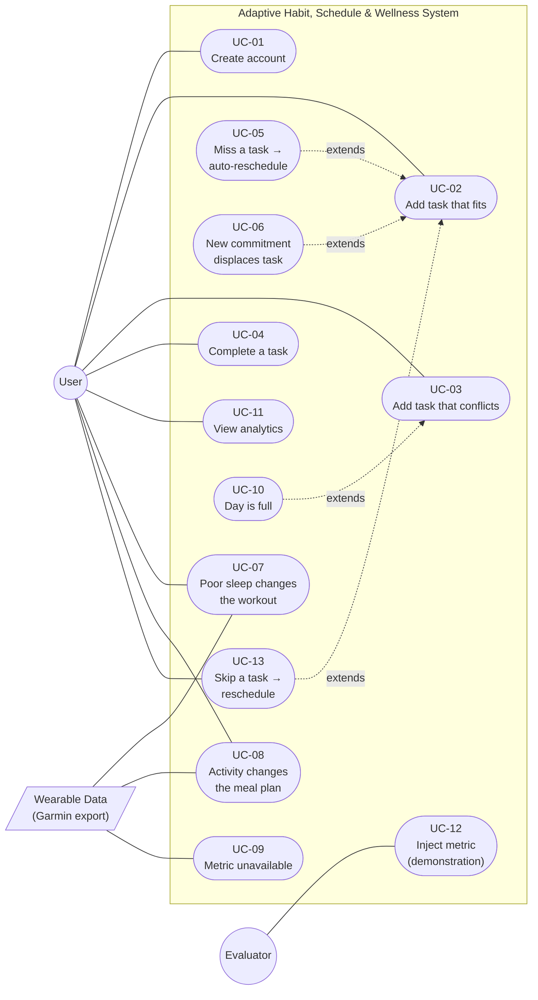
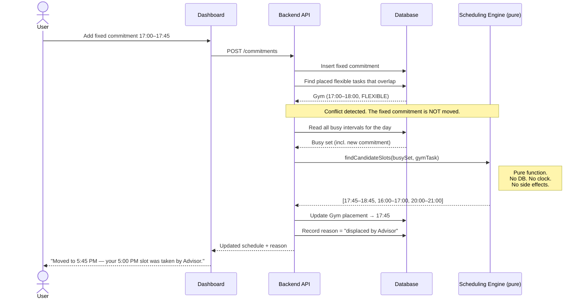
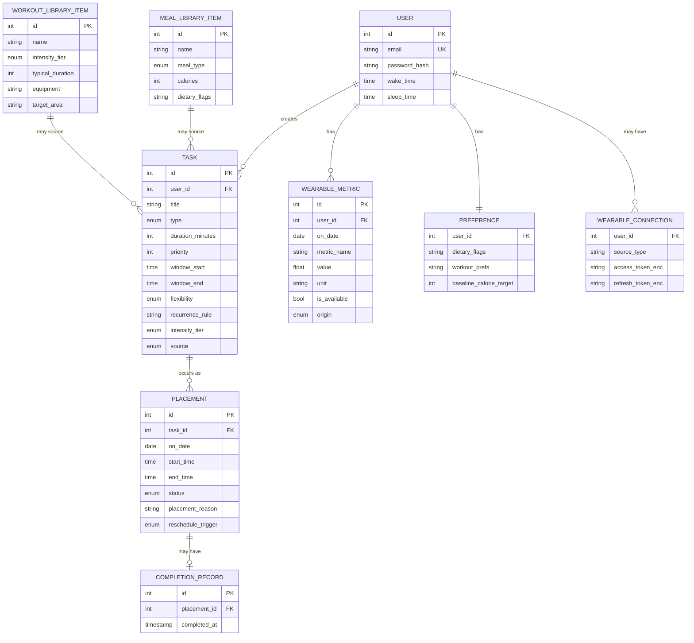
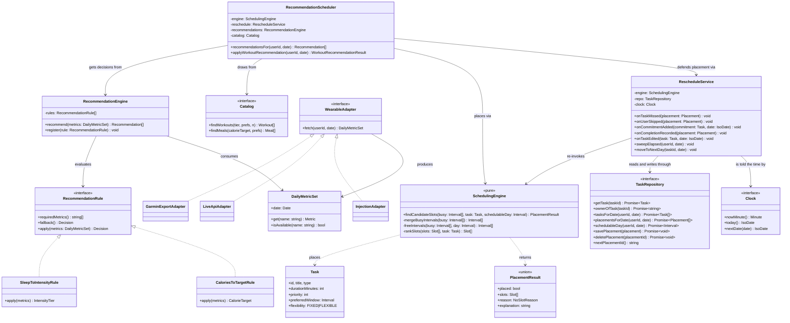

<div align="center">

# Software Requirements Specification

## Adaptive Habit, Schedule & Wellness System

### An adaptive scheduling engine driven by real wearable health data

<br>

**Version 2.36**

**CS 4398 — Software Engineering Capstone**

**Summer 2026**

<br>

**Prepared by:**

**Patrick Rucker** — *Scheduling Algorithm Lead*
**Ryan Woosley** — *Data & Wearable Integration Lead*
**Miguel Alvarez** — *Frontend & Backend Lead*

<br>

**Date:** 21 July 2026

**Standard:** IEEE Std 830-1998, *Recommended Practice for Software Requirements Specifications*

</div>

---

## Revision History

| Version | Date | Author | Description |
|---|---|---|---|
| **2.37** | **29 July 2026** | **Frontend & Backend Lead** | **FR-DSH-08's mechanism replaced — a collapsible dots-only navigator becomes a full-page Day/Month toggle showing each day's tasks by title and time.** Raised by the requirement's own owner while restyling the schedule view to match a reference screenshot (`docs/full.png`). The Essential day view (FR-DSH-01/02) is unchanged and is still what the screen opens on; the month grid is now reached via an explicit **Day / Month** toggle in the schedule view rather than a `▼` dropdown layered above the day timeline, and each day cell lists its tasks (colored bar, title, time) instead of undifferentiated dots — closer to what a user actually wants from a month glance, and closer to the picture this was modeled on. **Backing data**: `GET /schedule/overview` (`TaskRepository.taskTypesInRange`) gained an additive `items: { id, title, type, start }[]` field per day alongside the existing `types` field — `types` is untouched, so nothing that already read it changed. `items.start` is the task's `preferredWindow.start`, **not a placed time** — the endpoint still reads task *definitions*, never calls the engine and writes no `Placement`, per FR-RSC-10 and this requirement's original v2.24 note; a FIXED commitment's `start` is its actual time, a FLEXIBLE task's is only where the System will try first. *Rejected: computing each month cell's real placed time by invoking the engine for every visible day. That would mean a month view materializes placements for days nobody asked to see yet — the exact failure v2.24 already wrote this endpoint to avoid, now for 30+ days instead of one.* **No requirement demoted or promoted** — FR-DSH-08 stays Conditional; this is the same requirement demonstrated more legibly. *(Full reasoning: `docs/TEAM-MEETING.md` decision log, 29 Jul.)* |
| **2.36** | **28 July 2026** | **Scheduling Algorithm Lead** | **Appendix C brought up to date — four issues were resolved in practice but never recorded as closed, so the document was presenting settled questions as open ones with lapsed due dates.** **OPEN-01** (the baseline wearable data path) and **OPEN-02** (a sleep-score derivation formula) both closed **22 July** when the real Garmin export was read: both metrics are published fields — `activeKilocalories` and `sleepScores.overallScore`, an integer 0–100 joining on `calendarDate` — so **OPEN-02's premise was simply false and no formula was ever needed.** **OPEN-05** (whether a live data source is attempted) and **OPEN-06** (whether priority displacement is in scope) both closed **26 July, unattempted**, when every remaining Conditional requirement was cut — which is **the outcome each entry had named in advance** ("close it unattempted, having lost nothing"), so each now records that it happened rather than leaving the reader to infer it. **OPEN-30** was already closed in its body and now says so in its opening line, matching OPEN-04/28/29. **No requirement changed, and nothing was removed** — each closure keeps the original question struck through above the answer, per the convention this appendix already uses, because a closed issue with no recorded answer is not closed. *(Found while reviewing the appendix ahead of submission; four entries carried due dates of 16, 16, 27 July and "after all Essential work is verified", all of which had passed.)* |
| **2.35** | **27 July 2026** | **Scheduling Algorithm Lead** | **FR-ANL-01's streak is counted in OCCURRENCES, not calendar days — adjudicated at the packet 15a RED gate's second read (OPEN-32, finding 2), before the freeze.** The requirement said *"consecutive completed **days** ending at the most recent day"*. **`Task.recurrence` makes that literal reading bite: a Monday-only habit's occurrences are never on adjacent days, so its streak would be capped at 1 permanently** — the metric would report the same number for a user who never misses and one who always does. **Ratified: a streak counts the habit's own occurrences in sequence, whatever their spacing** — three weeks of a weekly habit is a streak of three. **A gap the recurrence rule itself creates does not break a streak; a missed or skipped occurrence does** (FR-ANL-06, unchanged). ⚠️ **This was invisible to the 15a RED suite and would have frozen the wrong way by default**: every test in it uses consecutive calendar dates, where the two readings are indistinguishable, and the occurrence reading was pinned only *incidentally* by one `SUPERSEDED` test — **no weekly-gap test existed.** Cross-references updated: UC-11's basic path (which said *"consecutive-day streak"*). *Rejected: keeping the literal wording and specifying that streaks apply only to daily habits — it would make the analytics view silently useless for exactly the habits recurrence exists to support, and no requirement anywhere restricts habits to daily.* ⚠️ **Version 2.31 is claimed by `wp-15-analytics` (unmerged, and where this requirement's implementation lives); this entry takes 2.35** rather than collide, as 2.23/2.24 did on 24 July. **Expect a revision-history reconciliation when that branch merges — text only; FR-ANL-01's line itself is identical on both branches and was checked before this edit.** *(Full reasoning, and the companion `asOf` decision which is a design change rather than a requirement one: `docs/TEAM-MEETING.md` decision log, 27 Jul.)* |
| **2.34** | **27 July 2026** | **Scheduling Algorithm Lead** | **Corrected: v2.32's justification contradicted FR-WEL-01. The narrowing it made still stands; the sentence defending it does not.** v2.32's explanatory note under FR-WER-04 asserted that *"the wellness view is not obliged to display it."* **FR-WEL-01 (Essential, D) states the opposite verbatim** — the wellness view shall display **every metric in the Daily Metric Set** for the current date, rendering *"whatever the set contains **rather than a hard-coded list**, so a metric added under FR-WER-04 appears without changing this view."* **FR-WEL-01 was simply missed during v2.32's cross-reference hunt** (a failure of the rule that a changed requirement's cross-references must be chased — the one control that stops a narrowing leaving contradictions behind it). **The corrected reasoning, which reaches the same outcome:** FR-WER-04 makes no claim about the view layer **because the generic-rendering obligation lives in FR-WEL-01 and is verified by demonstration (D)** — FR-WER-04 need not, and should not, duplicate it as an inspection (I) obligation that could then drift from it. **Where a view does name metrics explicitly it does so under FR-WEL-04**, which requires a seven-day history of *"sleep score and active calories"* and **names both metrics in its own text**; hard-coding them there satisfies a requirement rather than violating one. **That is what the code raised as OPEN-29 actually does** — its current-date list is already generic and already satisfies FR-WEL-01, and only its FR-WEL-04 chart names the two series. *(The original OPEN-29 analysis reasoned from a search for metric names rather than from reading the file, and so described the FR-WEL-04 chart as though it were the whole view — recorded because the method error is the reusable lesson.)* **Nothing downstream changes**: FR-WER-04's four surviving surfaces, FR-REC-11's verification clause, the packet 16b guard's exclusion of the view layer, and the absence of any resulting work for the wellness view are all **exactly as v2.32 left them.** OPEN-29's closure record amended in place. *(Full reasoning: `docs/TEAM-MEETING.md` decision log, 27 Jul.)* |
| **2.33** | **27 July 2026** | **Scheduling Algorithm Lead** | **Corrected: how an enforcement check earns its NFR-MNT-09 exemption. The document claimed one route; the practice had two, and had for three days.** NFR-MNT-09's note said the checks required by NFR-MNT-07/08 are exempt from reproduction because they are **human-authored** — but packet 16a (merged 24 July) handed an agent a human-authored *specification* and had it derive `guard-single-placement.mjs` and `guard-engine-purity.mjs`, and packet 16b is about to do the same for two more. **The document was wrong, not the practice.** Two routes are now named as acceptable: **(1) transcription** — verbatim, as the domain contract is, which is how the toolchain's original checks were made; **(2) generation from a human-authored specification, with every individual check watched to fail on a deliberately introduced violation before the packet closes**, the failing output recorded in that packet's report. **Route 2 is the stronger control for the property actually at issue** — the danger is a check that enforces nothing while exiting 0, and route 2 tests that *behaviourally*, where transcription only attests to provenance; what transcription contributes (that the check tests the *right* thing) route 2 gets from the specification being human-authored. **Neither route permits a check that has never been observed to fail**, and NFR-MNT-07 gains that as an explicit clause — *this project has twice shipped a check that was green while enforcing nothing.* **No requirement's obligation changed** — an exemption was described accurately and a standing practice made explicit. *(Found on 27 July while deciding whether packet 16b's guards may share a helper with 16a's; corrected rather than left for a reader to disprove with one `git log`. Full reasoning: `docs/TEAM-MEETING.md` decision log, 27 Jul.)* |
| **2.32** | **27 July 2026** | **Scheduling Algorithm Lead** | ⚠️ **The narrowing below stands; its stated justification was corrected at v2.34 — read that entry with this one.** *Specifically: the clause "but a view is not obliged to display it" and rejected option (a) both mis-describe the wellness view, which already renders the current date's metrics generically per FR-WEL-01. Left here unedited as the record of what was decided on the day.* **FR-WER-04's extensibility obligation clarified and NARROWED: the dashboard is removed from the list of surfaces a new metric may not change, and FR-REC-11's matching verification clause follows it. OPEN-29 closed.** *Raised while authoring packet 16b, the executable guard for these two requirements:* the wellness view (packet 14b) selects its two chart series by literal metric name, so the wider reading of *"no change to … the dashboard"* would make FR-WER-04 **false** the moment a third metric arrived. **The narrower reading is ratified: a new metric shall be ingested, stored, evaluated by its rule, and reflected in the recommendation with no change to the scheduling engine, the task model, the persistence layer's structure, or any existing rule — but a view is not obliged to display it.** The four remaining surfaces are all **structural**, and a new metric touching one would mean "there are exactly two metrics" had been encoded into the architecture (DR-05's subject); a chart naming its series encodes nothing, and the metric flows end to end without it. **The deciding distinction: does the System need editing for the metric to WORK, or for the user to SEE it — only the first is FR-WER-04's business.** *Rejected: (a) making the view render the metric set generically — the strongest demonstration, but FR-WEL-01…05 / UI-03 specify a designed screen with per-metric labels, units and narrative, the change lands on another owner's unmerged branch four days before the presentation, and the only requirement that would ever exercise it (FR-REC-12) is Conditional and cut; (b) leaving the wording alone and simply not scanning the view layer — cheapest, but it leaves the SRS asserting something the build no longer checks, which is the precise shape §4.8 exists to prevent.* **Recorded plainly: this narrowing was made after seeing code the wider reading would have failed.** No other requirement's obligation changed; NFR-MNT-06 and DR-05 never named the dashboard and are untouched. *(⚠️ **Version 2.31 is claimed by `wp-15-analytics`** — two FR-ANL rules ratified at the 15a RED gate, not yet merged. This entry takes 2.32 deliberately rather than collide, as 2.23/2.24 did on 24 July. Full reasoning: `docs/TEAM-MEETING.md` decision log, 27 Jul.)* |
| **2.31** | **27 July 2026** | **Data & Wearable Lead** | **FR-ANL gains two rules it always implied but never stated — ratified at packet 15a's RED gate, before the freeze, so a RED run does not silently author them (§0.1).** The 15a suite (streak + completion rate) had to decide two cases the SRS left open. **(1) FR-ANL-02's denominator is defined:** an *occurrence scheduled* is one whose window has **elapsed** in the period — a future `PLANNED` occurrence is counted in neither term, so a habit is never penalised for a day that has not happened (consistent with FR-RSC-01/FR-RSC-10's miss-on-elapse model, which the SRS never connected to the rate). **(2) New FR-ANL-07:** a `SUPERSEDED` occurrence (a workout the System **replaced** per FR-REC-02) counts as **neither completed nor missed** — excluded from both terms of FR-ANL-02 and not a streak-breaker — extending FR-ANL-03's principle that the System must not penalise the user for its own action, with a deliberate asymmetry to FR-ANL-06 (a *user-declared* skip is a miss; a *System-driven* supersession is not). This is precisely the FR-ANL reading the v2.28 `SUPERSEDED`/`CANCELLED` distinction was preserved **for** — §3.6/DR-06/§5 already say the two statuses stay distinct because "FR-ANL … may read differently"; this fills that in. **No existing obligation changed** — a denominator defined, a terminal-status case stated. Cross-refs updated: UC-11 alternate flows, the FR-ANL traceability row, and the index. *(Full context + the RED gate escalations: `docs/TEAM-MEETING.md` decision log, 27 Jul; `docs/P15A-RED-REPORT.md`.)* |
| **2.30** | **27 July 2026** | **Data & Wearable Lead** | **FR-LIB-07's swept calorie range and day-plan model pinned, ratified at the packet 11 RED gate.** The requirement always demanded coverage "for any target FR-REC-08 can produce" but the SRS never bounded that range (`baseline + active calories`, baseline user-set). The RED suite had to pick one, which freezes into the spec (§0.1) — so it is ratified as a decision: swept range **1,500–4,000 kcal**, the ±10% band as the **closed** interval, and a **0.30/0.35/0.35** BREAKFAST/LUNCH/DINNER split under which per-slot ±10% gives whole-day ±10% by construction (keeping FR-LIB-07 a library-richness property, not a planner). Added the concrete values to FR-LIB-07. **No obligation changed — an unbounded phrase was bounded.** *(Full gate record incl. the other four packet-11 escalations, and OPEN-28 on the 17b↔11 `Catalog` reconciliation: `docs/TEAM-MEETING.md` decision log, 27 Jul.)* |
| **2.29** | **27 July 2026** | **Data & Wearable Lead** | **FR-LIB-08's "documented, fixed" relaxation order is now actually documented — surfaced while authoring packet 11, before its RED freeze.** FR-LIB-08 has always required the catalog to relax constraints "in a documented, fixed order," but no order was ever stated — an unstated requirement packet 11's RED suite would otherwise have frozen from the RED agent's guess (the OPEN-13 trap, §0.1). Added to FR-LIB-08: the two **hard** constraints (**dietary preference**, **intensity ceiling**) never relax, in any order, for any reason; the **soft** constraints relax **(1) meal type → (2) equipment / workout preference → (3) ±10% calorie tolerance widened**, the tolerance last because the wearable-driven calorie target (FR-REC-08) is the adaptive claim and is preserved longest. Each relaxation is reported; where none yields a candidate the System says so plainly rather than returning a hard-constraint violation. **No requirement's obligation changed — an existing "documented" promise was filled.** *(Also corrects the cover-page version token, which had drifted to 2.24 while this table was at 2.28. Full context: `docs/TEAM-MEETING.md` decision log, 27 Jul; and the OPEN-04 exercise-dataset resolution the same day — `free-exercise-db`/Unlicense, the FR-LIB-04 tier mapping, and the FR-LIB-03 per-tier duration rule — which is recorded in the decision log and transcribed into packet 11 rather than here, being dataset-specific seeding detail.)* |
| **2.28** | **26 July 2026** | **Scheduling Algorithm Lead** | **A sixth terminal `PlacementStatus` value, `SUPERSEDED`, added to the domain contract (§3.6) and the Data Requirements (§5, DR-06) — OPEN-27 closed (packet 17c).** FR-REC-02 obliges the System, where a workout is scheduled above the warranted tier, to **replace it** with one at the warranted tier and place the replacement by the engine (FR-REC-04). The 17b wiring vacated the replaced occurrence by marking it `CANCELLED` — but `CANCELLED` is defined as an FR-RSC-09 *withdrawal*, and a `CANCELLED` occurrence, being neither `PLANNED` nor occupying, left the replaced task with **no `PLANNED` placement**, so FR-RSC-05's self-heal re-attempt re-placed it on the next schedule retrieval — the replaced run **resurrected** beside the recovery session, undoing the replacement (a §6 rehearsal hits this on the second `GET /schedule`). **`SUPERSEDED`** records that *this occurrence was replaced by a recommendation and will not happen as planned* — terminal like `MISSED`/`SKIPPED`, recording neither a user event nor a withdrawal. It is **excluded from the busy set** (frees the slot for the recovery, exactly as `CANCELLED` did) **and, unlike a task with no placement at all, excluded from FR-RSC-05's re-attempt eligibility** — that second exclusion is the fix: `RescheduleService.sweepElapsed` does not re-place a task whose date-occurrence is `SUPERSEDED`. **Per-occurrence** — a recurring task's other dates are untouched. The `PlacementStatus` addition is a §4.7 contract change (human-authored, transcribed verbatim into packet 17c). **No existing requirement's obligation changed** — a terminal status added and the two service-level status sets (§3.8.5 busy-set / re-attempt) noted to exclude it. Rejected: (a) a separate set-aside marker (more machinery than a status the domain already models like `MISSED`/`SKIPPED`); (c) modelling the replacement as an *edit* of the user's own workout (contradicts 17a's frozen `source: 'SYSTEM'` assertion and FR-REC-04's "created as a task"). *(Full context + the mechanism-agnostic 17c test: `docs/TEAM-MEETING.md` decision log, 26 Jul; `docs/P17C-GREEN-REPORT.md`.)* |
| **2.27** | **26 July 2026** | **Scheduling Algorithm Lead** | **Two adjudications from packet 17a's RED gate (the acceptance suite, `docs/P17A-RED-REPORT.md`), both additive.** **(1) §3.6 — `RecommendationScheduler` ratified** as a dedicated server-local collaborator realizing the class diagram's `places via SchedulingEngine` and `draws from Catalog` edges, which move to it from `RecommendationEngine`. Packet 10 built `RecommendationEngine` content-agnostic (`register`/`recommend` only, FR-REC-11) and the packet-09 suite freezes that shape, so the placement wiring — needing the `Catalog`, engine, `RescheduleService`, repository and clock — composes the frozen engine rather than bloating it, the same way `RescheduleService` re-invokes the engine without being it (FR-RSC-03). This is where **FR-REC-04** is wired (RED suite frozen in 17a; wiring is 17b). **(2) §6 — the demonstration's closing step clarified**: the *withdraw-its-own-reschedule* behaviour is shown on a **missed** reschedule, not chained off the preceding skip, because **FR-RSC-09 corrects only the inferred miss** (completing a skipped occurrence is ordinary completion). The earlier prose chained skip → complete → withdraw on one occurrence, which FR-RSC-09 does not do. **No requirement's obligation changed** — a class named, two diagram edges re-pointed, and a demonstration script made executable as written. *(Full context + the five 17a escalations: `docs/TEAM-MEETING.md` decision log, 26 Jul.)* |
| **2.26** | **25 July 2026** | **Data & Wearable Lead** | **The recommendation DATA types the §3.6 class diagram already names — `Recommendation`, `Decision`, `CalorieTarget` — are realized in the shared contract (§3.6), plus a `RecommendationReason` the UML did not carry (FR-REC-11, FR-REC-13).** The diagram has specified `RecommendationEngine.recommend() → Recommendation[]` and `RecommendationRule.apply()/fallback() → Decision` since the recommendation architecture was drawn; this revision writes the TypeScript to match, ahead of packet 09 (rules RED) rather than during it — exactly as `Task.recurrence` (v2.19) preceded packet 12 — so one frozen test run's arbitrary output shape does not silently become the spec (§0.1, §4.11). **`Decision`** is a discriminated union on `kind` (`WORKOUT_INTENSITY` → `IntensityTier`, FR-REC-01; `CALORIE_TARGET` → `CalorieTarget`, FR-REC-08), matching the diagram's two rules `SleepToIntensityRule`/`CaloriesToTargetRule`. **`Recommendation`** bundles a `Decision` with a **`RecommendationReason`** (metric name, value, and a `usedFallback` flag) — the machine-readable substrate of FR-REC-13, which the UML omits; `metricValue` is `null` *exactly* when the metric was unavailable, kept distinct from a measured zero (DR-02, NFR-ROB-01). **The rules and `RecommendationEngine` are NOT in the contract** — they are server-local (`server/src/recommendation/`), like `RescheduleService` and the `WearableAdapter` which the same diagram names but which live under `server/`; only the data crossing the server→web boundary lives in the contract, because the wellness views (FR-WEL-02, packets 14/15) render this shape and a server-local type would force a duplicate web-side (§4.7). **The §3.6 diagram needed no change — the contract now matches it. No existing requirement changed** — additive only. *(Full context: `docs/TEAM-MEETING.md` decision log, 25 Jul.)* |
| **2.25** | **25 July 2026** | **Data & Wearable Lead** | **FR-WER-03 pins the sleep score's unit token as `score` — a gap filled, no behaviour changed.** FR-WER-02 makes `Metric.unit` mandatory, but FR-WER-03's table gave `kcal` for active calories and only a *range* (0–100) for the sleep score, leaving the string an implementation would carry unspecified. **Raised as an escalation by the packet 08 RED session rather than defaulted silently** — had it been left to the frozen test suite, one run's arbitrary choice of token would have become the de-facto spec, indistinguishable from a team decision (§0.1, §4.11). `score` chosen as Garmin's own term for the metric; the token is descriptive only and is read by no recommendation rule (FR-REC-01 keys on the value and the metric name, never the unit), so the stakes are cosmetic — which is exactly why it belongs pinned in the specification rather than guessed in a test. **No existing requirement changed.** *(Full context: `docs/TEAM-MEETING.md` decision log, 25 Jul — packet 08 RED escalations E1/E2/E3.)* |
| **2.24** | **24 July 2026** | **Frontend & Backend Lead** | **FR-DSH-08 added — a collapsible month-grid navigator, Conditional.** Built interactively on top of the already-Essential day view (FR-DSH-01/02): a per-month grid showing which days have at least one task, with a per-day colored indicator by task type, from which a day can be selected into the day view. **Conditional, not Essential** — it is convenience layered on the Core Demonstrable Capability's day view, not part of it (§2.7.1), and its absence would not weaken the System's central claim. **Backed by a new endpoint, `GET /schedule/overview`, verified by Test** (Appendix B): it reads task *definitions* (`intendedDate` + `recurrence`), not `Placement` rows, because FR-RSC-10 evaluates a day only when it is actually retrieved — a future day nobody has opened via the day view has no `Placement` at all, so a placements-only overview would silently show it as empty even when tasks are defined for it. Bounded to a 62-day request range (NFR-SEC-05's existing query-parameter discipline). *(Renumbered from 2.23 to 2.24 on merge into `dev` — the Scheduling Algorithm Lead's §2.8 methodology entry reached `dev` first and kept 2.23; two independent branches had each claimed the same next version number.)* **No existing requirement changed.** |
| **2.23** | **24 July 2026** | **Scheduling Algorithm Lead** | **New §2.8 "Development Methodology" — the agentic + test-first method is now stated in the specification, where it was previously absent.** The document is built by agentic programming (the team specifies requirements; AI agents generate the implementation under a named human owner per module), and three requirements already in this document exist specifically to keep that method honest — the human-authored frozen contract (§3.6), the RED/GREEN separation that gives NFR-MNT-01 and NFR-COR-01 their meaning (NFR-MNT-08/09), and the executable (I)-guards of NFR-MNT-07. Those were stated as requirements but never tied together as a methodology, and the *agentic* framing appeared nowhere — an odd gap in a submission document whose method is a central part of what it demonstrates. §2.8 supplies the connective tissue and points to the team's *Agentic TDD Workflow* (§1.5, ref. 8, newly listed) for the full detail; it restates no requirement and duplicates none. **No existing requirement changed** — additive only, plus the reference, the TOC row, and this entry. |
| **2.22** | **24 July 2026** | **Scheduling Algorithm Lead** | **NFR-MNT-09 gains an empirically-established limit — a note, no requirement changed.** A partial replay (packets 04–07, engine + reschedule) confirmed the pack reproduces a **working** System from requirements alone, but also that a regenerated suite is only as thorough as its RED session: a fresh agent, from this document, **omitted FR-RSC-05's displaced-or-edited-still-`PLANNED`-cannot-re-place deletion case** (the `deletePlacement` path, v2.16) even though §3.6 names the method and §5 explains it — and the GREEN implementation then **passed while being wrong on that case**, because nothing pinned it. So *"same requirements satisfied"* holds only as strongly as the regenerated tests pin them, and the curated mainline suites stay authoritative — a replay demonstrates the method, it does not replace them. **Mitigation adopted and recorded in the decision log**: an Essential behaviour specified only in prose is promoted to a **named required-test-case** in its RED packet (as FR-SCH-09's boundary matrix already is); packet 06 was updated accordingly. *Found by the reproducibility test run 24 Jul; the freeze tooling also gained a provenance-sha fix the same test surfaced (decision log).* **No existing requirement changed.** |
| **2.21** | **24 July 2026** | **Scheduling Algorithm Lead** | **Three maintainability requirements added to §4.5, stating obligations the project has been running on informally since 22 July and which nothing in this document required.** **NFR-MNT-07: every (I) requirement shall be enforced by an automated check that fails the build.** The (I) requirements are the architectural ones, and each is violated by doing the locally simplest thing — asked to re-place a displaced task, the shortest correct-looking route is a small local free-slot helper, after which FR-RSC-03 is false and **no test fails**. An inspection recorded only as an instruction to look has no failing state and rots silently; it must be executable or it is decoration. **NFR-MNT-08: a frozen suite shall be verifiable as unmodified without reliance on repository history.** The prohibition on editing a frozen test needs a failing state or it is a request — and a freeze verified by diffing against a commit holds in neither a shallow CI checkout nor a rebuild-from-specification, **which is the case it most needs to protect**, since a rebuild freezes its suites before it commits anything. *The property is required; the mechanism is not. A per-file content digest satisfies it. Repository provenance may be recorded in addition and is explicitly not a substitute — it is what catches a suite edited and then re-frozen to cover the edit.* **NFR-MNT-09 (Conditional, D): the System shall be reproducible from its specification** — delete every generated source file, execute the work packets in order, and the same requirements are satisfied by an independently derived implementation, **with each suite regenerated and frozen by that run.** It does **not** claim the same code; claiming that would require carrying one run's implementation into the specification, at which point NFR-MNT-01's coverage figure and NFR-COR-01's 1,000-case property test would measure the code against itself and stay green while measuring nothing. **The human-authored inputs are named rather than implied — the domain contract (§3.6) and the checks required by NFR-MNT-07/08 — for one reason: a regenerated safety net can come back weaker, and a weaker check passes.** *Conditional, not Essential, on purpose: it is a property of how the System is built rather than of what it does, no user-facing requirement depends on it, and it cannot be demonstrated in full until every work packet exists — promoting it sooner would make an incomplete prompt sequence an acceptance failure, which §2.7.1 exists to prevent.* **No existing requirement changed.** |
| **2.20** | **22 July 2026** | **Scheduling Algorithm Lead** | **OPEN-21 closed — a reschedule trigger shall never be inferred where the store holds no evidence of a reschedule.** *Raised by the Frontend & Backend Lead from an end-to-end smoke test against the running server during packet 12's integration: **a brand-new task's first-ever placement came back stamped `MISSED`.*** `RescheduleService`'s re-attempt path derived its trigger from the day's leftover rows and, finding none, **returned `MISSED` as a hardcoded default** — so an absent history, which means *"never rescheduled"*, was reported as a specific event that had not happened. **This contradicted the contract's own sentence on `RescheduleTrigger`** (*"absent means it has never been rescheduled"*) and would have had **FR-DSH-05 render *"its 8:00 PM slot passed without being marked complete"* over a task the user had just created.** **FR-RSC-05 gains the re-attempt's provenance rule** (evidence-based, absent where there is none — and this is the **commonest** path through that branch, since every new flexible task's first placement is made there) and **DR-06 gains the prohibition** (*the missing value must stay missing, never be filled in with the likeliest-looking member of the set*), **plus its long-stale `edited` member**, added to the trigger set at v2.15 and never carried into this enumeration. Also recorded: a **displaced or edited** occurrence whose row E11 removed leaves **no** provenance either, and that is accepted — *understating by one fact beats stating a false one, and re-introducing a stored side-channel to survive the deletion is exactly what v2.13 removed.* **Fixed at the root rather than the report:** the same defaulting function feeds `moveToNextDay`, whose outcome packet 12's API sends over the wire, so patching only the sweep would have left a second live instance. *Fix verified by temporary tests that failed on the old code and passed on the new; **those tests were then deleted, not committed** — §4.6 forbids an agent that has read the implementation from also pinning it. **The case is therefore specified here but not yet in the frozen suite**, and pinning it is packet **17a**'s obligation (`docs/TEAM-MEETING.md`, OPEN-22).* |
| **2.19** | **22 July 2026** | **Frontend & Backend Lead** | **`Task.recurrence` added to the contract, while authoring packet 12.** FR-TSK-01's attribute table and the Data Requirements table (§5) had both always listed `recurrence` as a Task attribute, and FR-TSK-05 (Essential, Core) requires expanding a recurring task into one placement per matching day — but `shared/src/contract.ts` had no field to read. **The same defect shape as `Task.createdAt` (v2.11) and FR-SCH-03's removed criterion (b) (v2.7).** `Task.recurrence?: Recurrence` — `{ frequency: 'DAILY' \| 'WEEKLY'; daysOfWeek?: readonly number[] }`, optional so absence means "no recurrence" per FR-TSK-01's own default and so the 30 engine tests frozen at `ac06e70` need no re-freeze. **The engine never reads it**: expansion happens in packet 12, before the engine ever sees a task — the same division FR-CAL-06 already states for calendar-sourced recurring events ("the engine shall never receive a recurrence rule — only concrete busy intervals"). Note under FR-TSK-01 added; both contract copies (`shared/src/contract.ts`, `prompts/foundation/03-shared-contract-types.md`) updated identically per §4.7. *Verified: typecheck clean, 184/184 frozen tests green.* |
| **2.18** | **22 July 2026** | **Frontend & Backend Lead** | **OPEN-12 closed — the user identifier is the Mongo `_id` of the `User` document, stringified, minted at account creation.** Email stays unique (FR-USR-01) but is used only to look the id up at login; it is never itself the identifier stored on ownership records. **Ownership lives at the API/persistence boundary, not on the domain types** — `shared/src/contract.ts` still carries no `userId` field, and this is not a gap: `TaskRepository.ownerOfTask(taskId)` (§3.6) is a repository lookup precisely because ownership is not a `Task` field, so the "domain types vs. boundary" half of OPEN-12 was already answered by the ratified interface before this revision named it. *Opaque id chosen over the email address itself: it decouples identity from a field the System never promises is immutable, and keeps a PII string out of every `Task`, `Placement`, and `Metric`-owning document — only the `User` document and the session need to know it.* Decided with packet 12 in front of the author, per the SRS's own instruction under FR-USR-04. |
| **2.17** | **22 July 2026** | **Scheduling Algorithm Lead** | **Two service-level invariants written down after the fact — added to §3.8.5, governing every trigger in the group.** Neither is pinned by a test, and **both were settled by packet 07's implementation before they were stated here, which is the wrong order**: an unstated rule is re-derived by the next module that needs it, differently, with nothing failing. **(1) The busy set is `PLANNED` and `COMPLETED` occurrences only** — a missed, skipped or cancelled occurrence **is not going to happen** and must not hold the day against a task that still could. *This is what makes FR-RSC-09's "free the interval it held" true **by construction**: a `CANCELLED` row drops out of the busy set, and no cleanup code exists or is needed.* **(2) "Fully elapsed" in FR-RSC-01 means the OCCURRENCE's own interval, not the task's preferred window.** The requirement uses the word *"window"* for both, and **they are different intervals**: the v2.14 substitution rule reads `preferredWindow.end`, the miss condition reads the placed occurrence's end. **Read the preferred window for the miss condition and the System churns forever** — a 21:15 successor of a task whose window closed at 20:30 is elapsed the moment it exists, so every retrieval re-misses and re-places it, and **FR-RSC-06's termination argument, which rests on each successor starting strictly later, silently stops holding.** *Also restated: the occurrence being re-placed is never in the busy set for its own re-placement — which matters more since v2.16 leaves a displaced row `PLANNED`, so a service reading "every `PLANNED` placement" would route the task around itself.* |
| **2.16** | **22 July 2026** | **Scheduling Algorithm Lead** | **Four more from packet 06's RED run, three of them consequences of v2.14 and v2.15 rather than of the original specification.** **FR-RSC-05 no longer lists its triggers (E12).** It read *"missed or displaced"* until v2.14 added *"skipped"*, and v2.15 added a fourth trigger six hours later without revisiting it — **the identical omission in the identical place.** The obligation is now about the failure rather than about what caused it, so a fifth trigger cannot reopen it. **FR-RSC-02 and FR-TSK-04 gain the failure path (E11):** a **displaced or edited** occurrence that the engine cannot re-place has its row **removed**, since it is still `PLANNED` and FR-RSC-05 recognises an unplaced task by the **absence** of a `PLANNED` placement. *Leaving it would store the flexible task overlapping the commitment that displaced it — and, far worse, **silently switch the next-day offer off**, because an occurrence that keeps a `PLANNED` row still looks placed. The overlap would be visible; the missing offer would not.* `TaskRepository` gains **`deletePlacement`**, the domain's only deletion, with a note to question any second caller. **FR-TSK-04's validity predicate is made precise (E13):** the placement's length must equal the new duration **exactly** — *a 60-minute block held for a 30-minute task is not a roomy booking, it is the wrong occurrence, and it blocks half an hour of the day from everything else; trimming `end` in place was rejected as a time computed outside the engine* — and **"lies inside the window" is genuinely part of validity**, because without it *editing the preferred window could never invalidate anything and half the requirement's own sentence would be dead text.* **And an edited occurrence is moved in place (E14)** — same row, still `PLANNED`, trigger `EDITED`, no successor — by FR-RSC-02's reasoning unchanged: a record is kept only where **something happened** at the old time, and nothing did. *E14 was found because **nothing in the frozen suite pinned it**: the shape was invisible, packet 07 would have chosen one by instinct, and it is the shape FR-ANL and the dashboard read.* **Provenance, recorded because it is the point: all four notes in this revision were DRAFTED by the packet 06 RED session and RATIFIED here after independent verification against the requirements — not authored by it.** *That session had previously published a v2.16 of its own and cited it as the spec its suite was written against, which is circular: the tests justified by a document the same session produced. The substance survived scrutiny; the provenance is stated so the record does not repeat the claim.* |
| **2.15** | **22 July 2026** | **Scheduling Algorithm Lead** | **FR-TSK-04 given a mechanism — OPEN-18 closed, raised by the Frontend & Backend Lead while authoring packet 12.** The requirement is **Essential** and, before this revision, **appeared exactly once in this document**: no use case, no sequence diagram, no class, nothing in §3.6 that answers *"a task's own attributes changed."* Now performed by **`RescheduleService.onTaskEdited(task, date)`**, with `RescheduleTrigger` gaining a fourth member, **`EDITED`** — without it DR-06 cannot say which trigger moved the placement and FR-DSH-05 cannot write *"Moved to 7:00 PM — you changed how long this takes."* **The boundary adopted, which also settles OPEN-17: does the occurrence already exist?** Re-placing one that does — missed, skipped, displaced, edited — is `RescheduleService`; placing a task that has none yet, including a day's planning under FR-SCH-10, is the API layer's creation path (packet 12). *Rejected: handling the edit directly in the API layer. It is defensible on filing — FR-TSK-04 sits under Task Management — but it puts the **validity check** in a second owner, and "is this placement still legal?" is one careless step from "where should it go instead?", which is the second placement function FR-RSC-03 forbids.* **The check may only reject; choosing a new time is the engine's, always.** *Also recorded: FR-SCH-10 does not apply to a single edited task, so the ordering duplication the question feared does not arise; and one call re-evaluates one occurrence, since FR-TSK-05 gives a recurring task many.* **Decided before packet 06's freeze on purpose** — a seventh method and a fourth trigger value cost minutes now and a re-freeze afterwards. |
| **2.14** | **22 July 2026** | **Scheduling Algorithm Lead** | **Ten escalations from packet 06's RED run; seven settled here, one deferred, two mechanical.** **FR-RSC-01 gains the elapsed-window rule (E1), and it is the important one:** a missed task's preferred window is behind `now` by definition and the day handed to the engine starts at `now`, so **FR-SCH-09's last boundary row obliged the engine to reject every missed task** — UC-05's 21:15 unreachable and §2.7.1's central claim false for its own trigger. **Resolved in the caller**: where a window has fully elapsed the engine is invoked with a derived task whose window is the remainder of the day, the stored task unchanged. *The engine cannot tell "the user asked for 2 AM" from "the caller narrowed the day past the user's window" — the two arrive identical — so the rule must live where the information is, exactly as `schedulableDay` does. Changing the engine would have re-opened 30 frozen tests to fix a defect it does not have.* **FR-RSC-02 gains what displacement does to the row (E10)** — moved in place, still `PLANNED`, trigger `DISPLACED`, no successor, as §3.4 has always drawn it — and **FR-RSC-06's idempotency note is generalised** to "a trigger is a no-op when the condition that fires it is no longer true of the schedule", because the old wording explained it by a state change displacement does not make. **FR-RSC-05 now says "missed, skipped, or displaced" (E3)** — FR-RSC-08, UC-10 and UC-13 already gave a skip the same offer. **FR-RSC-09 is explicitly scoped to the missed classification (E6):** a miss is inferred from silence, a skip and a displacement are witnessed. **FR-SCH-10 gains the mixed-`createdAt` rule (E5)** — rank on `(has instant, instant, id)`; *the proposed "if either is absent, compare by id" was rejected as **non-transitive**, and a comparator that admits a cycle does not define an order* — **and a note naming packet 12 as the owner of the initial day-planning path (E8, now OPEN-17).** **§3.6 ratifies `TaskRepository` and `Clock`**, which packet 06 had to draft because the diagram named them and listed nothing (E9): **the repository is asynchronous**, since packet 12 implements it over the promise-based MongoDB driver and a port its only implementer cannot satisfy is the wrong port. `onCommitmentAdded` gains a `date` (E2) — `Task` says *when in a day*, never *which day*. Also corrected: two citations reading UC-06 for text that lives in **UC-10** (E4). |
| **2.13** | **22 July 2026** | **Scheduling Algorithm Lead** | **FR-RSC-06's trigger identity specified — OPEN-16(3) closed, and OPEN-16 with it.** **Idempotency is a property of the occurrence's state, not of a record of past triggers**: a trigger acts only on a `PLANNED`, incomplete occurrence, and handling it moves that occurrence out of `PLANNED`, so a second firing finds nothing to act on. **This is load-bearing because FR-RSC-10 re-evaluates on every schedule retrieval** — five refreshes fire the missed check five times and must yield one placement. *Rejected: a stored processed-trigger record — a second source of truth that FR-RSC-09's cancellation would have to unwind by hand, where any divergence from the schedule is invisible.* **Termination is proved rather than capped:** the day handed to the engine begins at the current time, so each successor starts **strictly later**, and a strictly increasing sequence bounded by the day's end terminates — FR-RSC-05 ends the chain when the day runs out. *An "at most N reschedules" cap was rejected as a number nobody specified, with a refusal path that looks correct while silently denying a legitimate reschedule.* **Same version also: FR-RSC-05's "unplaced" and its offer specified (OPEN-16(2) closed).** **Unplaced is the absence of a placement, not a stored state**: no `UNPLACED` member is added to `PlacementStatus`, the task simply has no `PLANNED` placement for the date (a missed task keeps its `MISSED` one), and the reason is **recomputed on retrieval** from the engine's `NoSlotReason` rather than stored. *Rejected: a stored `UNPLACED` placement — it can drift out of step with the schedule, and a `Placement` that is nowhere would still carry a `start` and `end` that mean nothing. The derived form also self-heals: **free the day up and the next retrieval places the task**, with no stale row to clean.* **The offer is actionable**: accepting it re-invokes **the same engine** against the next day, via a new `RescheduleService.moveToNextDay` in §3.6 — **the only addition to that class since it was drawn**. UC-10 gained two alternate flows (accept → placed by the same engine; day frees up → offer ceases). **Explicitly deferred and recorded so they are not re-proposed: discarding a task for the day** (FR-RSC-08's skip re-invokes the engine by definition, so a discard-without-re-placement is a *different* obligation that no Essential requirement asks for) **and rearranging the current day to make room** (that is FR-SCH-07, Conditional, barred by §2.7.1 until all Essential work is verified). |
| **2.12** | **22 July 2026** | **Scheduling Algorithm Lead** | **An automatic reschedule takes the engine's RANK-1 candidate — OPEN-16(1) closed.** FR-RSC-01 said *"the next valid slot remaining that day"* while FR-SCH-02 returns **up to three ranked** candidates, and nothing said which one the automatic path took. Note added under FR-RSC-01, **governing all three triggers**: the System takes **rank 1**, and *"remaining that day"* is expressed by the service handing the engine a `schedulableDay` that **begins at the current time** — the service shapes the day, the engine ranks within it. **Rejected: the literal "earliest remaining."** For a **missed** task the two coincide (the preferred window has elapsed, so proximity ranking already yields the earliest remaining slot — UC-05's 21:15 is unchanged either way), so the choice only bites on a **skip declared in advance** or a **displacement** — and there "earliest" would move a 17:00 session skipped at 15:00 to 15:30, further from the user's stated preference, **by having the service override a ranking the engine had already made.** *That override is the shape FR-RSC-03 exists to prevent: not a second placement function yet, but the first line of one.* |
| **2.11** | **22 July 2026** | **Scheduling Algorithm Lead** | **FR-SCH-10's tiebreak given something to read — OPEN-15 closed.** The requirement broke a priority tie on the **earlier-created** task *"so that the order is total and repeatable"*, but no type in the System recorded when a task was created, so the criterion could not be evaluated — **the FR-SCH-03(b) defect shape again** (v2.7): a rule with no field behind it. **`shared/src/contract.ts` gains `Task.createdAt`**, an **ISO 8601 UTC instant** (`IsoTimestamp`), plus a note under FR-SCH-10 stating that an absent or identical instant falls through to **ascending `id`**, so the order is total in every case. *An instant rather than a calendar date because two tasks created minutes apart on one day are the ordinary case, and `IsoDate` would tie them again — closing the hole in a way that reopens it.* **Optional in the type deliberately:** the 30 engine tests frozen at `ac06e70` construct `Task` literals, and a required field would break their typecheck and force a re-freeze for a field **the engine never reads** — FR-SCH-10 governs the order in which the engine is *invoked*, and FR-SCH-05's purity forbids the engine *consulting* a clock, not the caller *passing* it data. *Contract change authorised by the Scheduling Algorithm Lead per `CLAUDE.md` §4.7; `prompts/foundation/03-shared-contract-types.md` updated identically, as it is the human-authored source transcribed verbatim. Verified after the change: typecheck clean, 30/30 frozen tests green, freeze guard passing.* |
| **2.10** | **22 July 2026** | **Scheduling Algorithm Lead** | **Two open issues added while authoring packet 06 — no requirement text changed.** **OPEN-15**: FR-SCH-10's *"earlier-created"* tiebreak has **no field behind it** — the domain contract's `Task` carries no creation timestamp, so the tie cannot be broken and *"total and repeatable"* cannot be satisfied. *This is the FR-SCH-03(b) defect shape again (v2.7): a criterion the code has nothing to read.* **OPEN-16**: three FR-RSC obligations are unspecified at service level — which of the engine's up-to-three candidates an **automatic** reschedule takes (FR-RSC-01 vs FR-SCH-02), whether FR-RSC-05's *"offer to move it to the next day"* creates a placement or surfaces an offer, and what makes two triggers *"the same trigger"* for FR-RSC-06's idempotency. **Recorded now rather than at the gate because packet 06 turns these into frozen tests**, and an invented answer is indistinguishable afterwards from a requirement the team agreed. Both are listed in the packet's escalation clause; neither was decided by the author. |
| **2.9** | **22 July 2026** | **Scheduling Algorithm Lead** | **Candidate positioning specified — OPEN-13 closed.** **FR-SCH-02** now states that where a free interval is longer than the task, the candidate's start is the fitting position **closest to the preferred window**, earliest breaking a tie. **This was an unstated rule the implementation would otherwise have chosen silently**, and it changes what the user is offered: a 60-minute task preferring 17:00, facing a free 07:00–10:00, is offered **09:00 rather than 07:00**. It matters only for intervals lying *before* the preferred window — after it, closest and earliest coincide, **which is why Appendix A could not settle it**: all three of its ranked candidates sit in intervals where the two readings agree. *Chosen for coherence with FR-SCH-03, whose primary criterion is already proximity to the preferred window; ranking intervals by closeness while positioning within them by something else would be arbitrary.* **Also recorded, because it is a genuine asymmetry rather than an oversight:** *inside* the preferred window every position is equally close, so closeness cannot choose and the **earliest fitting position** governs — which is exactly what FR-SCH-09's first boundary row already required. **The engine's frozen test suite is unaffected**: every test that asserts a start position uses an interval either exactly the task's length or lying after the preferred window, so it is correct under either reading. Separately, `shared/src/contract.ts` had its `priority` comment corrected — it still cited FR-SCH-03, removed in v2.7 — to cite **FR-SCH-10** and **FR-SCH-07** (OPEN-14 closed; `prompts/foundation/03-shared-contract-types.md` updated identically, since it is the human-authored source transcribed verbatim). |
| **2.8** | **22 July 2026** | **Scheduling Algorithm Lead** | **Priority given an Essential consumer, and displacement given a design without being started.** Added **FR-SCH-10** *(Essential)*: where several flexible tasks are placed into one day, they are placed in **ascending priority order**, each placement becoming a busy interval for the next, with **earlier-created** breaking a priority tie. **This was an unstated requirement, not a new feature** — the SRS never said what order multiple tasks were placed in, yet that order decides which task wins a contested slot. Left unstated it would have been settled silently by whichever module was written first, and could differ between two runs of the same day. It also resolves the gap opened by v2.7: after criterion (b) was deleted, **priority was collected, validated and stored but consumed by nothing Essential** — FR-SCH-07/08 being Conditional. **FR-SCH-07 was NOT promoted**, but it now carries a **design note locating displacement in the service rather than the engine**, with the three-call sketch and the revert path. *Rationale for recording the design while deferring the work: the naive design — teaching the engine who occupies each busy period — would change the frozen contract and every engine test, and contradicts §3.8.4's own separation of the pure decision from the stateful policy. Writing the cheap design down now is what keeps FR-SCH-07 a day's work rather than a week's if it is ever picked up, and stops it being re-derived under time pressure.* **Deliberately unchanged: §2.7.1's Core Demonstrable Capability.** FR-SCH-10 is Essential but not Core — the central claim is that the schedule repairs itself, and the demonstration's conflict is a **fixed** commitment landing on a flexible task (FR-RSC-02), which needs no priority at all. **OPEN-06 remains open and deferred.** |
| **2.7** | **22 July 2026** | **Scheduling Algorithm Lead** | **FR-SCH-03's second ranking criterion removed — it was not evaluable.** The requirement ranked candidate slots by *"(a) proximity to the preferred window; (b) the task's priority relative to neighbors; (c) earlier start time."* **Criterion (b) cannot be computed from the engine's inputs.** §3.6 gives the engine `busy: readonly Interval[]`, and an `Interval` carries only a start and an end — a neighbouring commitment has no priority attached for the engine to compare against. Reading (b) instead as the placed task's *own* priority does not help: that value is identical for every candidate slot of the same task, so it can never break a tie. **Ranking is now (a) proximity, then (b) earlier start.** *Priority is unaffected as a `Task` field and unaffected in **FR-SCH-07** (displacement, Conditional) — which is the requirement that genuinely needs a neighbour's priority, and which has the placed-task context to obtain it. The likeliest history is that (b) was drafted with displacement in mind and outlived it when FR-SCH-07 was made Conditional.* **Found by the packet 04 (RED) agent, which escalated rather than inventing a tiebreak** — had it guessed, the invented rule would have been frozen into the engine's test suite and implemented faithfully by packet 05 as a requirement nobody agreed to. Also added **OPEN-13**: where a candidate slot starts inside a free interval longer than the task is still unspecified, and Appendix A cannot discriminate between the two plausible rules. *(Report: `docs/P04-RED-REPORT.md`.)* |
| 0.1 | 8 July 2026 | Team | Initial project overview and problem statement. |
| 1.0 | 12 July 2026 | Team | First full SRS. Requirements made individually verifiable; priorities and verification methods assigned. |
| 1.1 | 12 July 2026 | Data & Wearable Lead | **Wearable strategy revised.** Official Garmin Health API removed from the critical path after its partner-approval lead time was found incompatible with the course timeline. Replaced with a layered data-source strategy. |
| 1.2 | 12 July 2026 | Data & Wearable Lead | Active calories added as a second driving metric, so that meal plans are genuinely wearable-driven. Metric set and rule registry made extensible. |
| 1.3 | 12 July 2026 | Team | Workout and meal libraries specified as local seeded data rather than runtime API calls. |
| **2.0** | **12 July 2026** | **Team** | **Restructured for submission.** Use cases promoted to formal specifications; UML and wireframe diagrams added; operating environment and hardware/software requirements added; non-functional requirements reorganized around the six quality attributes named in the course directions. |
| **2.1** | **12 July 2026** | **Team** | **Scope bounded against the timeline.** Added §2.7.1, defining the prioritization strategy and the **Core Demonstrable Capability** — the irreducible set of requirements carrying the System's central claim. Demoted FR-REC-10 (weekly meal plan) and NFR-MNT-02 (whole-system coverage) from Essential to Conditional. **No requirement in the Core was demoted.** |
| **2.2** | **12 July 2026** | **Team** | **Calendar semantics specified.** Added **FR-CAL-05** (an all-day event shall not be treated as a busy interval — naively doing so would mark the whole schedulable day occupied and the engine could place nothing) and **FR-CAL-06** (recurring events expanded to concrete occurrences before reaching the engine). Sharpened SI-05 to name Google Calendar and record why it is Conditional despite being unblocked. |
| **2.3** | **12 July 2026** | **Team** | **Engine signature corrected in §3.6 — it could not satisfy its own requirements.** The class diagram declared `findCandidateSlots(busy, task) → Slot[]`. A bare `Slot[]` **cannot express FR-SCH-06's required "explicit empty result *with a reason*"** — an empty array carries no reason and lets a caller ignore the failure silently, which is the exact behavior FR-SCH-06 forbids. It now returns a **`PlacementResult`** discriminated union. Separately, the engine must know the schedulable day to satisfy **FR-SCH-04**, but **FR-SCH-05** denies it a clock or database, so `schedulableDay` is now an explicit **parameter**. *No requirement changed; the design was brought into conformance with requirements it already had.* Found while deriving the implementation contract (`prompts/foundation/03-shared-contract-types.md`). |
| **2.6** | **21 July 2026** | **Team** | **The user identifier is deliberately deferred to implementation.** Added **OPEN-12** (Appendix C) and an explanatory note under **FR-USR-04**. The SRS requires per-user isolation but **deliberately does not prescribe** whether a user is keyed by email address or an opaque internal id, nor whether ownership rides on the domain types (`Task`, `Placement`, `Metric`) or is applied at the API boundary around them. *That is a Frontend & Backend Lead decision, correctly made when the API and its persistence are built — **the SRS's job is to require the isolation, not to pick the key.*** **`shared/src/contract.ts` therefore carries no `userId` field**, and any agent reaching the question is instructed to **stop and ask the module owner rather than choose**: the identifier reaches every collection, every query and every frontend fetch, is expensive to reverse, and is invisible once made — nothing fails, the code simply hardens around a decision nobody took. |
| **2.5** | **21 July 2026** | **Team** | **The miss signal was under-specified — a user could not tell the System anything, and the System could not be corrected.** FR-RSC-01 inferred a miss from an elapsed, unmarked window, which is ambiguous between *"missed"* and *"did it and forgot to tap complete"*, and the SRS offered no way to resolve that ambiguity in either direction. Added **FR-RSC-08** (user declares an occurrence **skipped** — a third reschedule trigger, and the only one available *before* the window elapses), **FR-RSC-09** (marking an occurrence complete after an automatic reschedule **cancels** that reschedule — the correction path), and **FR-RSC-10** (what actually observes an elapsed window; FR-RSC-01 stated the condition but never the mechanism, leaving it to whichever module was built first). Added **UC-13**, **FR-DSH-07**, **DR-06**, and **FR-ANL-06** (a declared skip that is never made up counts as **not completed** — the alternative would let a user protect a streak by announcing failures in advance, making it a measure of candor rather than consistency). §1.4.2 updated: **three** reschedule triggers, not two, and **Skipped Task** defined. **All thirteen use cases were re-audited against the change**, which surfaced four that had quietly become incomplete: UC-10's trigger list omitted a skip; UC-11 had no answer for a skipped-and-never-completed habit; UC-07 did not say whether a re-placed workout is still eligible for intensity adjustment (it is — FR-REC-07 clarified); and UC-12, the acceptance-demo backbone, had drifted from the §6 script. *No requirement was demoted, and FR-RSC-01's automatic classification is unchanged — the user's declaration is an **additional** path and a **correction** path, never a precondition. Making it a precondition would have meant the schedule repairs itself only when asked, which is a weaker claim than §2.7.1 makes.* |
| **2.4** | **12 July 2026** | **Team** | **Ratified at the team meeting of 12 July.** Roles assigned (see cover page and annotated TOC). **Data layer changed from PostgreSQL to MongoDB** (CON-08) — the System's data requirements are storage-model-independent, so §5 is unaffected in substance, but DR-05 is restated in document terms and the ERD is marked as a logical model. **Calendar import (SI-05) declined**; replaced by **calendar export as `.ics`** (SI-06, FR-CAL-07, Conditional) — cheaper, and it preserves the offline acceptance demonstration. CON-07 restated to distinguish *exporting a file to the user* from *writing to a third-party account*. |

---

## Table of Contents

*Annotated to indicate the team member primarily responsible for each section, per the course directions.*

| § | Title | Primary Author |
|---|---|---|
| **1** | **Introduction** | |
| 1.1 | Document Purpose | *Patrick Rucker* |
| 1.2 | Product Scope | *Patrick Rucker* |
| 1.3 | Intended Audience | *Patrick Rucker* |
| 1.4 | Definitions, Acronyms, and Abbreviations | *Patrick Rucker* |
| 1.5 | References | *Patrick Rucker* |
| 1.6 | Overview and Document Conventions | *Patrick Rucker* |
| **2** | **Overall Description** | |
| 2.1 | Product Perspective | *Ryan Woosley* |
| 2.2 | Product Functions | *Patrick Rucker* |
| 2.3 | User Characteristics | *Miguel Alvarez* |
| 2.4 | End-User Operating Environment | *Miguel Alvarez* |
| 2.5 | Design and Implementation Constraints | *Patrick Rucker* |
| 2.6 | Assumptions and Dependencies | *Ryan Woosley* |
| 2.7 | Apportioning of Requirements | *Patrick Rucker* |
| 2.7.1 | Prioritization Strategy and Core Demonstrable Capability | *Patrick Rucker* |
| 2.7.2 | Deferred Beyond This Release | *Patrick Rucker* |
| 2.8 | Development Methodology | *Patrick Rucker* |
| **3** | **Functional Requirements** | |
| 3.1 | Summary and Development Tools | *Patrick Rucker* |
| 3.2 | Use Case Diagram | *Miguel Alvarez* |
| 3.3 | Use Case Specifications | *(all)* |
| 3.4 | Sequence Diagram — Automatic Rescheduling | *Patrick Rucker* |
| 3.5 | Entity-Relationship Diagram | *Ryan Woosley* |
| 3.6 | Class Diagram | *Patrick Rucker* |
| 3.7 | Wireframes | *Miguel Alvarez* |
| 3.8 | Detailed Functional Requirements | *(all)* |
| 3.8.1 | Account and Session Management (FR-USR) | *Miguel Alvarez* |
| 3.8.2 | Task, Habit, and Goal Management (FR-TSK) | *Patrick Rucker* |
| 3.8.3 | Fixed Commitments and Calendar Data (FR-CAL) | *Miguel Alvarez* |
| 3.8.4 | Core Scheduling Engine (FR-SCH) | *Patrick Rucker* |
| 3.8.5 | Automatic Rescheduling — Triggers and Policy (FR-RSC) | *Patrick Rucker* |
| 3.8.6 | Wearable Data Acquisition (FR-WER) | *Ryan Woosley* |
| 3.8.7 | Adaptive Recommendation Engine (FR-REC) | *Ryan Woosley* |
| 3.8.8 | Schedule Dashboard (FR-DSH) | *Miguel Alvarez* |
| 3.8.9 | Wellness Section (FR-WEL) | *Miguel Alvarez* |
| 3.8.10 | Analytics and Streaks (FR-ANL) | *Miguel Alvarez* |
| 3.8.11 | Workout and Meal Libraries (FR-LIB) | *Ryan Woosley* |
| 3.9 | External Interface Requirements | *Miguel Alvarez* |
| 3.10 | Hardware and Software Requirements | *Ryan Woosley* |
| **4** | **Non-Functional Requirements** | |
| 4.1 | Functional Correctness | *Patrick Rucker* |
| 4.2 | Reliability | *Patrick Rucker* |
| 4.3 | Robustness | *Patrick Rucker* |
| 4.4 | Usability | *Miguel Alvarez* |
| 4.5 | Maintainability | *Patrick Rucker* |
| 4.6 | Portability | *Miguel Alvarez* |
| 4.7 | Performance | *Patrick Rucker* |
| 4.8 | Security | *Ryan Woosley* |
| 4.9 | Availability | *Ryan Woosley* |
| **5** | **Data Requirements** | *Miguel Alvarez* |
| **6** | **Verification Approach** | *Patrick Rucker* |
| **A** | **Appendix A — Worked Example of the Scheduling Algorithm** | *Patrick Rucker* |
| **B** | **Appendix B — Requirements Traceability Matrix** | *Patrick Rucker* |
| **C** | **Appendix C — Open Issues** | *Patrick Rucker* |
| **D** | **Appendix D — Approval and Acceptance** | *(all)* |
| **I** | **Index** | *Patrick Rucker* |

---

# 1. Introduction

## 1.1 Document Purpose

This document specifies the software requirements for the **Adaptive Habit, Schedule & Wellness System** (hereafter "the System"), a web application that maintains a user's daily schedule and adapts both that schedule and the health recommendations within it in response to real physiological data collected from a wearable device.

This SRS is the authoritative statement of *what* the System shall do and the quality attributes it shall exhibit. It does not prescribe *how* those behaviors are to be implemented, except where an implementation choice is itself a binding constraint (see §2.5). Every requirement in §3 and §4 is stated in a verifiable form and carries the method by which the team will demonstrate it has been satisfied.

Per the course directions, this document serves as **the contract between the customer and the development team** concerning what the final product will do and to what standard. Appendix D records acceptance.

## 1.2 Product Scope

The software product to be produced is named **Adaptive Habit, Schedule & Wellness System**.

**What the System will do.** The System treats every commitment in a user's day — a class, a meeting, a personal habit, a workout, or a meal — as a uniformly represented *task* carrying a duration, a priority, a preferred time window, a flexibility flag, and an optional recurrence. It places these tasks into the user's day around their fixed commitments using a single constraint-based scheduling function. When the user's day diverges from the plan — a task is missed, or a new fixed event lands on top of something already scheduled — the System invokes that same function again to repair the schedule automatically, without the user rearranging anything by hand.

The System additionally obtains the user's health metrics from a wearable device: a **sleep score** and an **active-calorie count**. It uses those metrics to generate and adjust recommendations — sleep score sets the recommended workout intensity, and active calories set the daily calorie target the meal plan is built against. Critically, these recommendations are not confined to an advisory panel. A recommended workout is a schedulable task, is placed onto the real calendar, is subject to the same conflict detection as any other task, and is automatically rescheduled by the same engine if it is missed or displaced. The user may replace any recommendation the System places, so that adaptation never overrides the user's authority over their own day.

**What the System will not do.** The System is **not a medical device**. It does not diagnose, treat, or offer clinical advice, and it does not estimate physiological quantities such as basal metabolic rate. It does not perform coaching or messaging between users, does not support multiple wearable platforms in this release, does not write events back to any third-party calendar, and does not replace the user's existing calendar application.

**Objective.** Habit trackers record that a commitment was missed but offer no help recovering from it. Wearable companion apps generate health advice with no awareness of whether the user has time for it. The System closes the gap between these two categories by treating a person's schedule and their physiological state as inputs to one adaptive process, so that a recommendation produced from real biometric data becomes a real, placed, defended commitment on the user's calendar.

## 1.3 Intended Audience

| Audience | What they should read |
|---|---|
| **The customer** (course instructor), who will judge whether the delivered product meets its stated requirements | §1, §2, §3.3 (use cases), §6 (verification), Appendix B and D |
| **The development team**, who will build and verify the System | The entire document. §3.8 and §4 are the binding contract. |
| **An external evaluator** unfamiliar with the project | §1.2, §2, §3.2–3.7 (diagrams and use cases) give a complete picture without the requirement detail. |

The document assumes a reader who is comfortable with software engineering vocabulary but has **no** prior knowledge of scheduling theory, constraint satisfaction, or exercise physiology. Terms specific to this System are defined in §1.4.

## 1.4 Definitions, Acronyms, and Abbreviations

### 1.4.1 How to Read a Requirement Identifier

Every requirement, constraint, and assumption carries a unique identifier. **The prefix says what kind of statement it is; the number is a counter within that group.** So `FR-SCH-02` reads as *the second functional requirement of the scheduling engine*, and can be looked up directly. Identifiers are stable: once assigned, a number is never reused.

**Functional requirements — what the System shall do.**

| Prefix | Expands to | Covers | § |
|---|---|---|---|
| **FR-USR** | Functional Requirement — **User** | Accounts, login, sessions | 3.8.1 |
| **FR-TSK** | Functional Requirement — **Task** | Creating, editing, completing habits and tasks | 3.8.2 |
| **FR-CAL** | Functional Requirement — **Calendar** | Fixed commitments as hard constraints | 3.8.3 |
| **FR-SCH** | Functional Requirement — **Scheduling** | The core engine: finding and ranking time slots | 3.8.4 |
| **FR-RSC** | Functional Requirement — **Rescheduling** | *When* the engine is re-invoked. **Not a second engine.** | 3.8.5 |
| **FR-WER** | Functional Requirement — **Wearable** | Obtaining and normalizing health data | 3.8.6 |
| **FR-REC** | Functional Requirement — **Recommendation** | Turning metrics into workouts and meals | 3.8.7 |
| **FR-DSH** | Functional Requirement — **Dashboard** | The daily schedule view | 3.8.8 |
| **FR-WEL** | Functional Requirement — **Wellness** | Metrics, recommendations, meal plan | 3.8.9 |
| **FR-ANL** | Functional Requirement — **Analytics** | Streaks and completion rates | 3.8.10 |
| **FR-LIB** | Functional Requirement — **Library** | The workout and meal content libraries | 3.8.11 |

**Non-functional requirements — how well the System shall do it.** All prefixed **NFR**.

| Prefix | Quality attribute | § |
|---|---|---|
| **NFR-COR** | **Correctness** — the System computes the right answer | 4.1 |
| **NFR-REL** | **Reliability** — it keeps doing so, and loses nothing | 4.2 |
| **NFR-ROB** | **Robustness** — it behaves sanely when the world misbehaves | 4.3 |
| **NFR-USE** | **Usability** — a person can actually operate it | 4.4 |
| **NFR-MNT** | **Maintainability** — it can be changed safely | 4.5 |
| **NFR-PRT** | **Portability** — it runs elsewhere | 4.6 |
| **NFR-PERF** | **Performance** — it is fast enough | 4.7 |
| **NFR-SEC** | **Security** — health data is protected | 4.8 |
| **NFR-AVL** | **Availability** — it is up when needed | 4.9 |

*The first six correspond exactly to the quality attributes named in the course directions: a **functionally correct, reliable, robust, usable, maintainable, portable** software system.*

**Interfaces and context.**

| Prefix | Meaning | § |
|---|---|---|
| **UI / HW / SI / CI** | User / Hardware / Software / Communications interface requirements | 3.9 |
| **UC** | **Use Case** — a narrative specification of the System in use | 3.3 |
| **CON** | **Constraint** — a limit the team must design within | 2.5 |
| **ASM** | **Assumption** — believed true and relied upon. **If false, requirements may break.** | 2.6 |
| **DEP** | **Dependency** — something outside the team's control the project needs | 2.6 |
| **DR** | **Data Requirement** — data the System must retain | 5 |
| **FUT** | **Future** — deferred; **not part of the acceptance contract** | 2.7 |
| **OPEN** | **Open Issue** — an unmade decision, with owner and deadline | Appendix C |

### 1.4.2 Terms

| Term | Definition |
|---|---|
| **Task** | The System's uniform representation of any schedulable item — habit, goal, class, meeting, workout, or meal. Carries duration, priority, preferred time window, flexibility, and optional recurrence. |
| **Fixed Commitment** | A task whose flexibility flag is `FIXED`. It occupies a specific time and the engine may **never** move it. Classes and meetings are typical. |
| **Flexible Task** | A task whose flexibility flag is `FLEXIBLE`. The engine may place and later move it within its preferred time window. |
| **Preferred Time Window** | A bounded interval of a day (e.g. 06:00–10:00) within which the user prefers a task to occur. Distinct from the task's duration. |
| **Priority** | An integer 1 (highest) to 5 (lowest). It sets the **order in which flexible tasks are placed** into a day (FR-SCH-10), so that where two compete for the same slot the higher-priority task receives it. It also governs **displacement** (FR-SCH-07) — evicting a task already placed — which is Conditional and not part of this release. *Priority does **not** affect how the engine ranks candidate slots for a single task; that is proximity then earlier start (FR-SCH-03).* |
| **Busy Interval** | A span of a day already occupied by a placed task or fixed commitment. |
| **Free Interval** | A maximal span of the schedulable day not covered by any busy interval. |
| **Candidate Slot** | A free interval, or sub-interval, of length ≥ a task's duration satisfying that task's constraints — therefore a legal placement. |
| **Placement** | The assignment of a specific start time on a specific date to a task. |
| **Missed Task** | A flexible task occurrence whose scheduled window has fully elapsed without being marked complete and without being declared skipped. **The System infers this; the user is never required to report it.** |
| **Skipped Task** | A flexible task occurrence the user has **explicitly declared** they will not complete as placed. Distinct from a missed task in two ways: it is *declared* rather than inferred, and it may be declared **before** the window elapses. Both classifications lead to the same reschedule. |
| **Reschedule Trigger** | An event causing the System to re-invoke the engine for an already-placed task. **Three exist in this release:** a missed task (inferred), a skipped task (declared), and a new fixed commitment that conflicts. |
| **Schedulable Day** | The portion of a day in which the System may place tasks, bounded by the user's wake and sleep times. |
| **Daily Metric Set** | The System's normalized, source-independent representation of a user's wearable data for one date: named metrics, each with a value, a unit, and an availability flag. **The only form in which wearable data reaches the recommendation engine.** |
| **Sleep Score** | A normalized 0–100 measure of sleep quality. Drives recommended workout intensity. |
| **Active Calories** | Energy expended in activity over a date, in kcal, exclusive of basal metabolic rate. Drives the daily calorie target. |
| **Baseline Calorie Target** | The user's stated daily calorie need before activity. **Supplied by the user, not estimated by the System.** |
| **Intensity Tier** | A workout's classification as `LOW`, `MODERATE`, or `HIGH`. |
| **Recommendation Rule** | A self-contained mapping from metrics to one recommendation decision, declaring the metrics it consumes and its fallback when they are unavailable. Rules are **registered**, so a new metric is added by addition. |
| **Catalog** | The interface through which the recommendation engine queries the workout and meal libraries. Hides how a library was populated. |
| **Wearable Data Source** | Any origin of health data: an exported file, a live API, or an injected test value. All are normalized behind one adapter. |

### 1.4.3 Acronyms

| Acronym | Expansion and meaning here |
|---|---|
| **SRS** | **Software Requirements Specification** — this document. |
| **IEEE 830-1998** | The **Institute of Electrical and Electronics Engineers** standard this document follows. |
| **API** | **Application Programming Interface.** Used in two senses: the System's *own* API (frontend↔backend), and a *third-party* API (a wearable service). |
| **REST** | **Representational State Transfer** — the style of the System's own web API. |
| **JSON** | **JavaScript Object Notation** — the data format exchanged between frontend and backend. |
| **HTTP / HTTPS** | **HyperText Transfer Protocol**, and its encrypted form. All traffic must use HTTPS. |
| **OAuth 2.0** | **Open Authorization** — a way to be granted access to a user's data on another service without seeing their password there. |
| **CRUD** | **Create, Read, Update, Delete.** |
| **UML** | **Unified Modeling Language** — the notation of the diagrams in §3.2–3.6. |
| **ERD** | **Entity-Relationship Diagram** (§3.5). |
| **BMR** | **Basal Metabolic Rate** — energy burned at rest. **The System does not estimate it**; it asks the user. |
| **HRV** | **Heart Rate Variability** — a recovery metric. Deferred (FUT-02). |
| **kcal** | **Kilocalorie** — the unit ordinarily called a "calorie" in nutrition. |
| **MVP** | **Minimum Viable Product.** |

### 1.4.4 Priority Levels

Per IEEE 830-1998 §4.3.4:

- **Essential** — the software will **not be acceptable** unless this is met. Failure to deliver an Essential requirement constitutes failure of the project.
- **Conditional** — enhances the product; the product is still acceptable without it.
- **Optional** — may or may not be worthwhile; a candidate for removal.

### 1.4.5 Verification Methods

The course directions require that each requirement be written so the team can demonstrate it has been met. Every requirement therefore carries a method, shown beside its priority — so **"(Essential, T)"** means *an Essential requirement, verified by test*.

- **T — Test.** An automated test whose pass/fail outcome is machine-checked.
- **D — Demonstration.** Operating the System and observing the result.
- **I — Inspection.** Examining the code, schema, or documentation.
- **A — Analysis.** Measurement, modeling, or reasoning over collected data.

## 1.5 References

1. IEEE Std 830-1998, *IEEE Recommended Practice for Software Requirements Specifications*. IEEE, 1998.
2. Wiegers, K. E., "Writing Quality Requirements," *Software Development*, May 1999.
3. Humphrey, W. S., "The Personal Software Process: Overview, Practice and Results," Software Engineering Institute.
4. Team internal document — *Project Overview and Technical Explanation* ([project-overview.md](project-overview.md)).
5. Team internal document — *Project Description* ([Project Description.md](Project%20Description.md)).
6. Course-supplied SRS directions ([SRS planning.md](SRS%20planning.md)).
7. Team internal document — *SRS v1.3* ([SRS.md](SRS.md)), superseded by this document.
8. Team internal document — *Agentic TDD Workflow* ([AGENTIC-TDD-WORKFLOW.md](AGENTIC-TDD-WORKFLOW.md)) — the full development method summarized in §2.8.

## 1.6 Overview and Document Conventions

**Document conventions.** This document uses the numbered-outline format prescribed by IEEE 830-1998. The word **shall** denotes a binding requirement; **should** denotes a non-binding goal. Requirements are stated in a verifiable form: no requirement uses vague terms such as *user-friendly*, *fast*, *efficient*, or *as appropriate*, and where a quality is required it is **quantified**. Italicized parenthetical passages *(like this)* record the **rationale** for a requirement — they explain why a decision was made, and are not themselves requirements.

**Structure.** §2 describes the System in general terms and is readable without §3. §3 contains the functional requirements: first the use cases and diagrams that show the System in use, then the detailed numbered requirements that constitute the contract. §4 states the quality attributes. §5 states the data the System must retain. §6 describes how the team will demonstrate that the requirements are met. Appendices supply a worked algorithm example, a traceability matrix, the open issues, and the acceptance record. An Index concludes.

---

# 2. Overall Description

## 2.1 Product Perspective

The System is a new, self-contained web application. It replaces no existing system, but it depends on two external things it does not control: a **source of the user's wearable health data**, and a **source of fixed calendar commitments**.

Internally it separates a **frontend** (a browser dashboard; all user interaction, no scheduling logic), a **backend** (the scheduling engine, the recommendation engine, persistence, and all wearable communication), and a **database** (MongoDB). The frontend reaches the backend only through the backend's REST API.

**The scheduling engine is required to be an isolated module** callable as a pure function of (busy intervals, task) → (candidate placements), with no dependency on the API layer, the database, or the wearable integration. This is a requirement, not a stylistic preference: it is what makes the algorithmic core independently testable, and it underpins the verification approach in §6.

```
        ┌─────────────────────────────────────┐
        │   Browser — Dashboard (frontend)    │
        │  schedule view · wellness · stats   │
        └──────────────────┬──────────────────┘
                           │  REST / HTTPS / JSON
        ┌──────────────────▼──────────────────┐
        │            Backend Service          │
        │  ┌───────────────────────────────┐  │
        │  │ Scheduling Engine (PURE)      │  │
        │  │ findCandidateSlots(busy,task) │  │
        │  └───────────────────────────────┘  │
        │  ┌───────────────────────────────┐  │
        │  │ Recommendation Engine         │  │
        │  │  └── registered rules         │  │
        │  └───────────────────────────────┘  │
        │  ┌───────────────────────────────┐  │
        │  │ Catalog (workouts / meals)    │  │
        │  └───────────────────────────────┘  │
        │  ┌───────────────────────────────┐  │
        │  │ Wearable Adapter              │  │
        │  │  → Daily Metric Set           │  │
        │  ├───────────────────────────────┤  │
        │  │ export ingest    (Essential)  │◄─┼── Garmin export file
        │  │ live API client  (Conditional)│──┼─► data service (external)
        │  │ metric injection (Essential)  │◄─┼── demo / test
        │  └───────────────────────────────┘  │
        └──────────────────┬──────────────────┘
                           │
        ┌──────────────────▼──────────────────┐
        │          Database (MongoDB)         │
        │  users · tasks · placements ·       │
        │  completions · metrics · libraries  │
        └─────────────────────────────────────┘
```

## 2.2 Product Functions

- **Manage tasks.** Create, view, edit, delete habits, goals, workouts, meals, and one-off tasks with duration, priority, preferred window, flexibility, and recurrence.
- **Ingest fixed commitments.** Obtain classes and meetings and treat them as immovable constraints.
- **Place tasks.** One scheduling function determines whether a task's preferred time is free and, if not, returns ranked alternatives.
- **Repair the schedule automatically.** When a task is missed, when the user declares one skipped, or when a new fixed event conflicts with a placed flexible task, re-invoke that same function and re-place the affected task.
- **Let the user correct the System.** A miss is *inferred*, so it can be wrong. The user may declare a task skipped ahead of time, and may overturn an automatic reschedule by marking the original occurrence complete.
- **Obtain wearable metrics.** Retrieve the user's sleep score and active calories; normalize them into a source-independent Daily Metric Set.
- **Adapt recommendations.** Sleep score sets workout intensity; active calories set the daily calorie target for meals. Offer alternatives; the user may override.
- **Schedule recommendations.** Recommended workouts and meal windows are placed on the real calendar and participate fully in conflict detection and automatic rescheduling.
- **Present the day.** A calendar-style dashboard.
- **Present wellness data.** Metrics, recommendations, and the meal plan, outside the schedule context.
- **Report consistency.** Completion and streak analytics.
- **Export the schedule.** Publish the user's schedule as an `.ics` calendar file they may import into an external calendar. *(Conditional — FR-CAL-07.)*

## 2.3 User Characteristics

**The individual user** is an adult, typically a university student, who owns a compatible wearable and wishes to maintain habits against an irregular schedule. Assumed comfortable with consumer web applications and the concept of a calendar; assumed to have **no** knowledge of scheduling theory or health science. *No user should ever need to understand why the engine chose a slot in order to accept it* — the interface must explain placements in plain language (FR-DSH-05).

**The evaluator** (course instructor) uses the same interface, but requires the ability to observe adaptive behavior **on demand**, rather than waiting for real biometric conditions to occur. FR-WER-07 exists specifically to make this possible and is Essential for that reason.

## 2.4 End-User Operating Environment

| Aspect | Requirement |
|---|---|
| **Device** | Any desktop or laptop computer. No mobile app is produced in this release. |
| **Browser** | A current version of Chrome, Firefox, or Edge. |
| **Screen** | A viewport at least 1280 px wide. Narrower viewports are not supported in this release. |
| **Network** | An internet connection to reach the hosted application. **The recommendation and scheduling features themselves make no external network calls** (FR-LIB-02). |
| **Wearable** | A Garmin device, whose data reaches the System as an account export. The device need never be connected to the user's computer. |
| **Account** | A System account (email and password). No third-party sign-in is required. |

## 2.5 Design and Implementation Constraints

- **CON-01.** Delivered as a **web application** usable in a current desktop browser. No native mobile application.
- **CON-02.** Exactly **one wearable platform** in this release. Multi-platform support is deferred (§2.7).
- **CON-03.** The wearable data source must be usable **without a third-party approval process on the critical path.** This excludes two obvious options:
  - **Apple Watch is excluded.** HealthKit is an on-device, iOS-only framework with no public cloud endpoint. Its data cannot reach a web backend without an iOS companion app, which CON-01 forbids.
  - **The official Garmin Health API is excluded as a baseline dependency.** It is gated behind acceptance into Garmin's developer program — a partner review the team applies for and cannot schedule. Its lead time is incompatible with CON-06. It may be pursued opportunistically; **no Essential requirement shall depend on it.**
  - A team member owns a Garmin device, so the **data** is available immediately; only the **official API** is gated. The design must reflect that distinction rather than conflate them (see DEP-02).
- **CON-04.** The scheduling engine shall be a module with **no dependency** on the HTTP layer, the database, or the wearable client, exercisable by unit tests that build their inputs in memory.
- **CON-05.** The System shall **not present itself as a source of medical advice.** All health output is a suggestion the user may reject.
- **CON-06.** *(Timeline — the governing constraint.)* This is a **five-week summer course.** The team reaches its midpoint on **16 July 2026** and presents on **31 July 2026**. Therefore:
  1. **No Essential requirement may depend on an external party's approval or review.** Anything so gated is Conditional or deferred, regardless of technical merit.
  2. Conditional and Optional requirements shall not be started until every Essential requirement is complete and verified.
- **CON-07.** **The System never writes to a third-party calendar and holds no credential for one.** Where the user wishes their schedule to appear in an external calendar, the System **exports an `.ics` file** (FR-CAL-07, SI-06) which the *user* imports themselves. *(The distinction matters: an export is a file the System hands to the user, not an authenticated write into an account the System has been given access to. It requires no OAuth, no token storage, and no network, and it is why this capability adds no security surface — see §4.8.)*
- **CON-08.** *(Technology.)* The frontend shall be **React with TypeScript**; the backend **TypeScript on Node.js** exposing a REST API; the data layer **MongoDB**. *(Rationale: one language across the whole stack lets all three members read and review the entire codebase, which materially lowers review cost on a three-person team. TypeScript rather than JavaScript because the scheduling engine is interval arithmetic over multi-field records, where a static type system eliminates an entire class of defect the team would otherwise pay for in debugging time. **MongoDB** was chosen over a relational database on 12 July for team familiarity and because a schema-free store removes migration overhead from a nineteen-day project — a real advantage given DR-05, which requires that adding a wearable metric never force a schema change. **The trade accepted in return** is that the analytics of FR-ANL — streaks and completion rates, which group across placements — must be written as aggregations rather than joins, and are the fiddliest queries in the System.)*
- **CON-09.** Credentials and secrets shall be supplied by environment configuration and **shall never appear in the source repository.**
- **CON-10.** The System shall be deployable and runnable on a clean machine by a **single documented command sequence**, so an evaluator can run it unaided.

## 2.6 Assumptions and Dependencies

- **ASM-01.** The user's day contains enough free time for their flexible tasks. Where it does not, the System must report the failure honestly (FR-SCH-06) rather than force a placement; it is not required to solve an over-committed day.
- **ASM-02.** Fixed commitments are known before flexible tasks are placed around them. One added later is handled by the trigger in FR-RSC-02.
- **ASM-03.** Wearable metrics are available by the time the morning schedule is generated. Where they are not — the watch was not worn, or did not sync — the System must behave deterministically under a documented fallback (FR-REC-06) rather than block. Note that a day's active calories necessarily accrue **as the day passes**, so the calorie target for today is a current figure, not a final one.
- **ASM-04.** A single user's schedule is the only resource being allocated. There is no contention between users.
- **ASM-05.** The user's stated dietary and workout preferences are honest. The System is not required to detect a misreported preference.
- **DEP-01.** Where a live wearable integration is realized (FR-WER-11, Conditional), the System depends on that service's availability. **No Essential requirement depends on this.**
- **DEP-02.** *(The project's highest-risk dependency.)* The System depends on obtaining the user's real health data. Under CON-06 this must be achievable **without waiting on anyone.** The team therefore adopts a **layered data-source strategy**, in which each layer independently satisfies every Essential requirement and each successive layer is an upgrade, not a prerequisite:

  | Layer | Source | Availability | Requirement |
  |---|---|---|---|
  | **1 — Baseline** | Real sleep and activity data **exported** from the team member's Garmin account | **Immediate.** No approval, no credentials, no third party. **Cannot fail on demonstration day.** | FR-WER-08 *(Essential)* |
  | **2 — Upgrade** | Live authenticated retrieval via a health-data aggregation service with a self-service developer tier | Same-day signup, but terms are outside the team's control and unverified at the time of writing | FR-WER-11 *(Conditional)* |
  | **3 — Opportunistic** | The official Garmin Health API | Gated behind partner approval; **excluded from the critical path by CON-03** | Not required |

  Layer 1 is the commitment. Layers 2 and 3 shall be attempted only after every Essential requirement is verified. **Exit criterion for Layer 1: one real Garmin record, from the team member's own device, driving a real recommendation decision in the running System, no later than 16 July 2026** (FR-WER-10).

  This is safe because FR-WER-02 normalizes every source into a Daily Metric Set and the recommendation engine consumes only that (FR-WER-05, NFR-PRT-03). **The data source is a swappable adapter behind a normalized interface.** A change of source affects the adapter alone and invalidates nothing in FR-REC, FR-SCH, or FR-RSC.
- **DEP-03.** The System depends on a team member possessing a physical wearable, so adaptive behavior is verified against real rather than synthetic data. **Satisfied: a team member owns a Garmin device.** This satisfies the *data* dependency, **not** the *API* dependency — conflating them is the error CON-03 exists to prevent.
- **DEP-04.** The System depends on a source of fixed commitments. If real calendar integration proves out of scope, manually entered commitments satisfy the requirement, since the engine is indifferent to a busy interval's provenance.

## 2.7 Apportioning of Requirements

### 2.7.1 Prioritization Strategy

Under CON-06 the team has nineteen days. **The Essential set in this document is therefore not a wish list — it is a deliberately bounded minimum**, chosen so that it can be delivered and *verified*, not merely attempted. Every requirement was classified by one question: **if this were missing, would the System still demonstrate its central claim?**

That claim is stated once, here, and it is what the project should be judged on:

> **A user's real physiological state changes what appears on their real calendar, and the schedule repairs itself when the day goes wrong.**

The requirements that carry that claim are the **Core Demonstrable Capability** below. They are irreducible: if any one of them is missing, the project has not demonstrated what it set out to demonstrate, regardless of what else was built.

| The core | Requirements |
|---|---|
| A task can be created and placed around fixed commitments | FR-TSK-01, FR-SCH-01, FR-SCH-02, FR-CAL-02, FR-CAL-05 |
| The schedule repairs itself when a task is missed or displaced | FR-RSC-01, FR-RSC-02, FR-RSC-03 |
| Real wearable data reaches the System | FR-WER-02, FR-WER-08, FR-WER-10 |
| That data changes the recommendation | FR-REC-01, FR-REC-02, FR-REC-08 |
| The recommendation lands on the real calendar and is defended there | **FR-REC-04** |
| The user can see all of it and understand why | FR-DSH-01, FR-DSH-05 |
| It can be demonstrated on demand | FR-WER-07 |

*FR-REC-04 is bolded because it is the load-bearing requirement of the entire project. It is what makes this a single integrated system rather than a scheduler and a fitness app sharing a login. If everything else shipped and FR-REC-04 did not, the project would have failed at its own thesis.*

**Everything outside that core is classified by its distance from it.** Requirements that enrich the System but whose absence would not undermine the claim are marked **Conditional**, and — per CON-06.2 — **shall not be started until every Essential requirement is complete and verified.** This is the mechanism by which the team manages schedule risk: not by hoping, but by having decided in advance what gets built last and what may honestly go unbuilt.

**Requirements demoted to Conditional for schedule reasons**, recorded here so the decision is explicit rather than discovered late:

| Requirement | Was | Now | Reasoning |
|---|---|---|---|
| **FR-REC-10** — weekly meal plan and scheduled meal-prep windows | Essential | **Conditional** | FR-REC-08 already delivers wearable-driven meal recommendations against a daily calorie target, which is the adaptive claim. Weekly *planning* and prep-window scheduling are a second feature riding on top of it, and their absence does not weaken the claim. |
| **NFR-MNT-02** — 70% line coverage across the whole system | Essential | **Conditional** | Coverage of the frontend is expensive and reveals little. **NFR-MNT-01 (≥ 90% on the scheduling engine) remains Essential** and is the coverage figure that actually matters — the engine is where correctness lives. |

*(No requirement in the Core Demonstrable Capability was demoted, and none will be. That set is the floor.)*

### 2.7.2 Deferred Beyond This Release

Explicitly **deferred** and **not part of the acceptance contract**. Recorded so the product boundary is unambiguous and the architecture does not foreclose them.

| ID | Deferred capability |
|---|---|
| FUT-01 | Additional wearable platforms beyond the single initial integration. |
| FUT-02 | Recommendations driven by metrics beyond sleep score and active calories — stress, Body Battery, resting heart rate, HRV, training readiness. **Deferred in content, not in capability:** FR-WER-04 and FR-REC-11 require such a metric to be an *addition*, not a redesign, and FR-REC-12 exists to prove it. |
| FUT-03 | Natural-language habit entry. |
| FUT-04 | Habit dependencies (task B only schedulable after task A completes). |
| FUT-05 | Historical pattern-based scheduling, learning from actual completion behavior. |
| FUT-06 | Multi-day and multi-week optimization. The engine places within a single day. |
| FUT-07 | Native mobile applications and push notifications. |

---

## 2.8 Development Methodology

**This System is built by agentic programming: the team specifies the requirements and directs AI agents that generate the implementation.** The method is recorded here because it is part of what the project sets out to demonstrate, and because several requirements in this document exist only to keep it honest and cannot be read correctly without it. The full workflow is a separate team document — *Agentic TDD Workflow* (§1.5, ref. 8); this section states what is needed to read the rest of the specification.

**Every module has exactly one named human owner** — recorded in the annotated Table of Contents. The owner directs the agents that write the module, reviews every change before it is committed, and can explain the module aloud without opening the file. **Authorship and accountability rest with that person, never with an agent:** a diff no human has read is not complete, whether or not its tests pass. The unit of review is one work packet — one prompt, one reviewable change, one owner.

Agentic generation produces code faster than a three-person team can review it (CON-06), so the method is trustworthy only to the extent that an agent's output is made **checkable** rather than merely plausible. Three guardrails do that, and each is already binding elsewhere in this document rather than a new obligation introduced here:

| Guardrail | What it prevents | Stated in |
|---|---|---|
| **The domain contract is written by a human once, before any agent runs, and frozen.** An agent that needs to change it stops and escalates; the change is a team decision, not a refactor. | Parallel agents each inventing a locally reasonable, mutually incompatible `Task` type — every one passing its own tests, all colliding at integration. | §3.6 |
| **A requirement's tests and its implementation are written by different agent sessions (RED, then GREEN).** The RED agent sees this document and no implementation; the GREEN agent sees the frozen tests and **may not edit, weaken, rename, or delete one** — if it believes a test is wrong it halts and a human adjudicates it against this document. | One agent writing test and code together, so the test encodes what the code *does* rather than what the requirement *says* — green, plausible, and wrong. This independence is **what makes NFR-MNT-01's coverage figure and NFR-COR-01's property test measure the requirement rather than the code agreeing with itself.** | §6; NFR-MNT-08, NFR-MNT-09 |
| **Every requirement verified by Inspection (I) is enforced by a check that fails the build.** | An (I) requirement — exactly one placement function (FR-RSC-03), no network in the recommendation path (FR-LIB-02), a metric added by addition (FR-REC-11) — silently becoming false while no test fails, because the locally simplest change violates it and nothing reports it. | NFR-MNT-07 |

**What this means for reading the specification:** the frozen tests are the requirements in executable form, and it is *they*, not the implementation, that are held constant. Re-running a work packet may generate different code, and that is expected — it must still satisfy the same frozen tests. *(This is why the tests are written and frozen before any implementation exists, and why generated code is never pasted back into a prompt: doing so would freeze one run's arbitrary choices into the specification and make the coverage figure measure the code against itself. The reproducibility this enables is stated separately as NFR-MNT-09.)*

---

# 3. Functional Requirements

## 3.1 Summary and Development Tools

The System accepts tasks, places them around fixed commitments, repairs the schedule automatically when reality diverges from the plan, and adapts its health recommendations to the user's real physiological state — placing those recommendations onto the same calendar, subject to the same repair logic.

**Tools used in development:**

| Tool | Purpose |
|---|---|
| React + TypeScript | Frontend dashboard |
| Node.js + TypeScript | Backend service and REST API |
| MongoDB | Persistence |
| Git / GitHub | Version control and remote repository |
| Jest (or equivalent) | Unit and integration testing |
| A property-based testing library | Randomized verification of the engine's core invariant (NFR-COR-01) |
| ESLint + TypeScript compiler | Linting and static type checking |
| A coverage reporter | Verifying NFR-MNT-01 and NFR-MNT-02 |

## 3.2 Use Case Diagram



<details>
<summary><b>ASCII fallback</b> (if Mermaid does not render in your export)</summary>

```
                    ADAPTIVE HABIT, SCHEDULE & WELLNESS SYSTEM
        ┌──────────────────────────────────────────────────────────────┐
        │                                                              │
        │   ( UC-01 Create account )      ( UC-04 Complete a task )    │
        │   ( UC-02 Add task that fits )  ( UC-11 View analytics )     │
        │   ( UC-03 Add task, conflict )                               │
  User ─┤                                                              │
        │   ( UC-05 Miss task → auto-reschedule )   <<extends UC-02>>  │
        │   ( UC-06 New commitment displaces task ) <<extends UC-02>>  │
        │   ( UC-13 Skip task → reschedule )        <<extends UC-02>>  │
        │   ( UC-10 Day is full )                   <<extends UC-03>>  │
        │                                                              │
        │   ( UC-07 Poor sleep changes workout ) ───┐                  │
        │   ( UC-08 Activity changes meal plan ) ───┼── Wearable Data  │
        │   ( UC-09 Metric unavailable )         ───┘                  │
        │                                                              │
Evaluator ─ ( UC-12 Inject metric for demonstration )                  │
        │                                                              │
        └──────────────────────────────────────────────────────────────┘
```
</details>

## 3.3 Use Case Specifications

*Each use case names the requirements it exercises, so that Appendix B can trace them.*

### UC-01 — Create Account and Configure Day

| Field | Content |
|---|---|
| **Name** | Create Account and Configure Day |
| **Priority** | Essential |
| **Trigger** | A new person opens the System. |
| **Pre-Conditions** | The person has no account. |
| **Post-Conditions** | An account exists; the user's schedulable day (wake and sleep times) and baseline calorie target are recorded; the user is logged in. |
| **Basic Path** | 1. User supplies an email address and password.<br>2. System creates the account, storing the password only as a salted hash.<br>3. User sets wake time, sleep time, dietary preferences, workout preferences, and baseline calorie target.<br>4. System stores them and shows an empty schedule. |
| **Alternate Flows and Exceptions** | • Email already registered → System reports this and does not create a duplicate.<br>• Wake time is not before sleep time → System rejects and states why.<br>• User **declines to set** preferences → System proceeds with defaults; recommendations are unconstrained by preference. *(Wording avoids "skip", which §1.4.2 now defines as a specific action on a task occurrence.)* |
| **Requirements** | FR-USR-01, FR-USR-02, FR-USR-03, FR-USR-07, FR-REC-05, FR-REC-09 |

### UC-02 — Add a Task That Fits

| Field | Content |
|---|---|
| **Name** | Add a Task That Fits |
| **Priority** | Essential |
| **Trigger** | User creates a task. |
| **Pre-Conditions** | User is logged in. The preferred time window contains enough free time. |
| **Post-Conditions** | The task is placed on the schedule at a time within its preferred window. |
| **Basic Path** | 1. User enters "Read 30 minutes", priority 3, preferred window 20:00–22:00, flexible.<br>2. System validates the task.<br>3. Engine finds 20:00–20:30 free within the preferred window.<br>4. System places the task there and displays it on the schedule. |
| **Alternate Flows and Exceptions** | • Preferred window is shorter than the duration → System rejects at entry and states the reason **(this is the most common way a user makes a task unplaceable, so it is caught before scheduling).**<br>• A mandatory field is missing → System states which.<br>• The window is free but lies outside the schedulable day → System reports the task cannot be placed. |
| **Requirements** | FR-TSK-01, FR-TSK-02, FR-SCH-01, FR-SCH-04, FR-USR-07, UI-02 |

### UC-03 — Add a Task That Conflicts

| Field | Content |
|---|---|
| **Name** | Add a Task That Conflicts |
| **Priority** | Essential |
| **Trigger** | User creates a task whose preferred window is already occupied. |
| **Pre-Conditions** | User is logged in. The preferred window has insufficient free time. |
| **Post-Conditions** | The task is placed at a user-accepted alternative time, or the user is told none exists. |
| **Basic Path** | 1. User enters "Gym, 60 min", preferred 17:00–18:00. A lab occupies 17:00–19:00.<br>2. Engine finds no sufficient slot in the preferred window.<br>3. Engine searches the rest of the schedulable day and returns **up to three ranked alternatives** — e.g. 19:00, 20:00, 15:30.<br>4. System presents them, ranked by nearness to the preferred window.<br>5. User accepts 19:00; System places the task there. |
| **Alternate Flows and Exceptions** | • **No valid slot exists anywhere** → the System states this plainly and offers to move the task to the next day. It does **not** silently drop the task and does **not** overlap it onto a commitment. See UC-10.<br>• User declines all alternatives → the task remains unplaced and visible, not deleted. |
| **Requirements** | FR-SCH-02, FR-SCH-03, FR-SCH-06, FR-DSH-06, NFR-REL-02 |

### UC-04 — Complete a Task

| Field | Content |
|---|---|
| **Name** | Complete a Task |
| **Priority** | Essential |
| **Trigger** | User finishes a scheduled task. |
| **Pre-Conditions** | The task occurrence is placed and not yet complete. |
| **Post-Conditions** | The occurrence is marked complete with a timestamp; streak and completion rate update. |
| **Basic Path** | 1. User marks the task complete from the schedule view.<br>2. System records the completion timestamp.<br>3. Analytics update. |
| **Alternate Flows and Exceptions** | • The task was previously auto-rescheduled and then completed → it counts as **completed, not missed.** *(Rescheduling exists to help the user recover; a System that broke a streak for using its own recovery mechanism would defeat its own purpose.)*<br>• **The user did the task but did not mark it complete until after the System had classified it missed and re-placed it** → marking it complete **cancels the pending reschedule** (FR-RSC-09), the later placement is withdrawn, and the System says so. *This is the correction path for a wrong inference, and it exists because a miss is inferred from silence rather than reported.*<br>• A completed task is never subsequently rescheduled. |
| **Requirements** | FR-TSK-06, FR-DSH-03, FR-ANL-01, FR-ANL-02, FR-ANL-03, FR-RSC-07, FR-RSC-09 |

### UC-05 — A Task Is Missed and Is Automatically Rescheduled

| Field | Content |
|---|---|
| **Name** | Missed Task → Automatic Reschedule |
| **Priority** | Essential |
| **Trigger** | A flexible task's scheduled window fully elapses without being completed and without being declared skipped. |
| **Pre-Conditions** | The task is flexible, placed, and incomplete. Time remains in the day. |
| **Post-Conditions** | The task holds a new valid placement later the same day, and the user has been told why it moved. |
| **Basic Path** | 1. "Read 30 minutes" was scheduled 20:00–20:30 and was not completed.<br>2. The System evaluates elapsed occurrences (FR-RSC-10) and classifies this one **missed**.<br>3. The System re-invokes **the same engine** with the updated busy set.<br>4. Engine returns 21:15 as the next valid slot.<br>5. System re-places the task and reports: *"Rescheduled to 9:15 PM — this was missed this evening."* |
| **Alternate Flows and Exceptions** | • **No slot remains in the day** → System says so and offers to move it to tomorrow. It does **not** discard the task.<br>• The task was already completed → it is never rescheduled.<br>• **The user had already declared it skipped** → it was rescheduled at that moment (UC-13) and is not classified missed a second time.<br>• **The classification was wrong — the user did read, and simply did not tap complete** → they mark it complete and the reschedule is cancelled (UC-04, FR-RSC-09). **The System's inference is a proposal the user can overturn, not a verdict.**<br>• The same trigger fires twice → rescheduling is **idempotent**; no duplicate placement results. |
| **Requirements** | FR-RSC-01, FR-RSC-03, FR-RSC-04, FR-RSC-05, FR-RSC-06, FR-RSC-07, FR-RSC-09, FR-RSC-10, FR-DSH-05 |
| **Rationale** | *A missed task is the one event the user has the least incentive to report — the person who skipped their 8 PM run does not open the app to say so. **Inference is therefore the only mechanism that fires in the case the feature exists for**, which is why this use case remains automatic and why FR-RSC-01 is in the Core (§2.7.1). UC-13 and FR-RSC-09 exist because an inference can be wrong, not because it should be replaced.* |

### UC-06 — A New Fixed Commitment Displaces a Task

| Field | Content |
|---|---|
| **Name** | New Commitment Displaces a Placed Task |
| **Priority** | Essential |
| **Trigger** | A fixed commitment is added that overlaps an already-placed flexible task. |
| **Pre-Conditions** | A flexible task is placed. The new commitment conflicts with it. |
| **Post-Conditions** | The **fixed commitment is unmoved**; the flexible task holds a new valid placement; the user knows why. |
| **Basic Path** | 1. Gym is placed 17:00–18:00.<br>2. User adds a **fixed** "Advisor" meeting 17:00–17:45.<br>3. The System does **not** move the advisor meeting — a fixed commitment is immovable by definition.<br>4. It re-invokes the engine with the updated busy set.<br>5. Engine returns 17:45–18:45 as nearest to the preferred window.<br>6. System re-places Gym and reports: *"Moved to 5:45 PM — your 5:00 PM slot was taken by Advisor."* |
| **Alternate Flows and Exceptions** | • No valid slot remains → as UC-05.<br>• The displaced task is itself a **system-recommended workout** → it is rescheduled identically to a user-created task. *This is the integration point that distinguishes the project.* |
| **Requirements** | FR-RSC-02, FR-RSC-03, FR-RSC-04, FR-CAL-02, FR-CAL-03, FR-REC-04, FR-DSH-05 |

### UC-07 — Poor Sleep Changes the Day's Workout

| Field | Content |
|---|---|
| **Name** | Sleep Score Adapts Workout Intensity |
| **Priority** | Essential — **this is the System's central claim** |
| **Trigger** | The day's sleep score becomes available (from export, live API, or injection). |
| **Pre-Conditions** | A workout is scheduled for today at an intensity tier above what the sleep score warrants. |
| **Post-Conditions** | A lower-intensity workout is scheduled in its place, on the real calendar, placed by the same engine. The user may swap it. |
| **Basic Path** | 1. Sleep score for today is **42**.<br>2. The System maps 42 → **LOW** intensity tier.<br>3. Today's schedule holds a HIGH-intensity 3-mile run.<br>4. The System replaces the run with a LOW-tier recovery session drawn from the workout library.<br>5. It places the replacement **using the scheduling engine**, so the new workout is a real, placed, conflict-checked commitment.<br>6. It presents **three** LOW-tier options; its own choice is placed by default.<br>7. The user swaps to yoga; the System re-places the slot with that choice.<br>8. The dashboard states: *"Recovery session — your sleep score was 42 last night."* |
| **Alternate Flows and Exceptions** | • The workout is **already complete** → intensity is never reduced retroactively.<br>• The workout's window has **already begun** → it is not replaced.<br>• The workout was **missed or declared skipped and re-placed later in the day** → its new window has not begun, so it **remains eligible** for intensity adjustment and is downgraded normally. *(A recovery session is if anything more warranted after a day has already gone wrong.)*<br>• No sleep score is available → see UC-09.<br>• The replacement conflicts with a commitment → the engine finds another slot (UC-03 logic). |
| **Requirements** | FR-REC-01, FR-REC-02, FR-REC-03, FR-REC-04, FR-REC-07, FR-REC-13, FR-LIB-05, FR-SCH-01, FR-WEL-02 |

### UC-08 — Activity Changes the Meal Plan

| Field | Content |
|---|---|
| **Name** | Active Calories Adapt the Daily Calorie Target |
| **Priority** | Essential |
| **Trigger** | The day's active-calorie count becomes available or is refreshed. |
| **Pre-Conditions** | The user has recorded a baseline calorie target. |
| **Post-Conditions** | The day's calorie target reflects activity, and the meal plan is built against it. |
| **Basic Path** | 1. The user's Garmin reports **850 active calories** today; their baseline target is **2,000**.<br>2. The System computes a daily calorie target of **2,850 kcal**.<br>3. It generates meal recommendations against that target from the meal library, honoring dietary preferences.<br>4. The wellness view shows the baseline and the activity contribution **separately**, so the wearable's effect on meals is visible rather than implied.<br>5. The reason is stated: *"2,850 kcal today — you burned 850 active calories."* |
| **Alternate Flows and Exceptions** | • Active calories are **unavailable** → the target falls back to the baseline and is labeled as made without current data (UC-09).<br>• Calories accrue **during** the day → the target is recomputed on refresh and presented as a current, not final, figure.<br>• **No meal satisfies the target and the dietary preferences** → the catalog relaxes constraints in a documented order, but **never** relaxes a dietary preference. |
| **Requirements** | FR-REC-08, FR-REC-09, FR-REC-13, FR-LIB-06, FR-LIB-07, FR-LIB-08, FR-WEL-03. *(FR-REC-10 — weekly planning and meal-prep windows — is **Conditional** and is not required for this use case: the basic path above depends only on the daily calorie target, which is Essential.)* |

### UC-09 — A Metric Is Unavailable

| Field | Content |
|---|---|
| **Name** | Metric Unavailable — Graceful Fallback |
| **Priority** | Essential |
| **Trigger** | The System needs a metric for a date and no value exists. |
| **Pre-Conditions** | The watch was not worn, did not sync, or a data source failed. |
| **Post-Conditions** | Recommendations are still produced, under documented defaults, and are labeled as made without current data. |
| **Basic Path** | 1. No sleep score exists for today.<br>2. The System recommends at the **MODERATE** tier by documented default.<br>3. It labels the recommendation as generated without current data.<br>4. The wellness view shows the metric as unavailable — **never as a zero.** |
| **Alternate Flows and Exceptions** | • **The watch was worn overnight but not during the day**: a sleep score exists, active calories do not. The workout recommendation uses the **real** sleep score; only the meal plan falls back. **One missing metric does not degrade the other** — availability is tracked per metric, not per date.<br>• A live source is unreachable → retried, then surfaced as stale data. **The scheduling core continues to work regardless.** |
| **Requirements** | FR-WER-06, FR-REC-06, FR-WEL-05, NFR-ROB-01, NFR-ROB-04, NFR-REL-03, DR-02 |

### UC-10 — The Day Is Genuinely Full

| Field | Content |
|---|---|
| **Name** | Task Cannot Be Placed |
| **Priority** | Essential |
| **Trigger** | A task is added, missed, **declared skipped**, displaced, or **edited**, and no valid slot exists anywhere in the schedulable day. |
| **Pre-Conditions** | The day has no free interval long enough for the task within its constraints. |
| **Post-Conditions** | **The task still exists**, the user knows it could not be placed and why, and is offered the next day. |
| **Basic Path** | 1. User adds a 2-hour task to a day with no 2-hour gap.<br>2. The engine returns an **explicit empty result with a reason**.<br>3. The System tells the user the task could not be placed and why.<br>4. It offers to move the task to the next day. |
| **Alternate Flows and Exceptions** | • The System **never** silently drops the task (NFR-REL-02).<br>• The System **never** places it in violation of its constraints or on top of a fixed commitment.<br>• The task remains visible and retrievable in an unplaced state — **which is the absence of a placement, not a stored status** (FR-RSC-05 note).<br>• **If the user accepts the offer**, the task is placed on the next day by **the same engine** (FR-RSC-03), exactly as any other placement.<br>• **If the day later frees up**, the next retrieval places the task and the offer ceases to be made — the offer is derived, not stored. |
| **Requirements** | FR-SCH-06, FR-RSC-05, FR-RSC-08, NFR-REL-02, NFR-ROB-03, NFR-USE-03 |

### UC-11 — View Analytics

| Field | Content |
|---|---|
| **Name** | View Streaks and Completion Rates |
| **Priority** | Essential |
| **Trigger** | User opens the analytics view. |
| **Pre-Conditions** | The user has completion history. |
| **Post-Conditions** | Current streak and completion rate are displayed per habit. |
| **Basic Path** | 1. User opens the analytics view.<br>2. System displays, per recurring habit, the consecutive-**occurrence** streak (FR-ANL-01, v2.35) and the completion rate over the selected period. |
| **Alternate Flows and Exceptions** | • A habit was rescheduled and then completed → counts as **completed**. This holds whether the reschedule was triggered by a miss or by the user declaring it skipped — **the trigger does not affect the record; only the outcome does.**<br>• A habit was **declared skipped and never completed that day** → counts as **not completed**, exactly as a missed one does. *Declaring a skip is a statement about the schedule, not a pardon from the record.* (FR-ANL-06)<br>• A workout occurrence the System **replaced** with a warranted-tier recommendation (`SUPERSEDED`, FR-REC-02) → counts as **neither completed nor missed** and does **not** break the streak; the replacement workout is a separate task with its own record. *The System must not penalise the user for its own recommendation logic (FR-ANL-03's principle) — hence the asymmetry with a user-declared skip, which does count.* (FR-ANL-07)<br>• The completion rate counts only occurrences whose window has **elapsed** — a day still in the future is not yet in the denominator, so it cannot lower the rate. (FR-ANL-02)<br>• A habit was deleted → its historical completion records are **preserved**, so past analytics remain correct. |
| **Requirements** | FR-ANL-01, FR-ANL-02, FR-ANL-03, FR-ANL-04, FR-ANL-06, FR-ANL-07, FR-TSK-07, DR-01 |

### UC-12 — Inject a Metric for Demonstration

| Field | Content |
|---|---|
| **Name** | Metric Injection (Evaluator) |
| **Priority** | Essential — **this is what makes the System demonstrable on schedule** |
| **Trigger** | An evaluator wishes to observe adaptive behavior on demand. |
| **Pre-Conditions** | The System is running. |
| **Post-Conditions** | The specified metric value is in effect for the specified date, and the System's adaptive behavior follows from it. |
| **Basic Path** | 1. The evaluator injects a sleep score of 40 and 850 active calories for today.<br>2. The System behaves exactly as in UC-07 and UC-08: the run becomes a recovery session, placed on the real calendar; the calorie target rises to 2,850.<br>3. A fixed commitment is then dropped on top of the recovery session, and it is automatically re-placed (UC-06).<br>4. The evaluator **declares the re-placed session skipped**, and it moves again — the same engine, a different trigger (UC-13).<br>5. The evaluator then **marks it complete**, and the System **withdraws its own reschedule** (FR-RSC-09), demonstrating that its classification is a proposal the user can overturn. |
| **Alternate Flows and Exceptions** | • An injected value is **recorded as injected**, and is distinguishable in the data from a measured one — so that the claim in FR-WER-10 (that *real* device data drove a real decision) remains checkable rather than merely asserted. |
| **Requirements** | FR-WER-07, DR-04, and — through it — FR-REC-01, FR-REC-02, FR-REC-08, FR-SCH-01, FR-RSC-02, FR-RSC-08, FR-RSC-09 |
| **Rationale** | *The team cannot schedule a bad night's sleep for the morning of 31 July. Without this, the System's central claim would be undemonstrable on demand. **This use case requires no network, no device, and no third party**, and it is therefore the backbone of the acceptance demonstration (§6).* |

### UC-13 — The User Declares a Task Skipped

| Field | Content |
|---|---|
| **Name** | User-Declared Skip → Reschedule |
| **Priority** | Essential |
| **Trigger** | The user knows they will not complete an occurrence as placed, and says so. |
| **Pre-Conditions** | The occurrence is flexible, placed, and not complete. **Its window may not yet have elapsed** — this is the distinguishing condition, and it is why this is not simply an early UC-05. |
| **Post-Conditions** | The occurrence is recorded **skipped**; the task holds a new valid placement, or the user has been told none exists and offered the next day. |
| **Basic Path** | 1. "Gym" is placed 17:00–18:00. At 15:00 the user is told to stay late at work.<br>2. From the schedule view the user declares the occurrence **skipped** (FR-DSH-07).<br>3. The System records the skip and re-invokes **the same engine** with the updated busy set — no new placement logic (FR-RSC-03).<br>4. Engine returns 20:00–21:00.<br>5. System re-places Gym and reports: *"Moved to 8:00 PM — you skipped the 5:00 PM session."* |
| **Alternate Flows and Exceptions** | • **No slot remains in the day** → System says so and offers tomorrow; the task is not discarded (FR-RSC-05).<br>• **The user skips the re-placed occurrence too** → it is rescheduled again, subject to FR-RSC-06's termination bound. The System does not loop indefinitely.<br>• The occurrence is already complete → the skip is rejected; a completed task is never rescheduled (FR-RSC-07).<br>• The occurrence is a **fixed commitment** → skipping is not offered. A commitment is immovable by definition (FR-RSC-02), so there is nothing for the engine to re-place. |
| **Requirements** | FR-RSC-03, FR-RSC-04, FR-RSC-05, FR-RSC-06, FR-RSC-07, FR-RSC-08, FR-DSH-05, FR-DSH-07 |
| **Rationale** | *This is the only reschedule trigger available **before** the window elapses, and it is the one the user controls. It costs almost nothing — the same service method the automatic path calls — and it converts the most common real-world case ("I already know I can't make this") from a silent miss an hour later into a deliberate, explained move now.* |

## 3.4 Sequence Diagram — Automatic Rescheduling

*The flow when a new fixed commitment displaces an already-placed flexible task (UC-06). Note that the **same** engine is called that placed the task originally — there is no second algorithm.*



## 3.5 Entity-Relationship Diagram



> **This is a logical data model, not a physical schema.** The System persists to **MongoDB** (CON-08), so each entity below is a *collection* of documents and the `PK`/`FK` markers denote identity and reference rather than enforced relational keys. Referential integrity is therefore the application's responsibility, not the database's — see DR-01, which requires completion history to survive deletion of the task that produced it.
>
> **Note the shape of `WEARABLE_METRIC`: one document per metric per date, not one field per metric.** This is what makes FR-WER-04 true — introducing a new metric (stress, HRV) is an *insert*, not a redesign. A document carrying `sleep_score` and `active_calories` as named fields would satisfy this release and quietly make every future metric a change to every reader of that document.

## 3.6 Class Diagram

*The backend's core domain. Note that `SchedulingEngine` depends on nothing — that isolation is required by CON-04 and is what makes it testable.*

> **`TaskRepository` and `Clock` were named but empty until v2.14**, and packet 06 could not write a test without them, so their members were drafted by that packet and **ratified here** — see E9 in `docs/P06-RED-REPORT.md`. Two points are binding rather than incidental. **The repository is asynchronous**: packet 12 implements it over the MongoDB driver (CON-08, SI-03), which is promise-based, and **a port the only real implementer cannot satisfy is the wrong port** — discovering that after packet 06's suite is frozen would mean editing frozen tests, which the method forbids. `nextPlacementId` stays synchronous because identity generation is local, not storage. **`Clock` is synchronous and is the only way the service learns the time** (FR-RSC-10): no system-time call, no timer, no scheduled callback anywhere under `server/`.
>
> **`deletePlacement` was added at v2.16 (E11), and it is the only deletion the domain performs.** It serves one case: an occurrence that was still `PLANNED` — displaced or edited — which the engine could not re-place, and which FR-RSC-05 therefore requires to leave no `PLANNED` placement behind. *It destroys no history. A `PLANNED` row is a statement about the future; what actually happened lives in completion records (DR-01) and in the `MISSED` and `SKIPPED` rows that record a real event. **If a second caller for this method ever appears, question it** — the domain marks rows, it does not remove them.*
>
> **`RecommendationScheduler` was added at v2.27, and it realizes the two edges the diagram had always drawn from `RecommendationEngine` — `places via SchedulingEngine` and `draws from Catalog` — as a dedicated collaborator rather than as methods on `RecommendationEngine` itself.** *Packet 10 built `RecommendationEngine` as a **content-agnostic rule evaluator** (`register`/`recommend` only, FR-REC-11), and the packet-09 suite freezes exactly that shape. Turning a recommendation into a placed, defended task needs the `Catalog`, the `SchedulingEngine`, the `RescheduleService`, the `TaskRepository` and the `Clock` — collaborators that content-agnostic evaluation must not acquire. So the "places via / draws from" edges move to `RecommendationScheduler`, which **composes** the frozen engine with the scheduling stack — the identical move by which `RescheduleService` realizes "re-invokes `SchedulingEngine`" without **being** the engine (FR-RSC-03). It is server-local (`server/src/recommendation/`), like `RescheduleService` and the rules. This is where **FR-REC-04** — the load-bearing requirement — is wired: its RED test suite is frozen in packet 17a (`server/test/acceptance/`, `docs/P17A-RED-REPORT.md`), the wiring itself is packet 17b. Drafted by packet 17a's RED session and ratified here, exactly as `RescheduleService`'s ports were drafted by packet 06 and ratified at v2.14 (E9).*
>
> **`PlacementStatus` gained a sixth value, `SUPERSEDED`, at v2.28 (packet 17c, OPEN-27).** *When `RecommendationScheduler.applyWorkoutRecommendation` **replaces** an above-tier workout (FR-REC-02), it vacates that occurrence by marking it `SUPERSEDED` — a terminal status meaning "replaced by a recommendation for this date, will not happen as planned." It frees the slot (excluded from the busy set) but, unlike a task with no placement, is **excluded from FR-RSC-05's re-attempt** (§3.8.5 rule 4), which is what stops `sweepElapsed` resurrecting the replaced run on the next retrieval. Not `CANCELLED`, which is an FR-RSC-09 withdrawal (DR-06); the two terminal statuses stay distinct. The `PlacementStatus` addition is a §4.7 contract change, human-authored and transcribed verbatim into packet 17c.*



> **Two things about the engine's signature are load-bearing, and both are consequences of requirements rather than matters of taste.**
>
> **It returns a `PlacementResult`, not a bare `Slot[]`.** FR-SCH-06 requires that where no valid slot exists the engine return *"an explicit empty result **with a reason**"* and **not silently drop the task**. An empty array carries no reason — it is indistinguishable from "I found nothing" and "I wasn't asked." Returning a bare list of slots would make FR-SCH-06 **unsatisfiable at the type level**, and would leave the caller free to ignore the failure by iterating an empty array. The discriminated union forces the caller to handle it.
>
> **`schedulableDay` is a parameter, not something the engine looks up.** FR-SCH-04 requires that no placement fall outside the schedulable day, so the engine must know where the day begins and ends — but FR-SCH-05 forbids it a clock or a database, and the day's bounds come from the user's wake and sleep times (§3.5, `USER.wake_time` / `sleep_time`). The only way to satisfy both is for the caller to **tell** the engine. This is what keeps the purity of FR-SCH-05 structural rather than merely intended.

## 3.7 Wireframes

### 3.7.1 Schedule Dashboard (UI-01, FR-DSH)

```
┌──────────────────────────────────────────────────────────────────────────┐
│  Adaptive Scheduler        [ Schedule ] [ Wellness ] [ Analytics ]  (P) │
├──────────────────────────────────────────────────────────────────────────┤
│  ◄  Monday, 13 July 2026  ►                            [ + Add Task ]    │
├──────────────────────────────────────────────────────────────────────────┤
│                                                                          │
│  07:00 ┌────────────────────────────────────────────────────────┐        │
│        │                    (free)                              │        │
│  09:00 ├════════════════════════════════════════════════════════┤        │
│        ║ CS 401 Lecture                          [FIXED]        ║        │
│  10:15 ├════════════════════════════════════════════════════════┤        │
│        │                    (free)                              │        │
│  12:00 ├────────────────────────────────────────────────────────┤        │
│        │ Lunch                           ○ complete   ⤼ skip    │        │
│  12:30 ├────────────────────────────────────────────────────────┤        │
│        │                    (free)                              │        │
│  14:00 ├════════════════════════════════════════════════════════┤        │
│        ║ Lab                                     [FIXED]        ║        │
│  16:00 ├────────────────────────────────────────────────────────┤        │
│        │ ✦ Recovery Session (yoga)       ○ complete   ⤼ skip    │        │
│        │   ⓘ Recovery session — your sleep score was 42.        │        │
│        │   [ swap ▾ ]                                           │        │
│  17:00 ├────────────────────────────────────────────────────────┤        │
│        │ ↻ Gym                           ○ complete   ⤼ skip    │        │
│        │   ⓘ Moved to 5:45 PM — 5:00 PM taken by Advisor.       │        │
│  18:45 ├────────────────────────────────────────────────────────┤        │
│        │                    (free)                              │        │
│  23:00 └────────────────────────────────────────────────────────┘        │
│                                                                          │
│  Legend:  ═ fixed commitment   ─ flexible task                           │
│           ✦ system recommendation   ↻ automatically rescheduled          │
└──────────────────────────────────────────────────────────────────────────┘
```

*Every automatic action carries a plain-language reason (ⓘ). Per NFR-USE-02, a user must never find a task in a place they did not put it with no explanation of how it got there.*

*Each occurrence carries **two** actions, not one: **○ complete** and **⤼ skip** (FR-DSH-07). The skip is what lets a user say "I already know I can't make this" **before** the window elapses (FR-RSC-08). On a task the System has moved on its own — ↻ Gym above — marking it **complete** is also the correction: it overturns the reschedule and withdraws the later placement (FR-RSC-09). **The correction lives on the moved task itself, beside the reason it was moved**, because that is the moment the user is looking at an inference the System may have got wrong.*

### 3.7.2 Wellness Section (UI-03, FR-WEL)

```
┌──────────────────────────────────────────────────────────────────────────┐
│  Adaptive Scheduler        [ Schedule ] [ Wellness ] [ Analytics ]  (P)  │
├──────────────────────────────────────────────────────────────────────────┤
│  TODAY'S METRICS                            measured 13 Jul, from Garmin │
│                                                                          │
│    Sleep Score          42 / 100    ▓▓▓▓░░░░░░   ← drives workout        │
│    Active Calories     850 kcal     ▓▓▓▓▓▓▓░░░   ← drives meal target    │
│                                                                          │
│  ┌── LAST 7 DAYS ────────────────────────────────────────────────────┐   │
│  │ Sleep    78  81  65  70  55  49  42     ╲___                      │   │
│  │ Calories 320 610 450 890 700 520 850                              │   │
│  └───────────────────────────────────────────────────────────────────┘   │
├──────────────────────────────────────────────────────────────────────────┤
│  TODAY'S WORKOUT                                        Tier: LOW        │
│  ⓘ Recovery session — your sleep score was 42 last night.               │
│                                                                          │
│   ◄  [ Yoga Flow  ]  [ Stretch & Mobility ]  [ Easy Walk ]  ►           │
│         ● selected           ○                     ○                     │
├──────────────────────────────────────────────────────────────────────────┤
│  TODAY'S MEAL PLAN                          Target: 2,850 kcal          │
│  ⓘ 2,850 kcal today — baseline 2,000 + 850 active calories.             │
│                                                                          │
│    Breakfast   Oatmeal & berries            520 kcal   [vegetarian]      │
│    Lunch       Chicken rice bowl            780 kcal                     │
│    Dinner      Salmon, potatoes, greens     950 kcal                     │
│    Snacks      Greek yogurt, almonds        600 kcal                     │
│                                        ─────────────                     │
│                                          2,850 kcal                      │
└──────────────────────────────────────────────────────────────────────────┘
```

*Baseline and activity contribution are shown **separately** (FR-WEL-03), so the wearable's effect on the meal plan is visible rather than implied.*

### 3.7.3 Analytics View (UI-04, FR-ANL)

```
┌──────────────────────────────────────────────────────────────────────────┐
│  Adaptive Scheduler        [ Schedule ] [ Wellness ] [ Analytics ]  (P)  │
├──────────────────────────────────────────────────────────────────────────┤
│  HABIT CONSISTENCY                              Period: [ Last 30 days ▾]│
│                                                                          │
│   Habit                  Streak      Completion Rate                     │
│   ─────────────────────────────────────────────────────────────────      │
│   Read 30 minutes         12 days    ▓▓▓▓▓▓▓▓░░  83%   (25/30)           │
│   Gym                      4 days    ▓▓▓▓▓▓░░░░  60%   (12/20)           │
│   Meal prep                7 days    ▓▓▓▓▓▓▓▓▓░  90%   ( 9/10)           │
│                                                                          │
│  ┌── COMPLETION TREND ───────────────────────────────────────────────┐   │
│  │  100% ┤          ╭─╮      ╭──╮                                    │   │
│  │   75% ┤    ╭─────╯ ╰──────╯  ╰───╮                                │   │
│  │   50% ┤ ╭──╯                     ╰──                              │   │
│  │    0% ┼──────────────────────────────────                         │   │
│  │       Week 1   Week 2   Week 3   Week 4                           │   │
│  └───────────────────────────────────────────────────────────────────┘   │
│                                                                          │
│  ⓘ Tasks that were automatically rescheduled and then completed count    │
│    as completed. Recovering from a missed task does not break a streak.  │
└──────────────────────────────────────────────────────────────────────────┘
```

## 3.8 Detailed Functional Requirements

### 3.8.1 Account and Session Management (FR-USR)

- **FR-USR-01.** *(Essential, T)* The System shall allow a person to create an account with a unique email address and a password.
- **FR-USR-02.** *(Essential, T)* The System shall authenticate a user by email and password and establish a session.
- **FR-USR-03.** *(Essential, T)* The System shall store passwords **only as salted cryptographic hashes**. Verified by inspecting the stored record: the plaintext shall not be recoverable.
- **FR-USR-04.** *(Essential, T)* The System shall deny any request for a user's tasks, metrics, recommendations, or history unless the request carries a valid session **for that same user**. A request authenticated as user A for user B's data shall be rejected.

  > ✅ **CLOSED 22 Jul, v2.18 — OPEN-12.** The user identifier is the **Mongo `_id` of the `User` document, stringified**, minted at account creation and carried in the session. Email (unique, FR-USR-01) is used only to look the id up at login — it is not itself the identifier. **Ownership is applied at the API/persistence boundary**, not on the domain types: `shared/src/contract.ts` still carries no `userId` field, and `TaskRepository.ownerOfTask(taskId)` is the repository-level lookup every FR-USR-04 check goes through. *Rejected: the email address as the identifier itself — it would put a PII string on every `Task`, `Placement`, and `Metric`-owning record for no benefit the opaque id doesn't already provide, and ties identity to a field the System never promises is immutable.*
  >
  > *Original, for the record:* ~~**The form of the user identifier is DEFERRED to implementation — OPEN-12, owner Miguel Alvarez.** This requirement states that data is *scoped to a user*; it deliberately does **not** state whether that user is keyed by email address, an opaque internal id, or something else, nor whether ownership is carried on the domain types or applied at the API boundary. **Those are Frontend & Backend Lead decisions and are correctly made when the API and its persistence are built, not before.** Whoever implements FR-USR-04, FR-TSK, FR-ANL, or the data layer shall STOP and ask the module owner rather than choosing an identifier scheme and propagating it.~~
- **FR-USR-05.** *(Conditional, D)* Where a live data source is used (FR-WER-11), the System shall allow a user to connect their wearable account via that service's OAuth flow.
- **FR-USR-06.** *(Conditional, D)* Where a live data source is used, the System shall allow a user to disconnect it, ceasing metric retrieval and deleting stored tokens. *(The right to **erase** health data already collected is Essential and specified separately at NFR-SEC-06, which does not depend on FR-WER-11.)*
- **FR-USR-07.** *(Essential, T)* The System shall allow a user to define their **schedulable day** (wake and sleep times) and shall never place a task outside those bounds.

### 3.8.2 Task, Habit, and Goal Management (FR-TSK)

- **FR-TSK-01.** *(Essential, T)* The System shall allow a user to create a task with these attributes:

  | Attribute | Type | Mandatory | Constraint |
  |---|---|---|---|
  | Title | text | yes | 1–100 characters |
  | Type | enum | yes | Habit, Goal, Class, Meeting, Workout, Meal, Other |
  | Duration | integer minutes | yes | 5 ≤ duration ≤ 480 |
  | Priority | integer | yes | 1 (highest) – 5 (lowest) |
  | Preferred time window | start/end time | yes | end > start; window length ≥ duration |
  | Flexibility | enum | yes | FIXED or FLEXIBLE |
  | Recurrence | enum + days | no | none, daily, or specific weekdays |
  | Intensity tier | enum | workouts only | LOW, MODERATE, HIGH |

  > ✅ **Given a field — added v2.19, while authoring packet 12.** `shared/src/contract.ts`'s `Task` had no `recurrence` field until this revision, even though this table and the Data Requirements table (§5) had always listed one — **the same defect shape as `Task.createdAt` (OPEN-15, v2.11) and FR-SCH-03's criterion (b) (v2.7): an attribute this document required with nothing in the contract to hold it.** `Task.recurrence?: Recurrence` is now optional (absent = "no" recurrence, FR-TSK-01's own default), where `Recurrence` is `{ frequency: 'DAILY' | 'WEEKLY'; daysOfWeek?: readonly number[] }` — ISO weekday numbers 1 (Monday)–7 (Sunday), required and non-empty for `'WEEKLY'`. **The engine never reads it**: FR-TSK-05's expansion happens in the API layer (packet 12) before anything reaches the engine, which is the identical division FR-CAL-06 already draws for calendar-sourced recurring events. Contract change authorised per `CLAUDE.md` §4.7; both copies (`shared/src/contract.ts` and `prompts/foundation/03-shared-contract-types.md`) updated identically. *Verified: typecheck clean, all 184 frozen tests green — the field is optional, so no existing `Task` literal is affected.*

- **FR-TSK-02.** *(Essential, T)* The System shall **reject** a task whose preferred window is shorter than its duration, stating that reason. *(This is the most common way a user makes a task unplaceable. Catching it at entry rather than at scheduling time is why this is Essential.)*
- **FR-TSK-03.** *(Essential, T)* The System shall allow a user to read, update, and delete any task they created.
- **FR-TSK-04.** *(Essential, T)* When a user changes a task's duration or preferred window, the System shall re-evaluate its placement and re-place it if the current placement is no longer valid.

  > **What performs this — added v2.15, closing OPEN-18.** **`RescheduleService.onTaskEdited(task, date)`** (§3.6), re-evaluating that task's occurrence on that date. Until v2.15 this requirement named **no mechanism at all**: it is Essential, and it was cited nowhere else in this document — no use case, no sequence diagram, no class. *An obligation with no assigned mechanism is implemented by whichever module reaches it first, or by none.*
  >
  > **The boundary, which also settles OPEN-17: does the occurrence already exist?** **Re-placing an occurrence that exists** — because it was missed, skipped, displaced, or **edited** — belongs to `RescheduleService`. **Placing a task that has no occurrence yet** — creation, and planning a day's tasks under FR-SCH-10's ordering — belongs to the creation path in the API layer (packet 12). *A task edit is the engine being called again for an already-placed task, which is exactly what §3.8.4 says FR-RSC is: **"when that same function is called again."** That the requirement is filed under Task Management describes the user's action, not the mechanism that serves it.*
  >
  > **The validity check may only reject, never choose.** Asking *"does this placement still fit the new duration, still lie inside the new window, still avoid every busy interval?"* is a predicate over an existing placement. **Asking where the task should go instead is the engine's, always** (FR-RSC-03). *This is the closest any requirement comes to licensing a second placement function, and the line is drawn here on purpose.*
  >
  > **FR-SCH-10 does not apply.** It orders the placement of **several** flexible tasks into a day; re-placing **one** edited task against the existing busy set never invokes it. *Note also that this requirement re-evaluates **one occurrence per call**: under FR-TSK-05 a recurring task has many, and the caller invokes this once per date it has materialised.*
  >
  > **What "no longer valid" means precisely — added v2.16, closing E13.** The placement is valid when **its length equals the new duration exactly**, **it lies inside the new preferred window**, and **it overlaps no busy interval**. Two consequences were left open by the v2.15 wording and are settled here:
  >
  > - **Any change of duration invalidates the placement, including a shorter one.** Every placement leaves the engine with `end = start + durationMinutes`, so a length that disagrees with the duration is not a roomy booking — **it is the wrong occurrence.** A 60-minute block held for a 30-minute task blocks half an hour of the day from every other placement, skews FR-SCH-10's contention, and shows the user a block of the wrong length. *Re-placing costs nothing and is the only correct-by-construction fix: the engine returns it correctly sized, in practice at the same start (FR-SCH-01 takes the earliest fitting position inside the window). **Trimming `end` in place was rejected** — it computes a time outside the engine, which is the one thing FR-RSC-03 forbids.*
  > - **"Lies inside the window" is genuinely part of validity**, even though FR-SCH-02 legitimately places tasks *outside* their preferred window as ranked alternatives. **Without it, editing the preferred window could never invalidate anything** — the old slot still fits and is still free — and half of this requirement's own sentence would be dead text. *The consequence is accepted deliberately: a task sitting on a ranked alternative is re-evaluated by any edit. The engine returns the same slot unless something nearer the preference has opened up, in which case moving it is the point.*
  >
  > **What the re-placement does to the row — added v2.16, closing E14.** The occurrence is **moved in place**, exactly as a displacement is (FR-RSC-02 note): same `Placement` id, status still `PLANNED`, `rescheduleTrigger` set to **`EDITED`**, **no successor and nothing marked missed or skipped.** *The reasoning is FR-RSC-02's, unchanged: the original is kept as `MISSED` or `SKIPPED` only where **something happened** at the old time, and nothing happened here — the user changed the task before its occurrence came round. A successor would also need a status for the row left behind, and `PlacementStatus` has none, which is precisely why v2.14 declined to invent one.* **Where it cannot be re-placed at all, the row is removed** and FR-RSC-05's offer follows.
- **FR-TSK-05.** *(Essential, T)* The System shall expand a recurring task into one placement per matching day, each **independently completable and independently reschedulable**.
- **FR-TSK-06.** *(Essential, T)* The System shall allow a user to mark an occurrence complete, recording the timestamp.
- **FR-TSK-07.** *(Essential, T)* Deleting a recurring task shall delete its **future** occurrences and **preserve its historical completion records**, so analytics over past behavior remain correct.

### 3.8.3 Fixed Commitments and Calendar Data (FR-CAL)

- **FR-CAL-01.** *(Essential, T)* The System shall accept fixed commitments, each with a title, date, start time, and end time.
- **FR-CAL-02.** *(Essential, T)* The engine shall treat every fixed commitment as a **hard constraint**: no placement shall overlap one by even one minute.
- **FR-CAL-03.** *(Essential, T)* The System shall **never** move, alter, or delete a fixed commitment to resolve a conflict. A fixed commitment is immovable by definition; only flexible tasks move.
- **FR-CAL-04.** *(Conditional, D)* Where an external calendar source is realized (SI-05), the System shall refresh fixed commitments at least once per day.
- **FR-CAL-05.** *(Essential, T)* An **all-day event shall not be treated as a busy interval.** A commitment that occupies no specific span of the day — a birthday, a holiday, a deadline marker — shall be ignored by the scheduling engine. *(This is a requirement, not an implementation detail, and it is Essential even though the calendar import that surfaces such events is Conditional. **Naively treating an all-day event as busy would mark the entire schedulable day occupied, and the engine would be unable to place anything at all.** A single "Mom's Birthday" entry would silently destroy the user's schedule. Verification: a test that adds an all-day event and asserts the day's free intervals are unchanged.)*
- **FR-CAL-06.** *(Conditional, T)* Where an external calendar source is realized, the System shall **expand recurring events into individual dated occurrences** before they reach the engine. The engine shall never receive a recurrence rule — only concrete busy intervals. *(Most calendar APIs will perform this expansion on request. Implementing recurrence-rule parsing by hand is out of scope and is not a good use of this project's remaining time. **Not applicable while SI-05 is unpursued**, but retained because the constraint on the engine — it never sees a recurrence rule — holds regardless of where commitments come from.)*
- **FR-CAL-07.** *(Conditional, D)* The System shall **export the user's schedule for a selected date range as an iCalendar (`.ics`) file** (SI-06), containing each placed task as an event with its title, date, start time, and end time. Verification: export a day's schedule, import the file into a real calendar application, and confirm the events appear at the correct times. *(This is what makes the System's output usable outside the System. **It is not a substitute for calendar import** — it supplies the scheduler with nothing — and it is Conditional because the Core Demonstrable Capability of §2.7.1 does not depend on it.)*

### 3.8.4 Core Scheduling Engine (FR-SCH)

> **There is exactly one scheduling engine in this System.**
>
> This group (FR-SCH) and the next (FR-RSC) are **not two engines.** FR-SCH specifies a single function — *given a day's busy intervals and a task, return the valid slots*. FR-RSC specifies **when that same function is called again**, and what happens around the call. Rescheduling is not a second algorithm; it is the identical function re-invoked with an updated view of the day. FR-RSC-03 makes this binding and is verified by inspection.
>
> **Why they are written separately.** The engine is required to be a **pure function** (FR-SCH-05): no clock, no database, no side effects. But deciding a task was *missed* requires the current time; re-placing it requires reading the database; telling the user requires a side effect. Folding those into the engine would destroy its purity — and its purity is exactly what allows it to be property-tested over a thousand randomized days with no database and no browser (NFR-COR-01), and held to 90% coverage (NFR-MNT-01).
>
> The split is **not** *scheduler vs. rescheduler*. It is **the decision** (pure, exhaustively tested) versus **the policy that decides when to re-decide** (stateful, integration-tested).

- **FR-SCH-01.** *(Essential, T)* Given busy intervals and a task, the engine shall determine whether the task's preferred window contains a free interval of length ≥ its duration, and if so return a placement within that window.
- **FR-SCH-02.** *(Essential, T)* If the preferred window contains no sufficient free interval, the engine shall search the remainder of the schedulable day and return **up to three ranked candidate slots**. Where a free interval is **longer than the task's duration**, the candidate's start shall be the fitting position **closest to the preferred window**; where several positions are equally close, the **earliest** shall be used.

  > **Why the positioning rule is stated (added v2.9, closing OPEN-13).** A free interval longer than the task admits many valid positions, and the SRS did not say which to take. It matters only for intervals lying **before** the preferred window — after it, the closest position *is* the earliest — but there it changes what the user is offered: for a free 07:00–10:00, a 60-minute task and a 17:00 preferred start, the candidate is **09:00**, not 07:00. **Appendix A could not settle this**: all three of its ranked candidates sit in intervals where the two readings agree, so the worked example is silent precisely here. Choosing *closest* keeps the rule coherent with FR-SCH-03, whose primary criterion is already proximity to the preferred window — ranking intervals by closeness while positioning within them by something else would be arbitrary.
  >
  > **Inside the preferred window (FR-SCH-01) the rule is different and deliberately so.** Every position there is equally "close", so closeness cannot choose, and the **earliest fitting position** applies — which for an otherwise free window is its start, exactly as FR-SCH-09's first boundary row requires.
- **FR-SCH-03.** *(Essential, T)* The engine shall rank candidates by, in order: (a) proximity of start time to the preferred window; (b) earlier start time as final tiebreaker. **Ranking shall be deterministic**: identical inputs always produce identical output ordering.

  > *A third criterion — "the task's priority relative to neighbors", formerly (b) — was **removed in v2.7**. It could not be evaluated: the engine receives busy periods as `Interval` values carrying only a start and an end, so a neighbouring commitment has no priority for the engine to read, and the priority of the single task being placed is identical for every candidate slot and therefore cannot order them. Priority remains on `Task` and is used by **FR-SCH-07** (displacement, Conditional), which is where a neighbour's priority is genuinely available. See Appendix C, **OPEN-13**, for the one ranking question that remains open.*
- **FR-SCH-04.** *(Essential, T)* No placement shall overlap any busy interval, and none shall fall outside the schedulable day.
- **FR-SCH-05.** *(Essential, T)* The engine shall be a **pure function**: called twice with identical inputs it returns identical outputs; it performs no database write, no HTTP call, and no mutation of its arguments.
- **FR-SCH-06.** *(Essential, T)* Where no valid slot exists, the engine shall return an **explicit empty result with a reason**, and the System shall tell the user the task could not be placed and why. It shall **not** silently drop the task, and shall **not** place it in violation of its constraints.
- **FR-SCH-07.** *(Conditional, T)* Where a candidate slot is occupied by a placed flexible task of strictly **lower** priority, the System may displace that task to make room. Any displacement shall itself be a valid placement from this same engine; **the displaced task shall never be dropped** — where it cannot be re-placed, the displacement shall be abandoned and the original placement left undisturbed. *(Conditional because a correct, useful System exists without it — **FR-SCH-10 already resolves contention between flexible tasks at placement time** — and because it introduces cascade risk, see FR-SCH-08.)*

  > **Design note — where this belongs, decided 22 July 2026 (v2.8).** Displacement is a **policy of the caller, not a capability of the engine**, and locating it correctly is the difference between roughly a day of work and roughly a week.
  >
  > The tempting design gives the engine knowledge of *who occupies* each busy period, so that it can compare priorities itself. **That is the expensive one**: `busy` would cease to be `readonly Interval[]`, which changes the frozen contract (§3.6) and every engine test written against it. It also contradicts §3.8.4's own division of labour — *the decision* (pure, exhaustively tested) versus *the policy that decides when to re-decide* (stateful). Displacement is unambiguously the second.
  >
  > **The intended design keeps the engine untouched.** The service already knows the placed tasks and their priorities, so it performs the arbitration and calls the **same engine** (FR-RSC-03) up to three times:
  >
  > 1. Place the incoming task normally. If it gets an acceptable slot, stop — no displacement.
  > 2. Otherwise, where the preferred slot is held by a **strictly lower-priority flexible** task, remove that occupant from the busy set and call the engine again for the incoming task.
  > 3. Call the engine once more to re-place the displaced task, against a busy set that now includes the incoming one. **If this call fails, revert step 2 entirely** — the incoming task takes its next-best alternative instead. This is how *"the displaced task shall never be dropped"* is satisfied by construction rather than by good intentions.
  >
  > **FR-SCH-08's no-cascade rule then costs nothing**: step 3 runs with displacement disabled, so a displaced task structurally cannot displace anyone. Termination is a property of the algorithm rather than something a test has to chase through a chain.
- **FR-SCH-08.** *(Conditional, T)* Where FR-SCH-07 is implemented, displacement **shall not cascade**: one placement operation displaces at most one task, and a displaced task shall not itself displace another. Verified by a test constructing a descending-priority chain and showing termination.
- **FR-SCH-09.** *(Essential, T)* The engine shall correctly handle these boundary cases. **Each row is a required test case.**

  | Case | Required behavior |
  |---|---|
  | Day entirely empty | Task placed at the start of its preferred window |
  | Day entirely full | Empty result with reason (FR-SCH-06) |
  | Free interval **exactly equals** duration | Placed; the slot is valid |
  | Free interval **one minute short** | Rejected; engine continues searching |
  | Duration equals the whole schedulable day | Placed only if the day is empty |
  | Two busy intervals **adjacent, no gap** | Treated as one; no zero-length slot returned |
  | Busy intervals **overlap each other** | Merged; no placement produced in the overlap |
  | Preferred window entirely outside the schedulable day | Empty result with reason |

- **FR-SCH-10.** *(Essential, T)* Where the System places **more than one flexible task** into the same schedulable day, it shall place them in **ascending order of priority** (1 first), each resulting placement becoming a busy interval for every task placed after it. Where two tasks share a priority, the **earlier-created** task shall be placed first, so that the order is total and repeatable.

  > **This is an obligation on the caller, not a behaviour of the engine.** The engine remains per-task and pure (FR-SCH-05); this requirement governs only the **order in which it is invoked**, and adds nothing to its inputs.
  >
  > **Consequence, and the reason this requirement exists:** when two flexible tasks compete for the same slot, **the higher-priority task receives it** and the lower-priority task receives its next-best alternative under FR-SCH-03. Without this rule the winner is decided by whatever order the tasks happen to come out of the database — which is not a decision anyone made, and which can differ between two runs of the same day.
  >
  > *Note what this does **not** do: a task **already placed** is not evicted by a higher-priority task created later. That is displacement, and it is **FR-SCH-07** (Conditional).*
  >
  > **What "earlier-created" reads, added v2.11 (closing OPEN-15).** The tie is broken on **`Task.createdAt`**, an ISO 8601 UTC instant recorded when the task is created. **Until v2.11 there was no such field**, so the tiebreak named a fact the System did not hold and *"total and repeatable"* could not be satisfied — the same defect shape as FR-SCH-03's criterion (b), removed in v2.7. **It is an instant, not a calendar date**, because two tasks created minutes apart on one day are the ordinary case and a date would tie them again. **Where `createdAt` is absent, or where two tasks share one instant, the order falls through to ascending `id`** — so the order is total in every case, which is what the requirement demands. *The engine does not read this field: FR-SCH-10 governs the order in which the engine is invoked, not anything inside a placement, and FR-SCH-05's purity forbids the engine **consulting** a clock, not the caller **passing** it data.*
  >
  > **Where only one of a pair has a creation instant — clarified v2.14 (closing E5).** `createdAt` is optional, so **a partly backfilled store is the ordinary state, not an edge case.** The order is: **tasks with a known instant are ordered by it; a task with no known instant sorts after every task that has one; any remaining tie breaks on ascending `id`.**
  >
  > ⚠️ *The obvious alternative — "if either is absent, compare that pair by `id`" — **is not transitive and therefore does not define an order at all.** With **A** (10:00, id `a`), **B** (absent, id `b`) and **C** (09:00, id `c`) it gives A before B, B before C, and C before A. A sort handed that comparator returns whatever its pivot choices happen to produce, which can differ between two runs of the same day — **precisely the outcome this requirement exists to eliminate.** The rule above avoids it by ranking on a single key, `(has instant, instant, id)`, which is total by construction.*
  >
  > **Who invokes this — recorded v2.14 (E8).** FR-SCH-10 binds **every** path that places more than one flexible task into a day. `RescheduleService` covers the reschedule paths and is tested against them in packet 06; **planning a day's tasks in the first place belongs to the API layer (packet 12)** and is bound identically. *Written down because §3.6 names no class for that path, and **a requirement with no owner is re-derived or silently skipped** — the same failure mode as the identifier in OPEN-12. See **OPEN-17**.*

### 3.8.5 Automatic Rescheduling — Triggers and Policy (FR-RSC)

*This group adds **no new placement logic.** It specifies the events that cause the engine of 3.8.4 to be re-invoked, and the behavior required around that call.*

> **What the System passes to the engine, and which interval "elapsed" reads — added v2.17. These govern every trigger in this group.** *Both were settled by packet 07's implementation before they were stated here, which is the wrong order: neither is pinned by a test, so each would otherwise have been re-derived — differently — by the next module that places anything.*
>
> **1. The busy set is `PLANNED` and `COMPLETED` occurrences only.** A `MISSED`, `SKIPPED`, `CANCELLED` or `SUPERSEDED` occurrence **is not going to happen**, so it must not hold the day against a task that still could. *This single rule is what satisfies FR-RSC-09's "free the interval it held" **by construction**: a withdrawn reschedule marked `CANCELLED` drops out of the busy set, and no cleanup code exists or is needed anywhere. The same construction lets a **replaced** workout, marked `SUPERSEDED` (v2.28, FR-REC-02), free its slot for the recovery session the recommendation places there.*
>
> **2. The occurrence being re-placed is never in the busy set for its own re-placement**, for all four triggers. *It matters most since the v2.16 displacement rule: a displaced row **stays `PLANNED`**, so a service that naively read "every `PLANNED` placement" would route the task around itself and never find the slot it is sitting in.*
>
> **3. ⚠️ "Fully elapsed" in FR-RSC-01 means the OCCURRENCE's own interval — `placement.end` — not the task's preferred window.** The requirement says *"a flexible task's **window** has fully elapsed"*, and the word is doing double duty: **the substitution rule (FR-RSC-01 note, v2.14) reads `preferredWindow.end`, while the miss condition reads the placed occurrence's end.** They are different intervals and the distinction is load-bearing. *Read the preferred window for the miss condition and **the System churns forever**: a 21:15 successor of a task whose window closed at 20:30 is "elapsed" the instant it is created, so every retrieval re-misses it, re-places it, and re-misses it again — and FR-RSC-06's termination argument, which rests on each successor starting strictly later, silently stops holding.*
>
> **4. ⚠️ A `SUPERSEDED` occurrence is excluded from FR-RSC-05's re-attempt — added v2.28, closing OPEN-27.** FR-RSC-05's self-heal re-attempts *"a task with no `PLANNED` placement … on every retrieval"* — correct for a genuinely unplaced task, but a task whose only occurrence for the date is `SUPERSEDED` (its workout was **replaced** by a recommendation, FR-REC-02) is not unplaced, it is **deliberately vacated**. *Re-attempting it resurrects the replaced run beside the recovery session on the next `GET /schedule`, degrading "replace" to "add a second one" — the exact OPEN-27 defect. So `sweepElapsed` skips a task whose date-occurrence is `SUPERSEDED` rather than re-placing it. This is why the replacement needed its **own** terminal status and not `CANCELLED`: both free the slot, but a `CANCELLED`-only vacate leaves the re-attempt branch reaching the replaced run. **Per-occurrence** — only the superseded date is skipped; a recurring workout's other dates still self-heal normally.*

- **FR-RSC-01.** *(Essential, T)* When a flexible task's window has fully elapsed and it is neither complete nor declared skipped, the System shall classify it **missed** and automatically invoke the engine to place it in the next valid slot remaining that day. *(This classification is **inferred from the absence of a completion**, because the user cannot be relied upon to report a miss — the person who skipped their 8 PM run is the least likely person to open the application and say so. The inference is therefore correct as a default and **wrong in one specific case**: the user did the task and did not mark it. **FR-RSC-09 is the remedy for that case**, and the two requirements shall be read together. Applies to **flexible** tasks only: a fixed commitment is immovable by definition (FR-RSC-02), so there is nothing to re-place and no missed classification is made.)*

  > **Which candidate the automatic path takes, added v2.12 (closing OPEN-16(1)). This rule governs all three triggers.** The System places the occurrence in the engine's **rank-1 candidate** — the first element of the returned `slots`. **The service does not choose among the candidates.** FR-SCH-03 has already ranked them, and a service applying its own criterion to that list is where the second placement function FR-RSC-03 forbids would begin.
  >
  > **"Remaining that day" is expressed by what the service passes in, not by a rule the engine applies**: the `schedulableDay` handed to the engine begins at the current time, so every candidate returned already lies in the remainder of the day. *The service shapes the day; the engine ranks within it. This is the same division as `schedulableDay` itself (FR-SCH-05) — the engine is told, it does not ask.*
  >
  > *For a **missed** task the two readings of "next" coincide: the preferred window has already elapsed, so FR-SCH-03's proximity criterion makes rank 1 the earliest remaining slot — which is exactly UC-05's 21:15. **They diverge only for a skip declared in advance (FR-RSC-08) or a displacement (FR-RSC-02)**, where the preferred window is still ahead. There, rank 1 places the task as near the user's stated preference as the day allows, and a literal "earliest remaining" would instead move a 17:00 gym session skipped at 15:00 to 15:30 — sooner, and further from what the user asked for.*

  > **When the preferred window has already elapsed — added v2.14, closing E1 from packet 06's RED run.** ⚠️ **Read with the note above, which is incomplete without it.** A missed task's preferred window lies **entirely in the past** by definition, and the day handed to the engine begins at `now` — at which point **FR-SCH-09's last boundary row obliges the engine to return an empty result**: *"preferred window entirely outside the schedulable day → empty result with reason."* **Taken literally, no missed task could ever be re-placed, UC-05's 21:15 would be unreachable, and §2.7.1's *"the schedule repairs itself"* would be false for the Core's own trigger.**
  >
  > **The resolution belongs to the caller, not the engine.** Where an occurrence's preferred window has **fully elapsed**, the System invokes the engine with a **derived task whose preferred window is the remainder of the day**. **The stored task is unchanged** — tomorrow's occurrence uses the user's real window again. Where the window has only **partly** elapsed it is passed **as it stands**, and the engine handles the surviving part normally; there is no substitution.
  >
  > *Why the caller: **the engine cannot tell the two cases apart.** "The user asked for 2 AM" and "the caller narrowed the day past the user's window" arrive as the identical input. A rule that needs information only the caller holds has to live in the caller — the same argument that made `schedulableDay` a parameter rather than something the engine works out (FR-SCH-05). Changing the engine instead would re-open the 30 tests frozen at `ac06e70` to repair a defect the engine does not have.*
  >
  > **Two consequences that must not be lost.** ⚠️ Every candidate returned by a substituted call is "within the preferred window" as far as the engine can see, so **`Slot.withinPreferredWindow` says nothing about the user's stated preference on such a call** and must not be presented as though it does (FR-DSH-05). And where **`now` is at or past the end of the schedulable day** there is no remainder to ask about and no valid `Interval` to pass: the System **does not call the engine** and reports the occurrence unplaceable with reason **`DAY_FULL`**. *That is the one case in which the reason shown to the user does not originate in the engine, and it is written down here so that it stays the only one.*
- **FR-RSC-02.** *(Essential, T)* When a new fixed commitment overlaps an already-placed flexible task, the System shall automatically invoke the engine to re-place that task, and shall **not** move the commitment.

  > **What displacement does to the stored occurrence — added v2.14, closing E10.** A displaced occurrence is **moved in place**: the same `Placement` row's start and end change, its status **stays `PLANNED`**, and its `rescheduleTrigger` records **`DISPLACED`** (DR-06). **No successor placement is created, and nothing is marked missed or skipped** — because nothing happened at the old time. The day was rearranged before the fact. *This is what §3.4's sequence diagram has always shown: **"Update Gym placement → 17:45."***
  >
  > **And where it cannot be moved anywhere — added v2.16, closing E11.** The row is **removed**, and the task is left with no placement for that date, exactly as FR-RSC-05 requires of any unplaceable task. **Leaving it `PLANNED` where it stands is not an option**: it would record the flexible task as overlapping the commitment that displaced it — the double-booking FR-SCH-04 forbids the engine from ever producing, arrived at by the caller instead — and, worse, **it would silently switch the next-day offer off.** *FR-RSC-05 recognises an unplaced task by the **absence** of a `PLANNED` placement; an occurrence that keeps one still looks placed, so the user is never offered the next day and a day that later frees up never heals it. The overlap would be visible; the missing offer would not.*
  >
  > *The contrast with FR-RSC-01 and FR-RSC-08 is deliberate and is the reason the shapes differ. There, the occurrence **elapsed** or was **declared skipped** — facts about the user's day that FR-ANL must still be able to read — so the original is kept as `MISSED` or `SKIPPED` and a **successor** is created. **A displacement leaves no such fact behind**, and inventing a `DISPLACED` status to record it would be recording that nothing happened.*
- **FR-RSC-03.** *(Essential, I)* Automatic rescheduling shall use **the identical engine** of FR-SCH — not a second, parallel implementation. Verified by inspection: **exactly one function in the codebase produces placements**, and both the manual and automatic paths call it.
- **FR-RSC-04.** *(Essential, D)* When the System reschedules automatically, it shall notify the user in the schedule view, stating the task, its new time, and the trigger.
- **FR-RSC-05.** *(Essential, T)* Where **a task's occurrence** cannot be re-placed in the remainder of the day, the System shall say so and offer to move it to the next day. **It shall not silently discard the task.**

  > **Why this requirement no longer lists the triggers — rewritten v2.16, closing E12.** It read *"a missed or displaced task"* until v2.14, when **E3** added *"skipped"* — a trigger that FR-RSC-08, UC-10 and UC-13 had covered all along, and that only this sentence had missed. **Six hours later v2.15 added a fourth trigger, `EDITED`, and this sentence was not revisited — the identical omission, in the identical place.** *An enumeration inside a requirement has to be updated every time the set it names grows, and **nothing fails when it is not**: the sentence still reads perfectly, and it is simply no longer about everything it governs.* The list is therefore gone. **The obligation is about the failure, not about what caused it** — an occurrence that cannot be re-placed is offered the next day, whichever of the four triggers was asking, and a fifth trigger will not reopen this.

  > **How "unplaced" is represented, and what the offer produces — added v2.13 (closing OPEN-16(2)).** **Unplaced is the ABSENCE of a placement, not a stored state.** The task remains listed for the date with **no `PLANNED` placement**; where it was missed, its original placement remains `MISSED` (**UC-10**: *"the task remains visible and retrievable in an unplaced state"*). **No `UNPLACED` status is added to `PlacementStatus`** — a stored flag can drift out of step with the schedule, an absence cannot, and a `Placement` that is not placed anywhere would still have to carry a `start` and an `end` that mean nothing (§3.6, DR-03).
  >
  > **What "no `PLANNED` placement" costs each trigger — completed v2.16 (E11).** A **missed** or **skipped** occurrence is already out of `PLANNED` by the time the engine is asked, so the absence is free. A **displaced** or **edited** one is not: it is still `PLANNED`, and the System therefore **removes the row** (FR-RSC-02 note) — the only place in this System where a `Placement` is deleted rather than marked. *The distinction is not arbitrary. A `MISSED` or `SKIPPED` row records **something that happened** and FR-ANL reads it; a displaced or edited row records only a plan the user overtook, and DR-01 keeps the history that matters — completion records — somewhere else entirely.*
  >
  > The reason shown to the user is the engine's own `NoSlotReason` and explanation (FR-SCH-06), **recomputed when the schedule is retrieved rather than stored.** *The engine is pure and answers in well under 200 ms (NFR-PERF-01), so re-asking costs nothing — and it buys a property storage does not: **if the day later frees up, the next retrieval simply places the task and the offer disappears**, with nothing to clean up and no stale row claiming otherwise.*
  >
  > **The offer is acted upon, not merely displayed.** Accepting it invokes **the same engine** (FR-RSC-03) against the next day and produces an ordinary placement there; `RescheduleService.moveToNextDay` (§3.6) is that path.
  >
  > **What trigger the re-attempt carries — added v2.20, closing OPEN-21.** The self-healing property above means a task with no `PLANNED` placement is **re-attempted on every retrieval**, and that re-attempt must record what it descends from. **It shall record a trigger only where the stored schedule holds evidence of one, and shall record none otherwise.** The evidence is the row the day left behind: a `MISSED` row makes the re-attempt `MISSED`, a `SKIPPED` row makes it `SKIPPED`. **Where there is no such row the placement carries no trigger at all**, per DR-06 — *"absent means it has never been rescheduled."*
  >
  > ⚠️ **This is not a corner case; it is the commonest path through this branch.** A task with no placement includes **every newly created flexible task, whose first-ever placement is made here** (the API layer's creation path, FR-SCH-10 note, v2.15). A first placement is not a reschedule, so there is no trigger to state — and a System that defaulted to `MISSED` would have **FR-DSH-05 render *"its 8:00 PM slot passed without being marked complete"* over a task the user had just created.** *Found by the Frontend & Backend Lead in an end-to-end smoke test against the running server while integrating packet 12; the frozen suite had never pinned the case, because before packet 12 nothing could hand the service a task with no placement history at all.*
  >
  > **The one case where provenance is genuinely lost, and what is done about it.** A **displaced or edited** occurrence that could not be re-placed has had its row **removed** (E11, above), so the store cannot distinguish it from a task that was never placed — both have empty history. **It therefore carries no trigger either.** *Understating by one fact is the only honest option available: a named trigger would state a fact that is false, and there is no third answer the store can support. Recording the trigger somewhere to survive the deletion was rejected — it reintroduces exactly the stored side-channel v2.13 removed when it made the offer derived rather than stored, and it would have to be unwound by FR-RSC-09's cancellation by hand.*
  >
  > *Deliberately **not** in this release, recorded so it is not re-proposed: **discarding** the task for that day (FR-RSC-08's skip explicitly re-invokes the engine, so a discard-without-re-placement is a different obligation, and no Essential requirement asks for it), and **rearranging the current day** to make room — that is **FR-SCH-07**, Conditional, which §2.7.1 forbids starting until every Essential requirement is complete and verified.*
- **FR-RSC-06.** *(Essential, T)* Automatic rescheduling shall be **idempotent and terminating**: the same trigger processed twice shall not produce two placements, and one trigger shall not cause an unbounded chain of reschedules. Verified by firing a trigger repeatedly and asserting a stable final schedule.

  > **What makes two triggers "the same" — added v2.13, generalised at v2.14 (closing OPEN-16(3), then E10).** **A trigger is a no-op when the condition that fires it is no longer true of the stored schedule.** Idempotency is therefore a property of **the schedule itself**, never of a record of past triggers — and the three triggers reach that state by two different routes, both of which must hold:
  >
  > - **Missed and skipped** — the trigger acts only on a **`PLANNED`**, incomplete occurrence, and handling it moves that occurrence out of `PLANNED` (to `MISSED` or `SKIPPED`) while creating the successor. A second firing finds nothing to act on.
  > - **Displaced** — the occurrence **stays `PLANNED`** and is moved in place (FR-RSC-02 note), so a second firing for the same commitment finds **no overlap** and does nothing.
  >
  > *The second route was missing until v2.14: the requirement explained idempotency by a state change that displacement does not make, so displacement was idempotent for a reason the SRS did not give. **Found by packet 06's RED agent while writing the test that asserts it** (E10).*
  >
  > This matters because FR-RSC-10 re-evaluates on **every** schedule retrieval: a user refreshing five times fires the missed check five times, and exactly one placement must result.
  >
  > *Rejected: **a stored record of processed triggers.** It is a second source of truth about what happened, and it must be kept in step with the schedule by hand — FR-RSC-09's cancellation would have to unwind it, and any divergence between the two is invisible. The state of the occurrence already carries the fact; recording it twice creates the opportunity for the two copies to disagree.*
  >
  > **Termination needs no counter and no cap.** The engine is handed a `schedulableDay` that begins at the current time (FR-RSC-01 note), so each successor starts **strictly later** than the occurrence it replaces; a strictly increasing sequence bounded by the end of the day terminates. Where it runs out of day, **FR-RSC-05** ends the chain by offering the next day. *An arbitrary "at most N reschedules" cap was rejected for the same reason: it would silently refuse a legitimate reschedule while everything continued to look correct, and it fixes a problem the design does not have.*
- **FR-RSC-07.** *(Essential, T)* A task the user has marked complete shall **never** be rescheduled.
- **FR-RSC-08.** *(Essential, T)* The System shall allow a user to declare a placed, incomplete, flexible occurrence **skipped**, and shall thereupon classify it skipped and invoke the engine exactly as FR-RSC-01 does for a missed task. **The declaration shall be accepted before the occurrence's window has elapsed**, not only after. *(This is the third reschedule trigger and the only one available in advance. It is not a substitute for FR-RSC-01: a user who forgets the task will also forget to declare it, so the automatic path must remain. It is offered only for flexible occurrences — a fixed commitment cannot be re-placed.)*
- **FR-RSC-09.** *(Essential, T)* Where an occurrence was automatically rescheduled under FR-RSC-01 and the user subsequently marks **the original occurrence** complete, the System shall **cancel the reschedule**, withdraw the later placement, free the interval it held, record the occurrence as completed, and state that it has done so. *(The classification in FR-RSC-01 is an inference from silence and can be wrong in exactly one direction — the task was done and not marked. **Without this requirement that error is permanent and uncorrectable**, and the user is left with a phantom task on their evening. This is what makes the automatic classification a proposal rather than a verdict. See FR-ANL-03: the occurrence counts as completed.)*

  > **Scope — added v2.14, closing E6.** This remedy is **for the missed classification only**, and deliberately not for the other two triggers. **A miss is inferred from silence and can be wrong without anyone having said anything; a skip and a displacement are events the user witnessed** — one they declared themselves, one they caused by adding a commitment. *The correction exists because the System guessed, not because the schedule changed.* Completing an occurrence that a skip or a displacement moved is **ordinary completion** (FR-ANL-03) and needs no withdrawal — and in the displacement case there is no earlier occurrence to withdraw at all, since the placement was moved in place (FR-RSC-02 note).
- **FR-RSC-10.** *(Essential, T)* The System shall evaluate FR-RSC-01 against every placed, incomplete, flexible occurrence whose window has elapsed **at each point a user's schedule for that date is retrieved**. A background scheduler or timer is **permitted but not required**. *(FR-RSC-01 states the condition for a miss but not what observes it. **An unstated mechanism is decided by whichever module is implemented first**, which is how a requirement acquires an accidental design. Evaluation on retrieval is sufficient because FR-RSC-04 requires the user to be told what moved and why — a reschedule nobody has been shown yet has no observable behavior to be late for. Verification: with the clock advanced past a placed occurrence's window, retrieving the schedule yields the occurrence re-placed and the reason recorded, with no background process running.)*

### 3.8.6 Wearable Data Acquisition (FR-WER)

*Structured so every Essential requirement is satisfiable on day one with no external dependency (CON-06), leaving a live API as a clean, non-blocking upgrade. See DEP-02.*

- **FR-WER-01.** *(Essential, T)* The System shall obtain the user's health data for a date from a **wearable data source**, and shall be **indifferent to which source supplied it**.
- **FR-WER-02.** *(Essential, T)* The System shall normalize data from any source into a **Daily Metric Set**: named metrics, each with a value, unit, and availability flag. This is the **only** representation of wearable data any downstream component sees.
- **FR-WER-03.** *(Essential, T)* The Daily Metric Set shall contain, in this release, the following metrics. **This is the complete set of wearable metrics driving recommendations.** It is deliberately minimal — one metric per decision — and the extensibility required by FR-WER-04 and FR-REC-11 is what makes that minimalism safe rather than limiting.

  | Metric | Unit / range | Derivation | Drives |
  |---|---|---|---|
  | **Sleep score** | 0–100 (unit token `score`) | Used directly where the source publishes one; otherwise derived from component sleep metrics (duration, deep-sleep fraction, interruptions) by a documented, deterministic formula | Workout intensity (FR-REC-01) |
  | **Active calories** | kcal, ≥ 0 | Energy expended in activity for the date, exclusive of BMR | Daily calorie target (FR-REC-08) |

- **FR-WER-04.** *(Essential, I)* The Daily Metric Set shall be **extensible by addition**: introducing a new metric shall require adding it to the set and registering a rule that consumes it (FR-REC-11), and shall require **no change** to the scheduling engine, the task model, the persistence layer's structure, or any existing rule.

  > **What "introducing" obliges, and what it does not — clarified v2.32, closing OPEN-29; the justification corrected at v2.34.** *A new metric shall be **ingested, stored, evaluated by its rule, and reflected in the resulting recommendation** with no change to any surface named above. **This requirement makes no claim about the view layer** — not because a view may ignore a new metric, but because **the obligation that a view render generically already lives in FR-WEL-01**, which states it directly and is verified by **demonstration (D)**. FR-WER-04 does not need to duplicate it as an inspection obligation, and should not: the two would then be verified by different means and could drift apart.*
  >
  > ⚠️ *An earlier form of this note read **"the wellness view is not obliged to display it."** **That was wrong and is withdrawn (v2.34) — FR-WEL-01 says the opposite in as many words**, requiring the current date's metrics to be rendered from whatever the set contains **rather than a hard-coded list**, precisely so that a metric added under this requirement appears without editing that view. **The outcome of v2.32 is unaffected; only its reasoning is.** Where a view names specific metrics it does so under **FR-WEL-04**, which requires a seven-day history of **sleep score and active calories** and therefore **names both metrics itself** — code hard-coding them there is satisfying a requirement, not violating one. That is the code OPEN-29 was raised about, and it was correct as written.*
  >
  > *This is a **narrowing**, and it was made after seeing code the wider reading would have failed: the wellness view selects its two series by metric name. **The narrower reading is nonetheless the one this requirement was always for**, and the four surfaces it still names are the evidence — each is **structural**, and a new metric touching any of them would mean the number two had been encoded into the architecture (DR-05's whole subject). A chart naming its series encodes nothing; the metric still flows end to end without it. **The distinction that decides it: does the System need editing for the metric to WORK, or for the user to SEE it?** Only the first is FR-WER-04's business.*
  >
  > *Consequence for the executable inspection (NFR-MNT-07, packet 16b): the metric-extensibility guard scans `engine/`, `shared/`, the persistence layer and the rules for a hard-coded metric name, **and does not scan the view layer** — not as an exemption, but because this requirement makes no claim about it. **A metric name reaching any of the four named surfaces remains a build failure.***
- **FR-WER-05.** *(Essential, I)* All data sources shall sit behind a **single adapter interface** whose output is the Daily Metric Set. No component downstream — in particular the recommendation engine — shall reference a source-specific field, file format, or API response shape. *(This is what makes the layered strategy of DEP-02 safe: it is why a late change of data source cannot threaten delivery.)*
- **FR-WER-06.** *(Essential, T)* **Each metric shall carry its own availability flag.** Where a source supplies no value for a metric on a date, that metric is recorded unavailable. The System shall **not** record a fabricated, zero, or default value that could be mistaken for a real measurement, and **the absence of one metric shall not render the others unavailable.** *(An active-calorie count of 0 — a genuine rest day — and an absent count are different facts. Per-metric granularity matters because a watch worn overnight but not by day yields a real sleep score and no calorie count, and the System must still recommend a workout.)*
- **FR-WER-07.** *(Essential, D)* The System shall provide a means of **injecting a specified value for any metric on a specified date**, for demonstrating and testing adaptive behavior without requiring the operator to actually sleep poorly or run a marathon. *(See UC-12. This depends on no network, no device, and no third party, and it is what makes the System's central claim demonstrable on 31 July.)*
- **FR-WER-08.** *(Essential, D)* The System shall ingest **real health data exported from the user's wearable account** — the baseline source of DEP-02, Layer 1. Verified by loading real, dated records from the team member's own Garmin device.
- **FR-WER-09.** *(Essential, T)* Ingestion shall be **idempotent**: ingesting the same export twice shall not duplicate metric records; re-ingesting a date shall update rather than duplicate.
- **FR-WER-10.** *(Essential, D)* The System shall make **at least one real metric value, obtained from a real device**, drive a real recommendation decision. *(Stated separately from FR-WER-07 and FR-WER-08 so that neither the injection path nor the mere fact of ingestion can be mistaken for satisfying it. **This is what separates the project from one built on synthetic data.** Exit date: the project midpoint.)*
- **FR-WER-11.** *(Conditional, D)* The System shall retrieve health data by a **live authenticated call**, without manual export. Where realized it shall additionally: refresh metrics at least daily (11a); obtain access under OAuth 2.0 or documented equivalent, never handling the user's wearable password (11b); and refresh an expired token using a stored refresh token without re-authorization (11c). *(Conditional purely because its availability rests with a third party — CON-06.1. It is an upgrade, and a prerequisite for nothing.)*

### 3.8.7 Adaptive Recommendation Engine (FR-REC)

- **FR-REC-01.** *(Essential, T)* The System shall map sleep score to recommended **intensity tier**:

  | Sleep score | Intensity tier |
  |---|---|
  | 0 – 49 | LOW |
  | 50 – 74 | MODERATE |
  | 75 – 100 | HIGH |

  *Verification: inject a score at each boundary (49, 50, 74, 75) per FR-WER-07 and assert the tier.*

- **FR-REC-02.** *(Essential, D)* Where a workout is scheduled at a tier **above** what the day's sleep score warrants, the System shall automatically replace it with one at the warranted tier and **place the replacement using the scheduling engine.** *This is the behavior the project exists to demonstrate: a low sleep score causes a scheduled long run to become a recovery session, which then appears on the user's actual calendar.*
- **FR-REC-03.** *(Essential, D)* The System shall **not silently override the user.** For any workout slot it shall offer **three** options at the warranted tier, drawn from the library (FR-LIB-05); its own choice is placed by default, and the user may select either other and have the slot re-placed.
- **FR-REC-04.** *(Essential, T)* A recommended workout or meal shall be created as a **task** (FR-TSK-01) and placed by the **engine** (FR-SCH). It shall be subject to conflict detection and automatic rescheduling **identically to a user-created task.** Verified by adding a conflicting commitment over a recommended workout and asserting it is re-placed by FR-RSC-02.
- **FR-REC-05.** *(Essential, T)* The System shall allow a user to record dietary and workout preferences and shall **never** recommend anything violating one. **This is a hard constraint that does not relax under any circumstance**, including when no compliant item is found (FR-LIB-08). Verified by recording each restriction in turn and asserting no recommendation, across the full calorie range, violates it.
- **FR-REC-06.** *(Essential, T)* Where a metric a rule needs is unavailable, that rule shall fall back to a **documented default**, and the recommendation shall be labeled as made without current data. **No rule shall fail, block, or leave a slot empty for want of a metric.** Defaults: sleep score unavailable → **MODERATE**; active calories unavailable → the **baseline calorie target**.
- **FR-REC-07.** *(Essential, T)* The System shall not reduce the intensity of a workout already marked complete, and shall not replace one whose window has already begun. A workout that was missed or declared skipped and **re-placed into a window that has not yet begun remains eligible** for adjustment. *(The exclusions are about not rewriting the past and not moving something underway. A re-placed workout is neither.)*
- **FR-REC-08.** *(Essential, T)* The System shall compute a **daily calorie target** as the baseline target plus the active calories recorded for that date, and generate meal recommendations against it. Because calories accrue during the day (ASM-03), the target for today shall be recomputed on refresh and presented as a **current, not final** figure. *(The meal-side counterpart of FR-REC-01. This is what makes "wearable-driven meal plans" literally true: 850 active calories yields a materially different plan from a rest day.)*

  *Verification: inject an active-calorie value and assert the target moves by exactly that amount; inject unavailable and assert fallback to baseline.*

- **FR-REC-09.** *(Essential, D)* The System shall allow the user to record a **baseline calorie target**, used as the floor for FR-REC-08 and the fallback for FR-REC-06. *(The System does not estimate BMR. **It asks.** Estimating would require height, weight, age, and sex, introduce a formula the team would have to defend, and add nothing the project is graded on — see CON-05.)*
- **FR-REC-10.** *(Conditional, D)* The System shall generate a **weekly** meal plan from the meal library, consistent with dietary preferences and daily calorie targets, and place any meal-prep windows onto the schedule as tasks. *(Demoted from Essential for schedule reasons — see §2.7.1. FR-REC-08 already delivers wearable-driven meal recommendations against a daily calorie target, which is the adaptive claim; weekly planning and prep-window scheduling ride on top of it. **The System's thesis survives the absence of this requirement.**)*
- **FR-REC-11.** *(Essential, I)* Each mapping from metrics to a recommendation shall be an **independent, registered rule** declaring the metrics it consumes, the decision it produces, and its fallback. The engine shall evaluate registered rules **without knowledge of any rule's content.** Consequently **adding a metric shall be two additions and no modifications**: add it to the metric set, register a rule that consumes it. Verified by inspection: no existing rule, and no code in the scheduler, the task model, or the persistence layer's structure, requires editing to introduce a new one. *(The **dashboard** was named here until v2.32; see FR-WER-04's clarification. **The obligation this requirement makes is that the metric works end to end untouched** — the separate obligation that the wellness view render every metric in the set generically is **FR-WEL-01's**, and is verified by demonstration rather than by this requirement's inspection. *The v2.32 note said instead that a view "is not obliged to display" a new metric; that was withdrawn at v2.34 as contradicting FR-WEL-01.*)*
- **FR-REC-12.** *(Conditional, D)* The team shall **demonstrate** FR-REC-11 by introducing one additional metric and rule from FUT-02 — e.g. a stress or Body Battery score — and reporting the change as a diff. *(An architecture is only extensible if someone has extended it; a design never exercised is a hypothesis. Expected diff: two files, no existing rule. **If it turns out larger, that is a finding worth reporting honestly in the presentation.**)*
- **FR-REC-13.** *(Essential, D)* Every recommendation shall be accompanied by **the reason it was made, naming the metric and value** — e.g. *"Recovery session — your sleep score was 42 last night"*, or *"2,850 kcal today — you burned 850 active calories."* Where made under a fallback, the reason shall say so.

### 3.8.8 Schedule Dashboard (FR-DSH)

- **FR-DSH-01.** *(Essential, D)* Display the schedule for a selected day in a calendar-style layout.
- **FR-DSH-02.** *(Essential, D)* Allow navigation to the previous and next day.
- **FR-DSH-03.** *(Essential, D)* Allow marking any occurrence complete directly from the schedule view.
- **FR-DSH-04.** *(Essential, D)* Visually distinguish fixed commitments from flexible tasks, and system-generated recommendations from user-created tasks.
- **FR-DSH-05.** *(Essential, D)* Where the System placed or moved a task, **state the reason in plain language** — e.g. *"Moved to 4:00 PM — your 2:00 PM slot was taken by CS 401 Lecture."* Verified by demonstration: **an evaluator with no knowledge of the algorithm shall be able to read why a task is where it is.**
- **FR-DSH-06.** *(Essential, D)* Where a task's preferred slot is unavailable, present the ranked alternatives from FR-SCH-02 and allow the user to accept one.
- **FR-DSH-07.** *(Essential, D)* Allow the user, directly from the schedule view, to **declare an occurrence skipped** (FR-RSC-08), and — where the System has automatically rescheduled an occurrence — to **overturn that reschedule by marking the original complete** (FR-RSC-09). The correction shall be reachable **from the reschedule notice itself** (FR-RSC-04), not from a separate screen. *(The user is told "this was missed this evening" at the moment the System may have got it wrong. Requiring them to navigate elsewhere to say otherwise is how a correctable inference becomes an uncorrected one.)*
- **FR-DSH-08.** *(Conditional, D)* From the schedule view, allow switching to a **month view** — a full-page grid for the visible month, each day cell listing that day's tasks by title and time — and allow selecting a day from it to navigate to the day view (FR-DSH-01/02), which is where the schedule view opens by default. *(Convenience on top of the Essential day view, not part of it — §2.7.1's Core Demonstrable Capability does not depend on it. Revised v2.37 — see that entry for what changed and why.)*

### 3.8.9 Wellness Section (FR-WEL)

- **FR-WEL-01.** *(Essential, D)* Display **every metric in the Daily Metric Set** for the current date, each with value, unit, and measurement date. The view shall render whatever the set contains **rather than a hard-coded list**, so a metric added under FR-WER-04 appears without changing this view.
- **FR-WEL-02.** *(Essential, D)* Display today's recommended workout, its intensity tier, and the two alternatives from FR-REC-03.
- **FR-WEL-03.** *(Essential, D)* Display the current meal plan **and the daily calorie target it was built against**, showing the baseline and the activity contribution **separately**, so the effect of wearable data on meals is visible rather than implied.
- **FR-WEL-04.** *(Essential, D)* Display sleep score and active calories over at least the previous seven days.
- **FR-WEL-05.** *(Essential, D)* Where a metric is not from the current day, or is unavailable, **say so and state the date of the value shown.** Never present an old measurement as current, nor an absent one as zero.

### 3.8.10 Analytics and Streaks (FR-ANL)

- **FR-ANL-01.** *(Essential, T)* Compute, per recurring habit, the count of **consecutive completed occurrences** ending at the most recent occurrence — its **streak**.

  > **Occurrences, not calendar days — clarified v2.35.** *A streak counts the habit's own scheduled occurrences in sequence, whatever their spacing. **A weekly habit completed three weeks running has a streak of three**, not one. The earlier wording said "consecutive completed **days**", which — read literally, and `Task.recurrence` makes it literal — capped every non-daily habit's streak at **1 permanently**, since its occurrences are never on adjacent days. **That is not a stricter reading of the requirement; it is a different and useless metric**, and it would have been indistinguishable in testing from the intended one for any daily habit. **A gap the recurrence rule itself creates does not break a streak; a missed or skipped occurrence does** (FR-ANL-06).*
- **FR-ANL-02.** *(Essential, T)* Compute, per habit over a selected period, its **completion rate**: occurrences completed ÷ occurrences scheduled. An **occurrence scheduled** is one whose window has **elapsed** within the period; an occurrence still in the future — a `PLANNED` placement whose window has not yet passed — is counted in neither term, so a habit is never penalised for a day that has not happened. *(This mirrors the miss-inference model: FR-RSC-01/FR-RSC-10 classify a miss only once the window elapses and the schedule is retrieved, so an un-elapsed occurrence has no completion outcome yet and cannot lower the rate.)*
- **FR-ANL-03.** *(Essential, T)* A task automatically rescheduled and **then completed** shall count as **completed, not missed**. *(Rescheduling exists to help the user recover. A System that broke the user's streak for using its own recovery mechanism would defeat its own purpose.)*
- **FR-ANL-04.** *(Essential, D)* Display each habit's current streak and completion rate.
- **FR-ANL-05.** *(Conditional, D)* Display completion trend over time as a chart.
- **FR-ANL-06.** *(Essential, T)* An occurrence the user declared **skipped** (FR-RSC-08) and did not subsequently complete shall count as **not completed**, identically to a missed one. The System shall provide **no means of excluding an occurrence from its own completion rate.** *(FR-ANL-03 already credits a rescheduled-then-completed occurrence, and that applies to a skip as readily as to a miss — **the trigger is irrelevant to the record; only the outcome matters.** This requirement settles the other half: a skip that is never made up is a day the habit did not happen. The alternative — treating a declared skip as excused — would let a user protect a streak by announcing failures in advance, which makes the streak a measure of candor rather than consistency and quietly destroys the meaning of FR-ANL-02.)*
- **FR-ANL-07.** *(Essential, T)* An occurrence marked **`SUPERSEDED`** — a workout the System **replaced** with a warranted-tier recommendation for that date (FR-REC-02) — shall count as **neither completed nor missed**: it is excluded from **both** the numerator and the denominator of FR-ANL-02, and it does **not** break a streak. *(The supersession is the System's own action, so FR-ANL-03's principle applies directly — a System that broke the user's streak for exercising its own recommendation logic would defeat its own purpose. It is not counted as **completed** either, because the superseded occurrence was not itself done; the warranted-tier workout the System placed in its stead is a separate task carrying its own record. Note the deliberate asymmetry with FR-ANL-06: a **user-declared** skip the user never makes up **is** a miss — the user chose not to do it — whereas a **System-driven** supersession is not. This is the FR-ANL reading the `SUPERSEDED`/`CANCELLED` distinction was kept distinct **for** — see §3.6, DR-06, and §5, which note the two terminal statuses stay distinct because "FR-ANL and the dashboard may read [them] differently.")*

### 3.8.11 Workout and Meal Libraries (FR-LIB)

*§3.8.7 decides **what kind** of workout or meal is warranted. It does not decide **which one** — it draws from the libraries specified here.*

*The governing decision: the libraries are **local, seeded reference data — not runtime API calls.** Workouts and recipes are static; a push-up is the same push-up in July as in January, so there is no freshness argument for fetching one over a network. Calling an external service at recommendation time would reintroduce exactly the dependencies CON-06 exists to eliminate — rate limits, API keys, network failure during the presentation — in exchange for nothing.*

- **FR-LIB-01.** *(Essential, I)* Each library shall sit behind a **catalog interface** accepting constraints and returning matching items. The recommendation engine shall query only through it and shall not know how a library was populated. *(The same seam as FR-WER-05, applied to content: it is what allows an external API to be adopted later, under FR-LIB-09, without touching a single rule.)*
- **FR-LIB-02.** *(Essential, I)* **No component of the recommendation path shall make an external network call.** Recommendation generation shall depend on nothing beyond the System's own database. Verified by inspection **and by demonstrating every Essential FR-REC requirement with all outbound network access disabled.** *(This is what makes 31 July immune to a rate limit, an expired key, or a conference-room network.)*
- **FR-LIB-03.** *(Essential, D)* The **workout library** shall be populated by a **one-time seeding process** from a freely licensed exercise dataset. Each workout shall carry: a name, an intensity tier, a typical duration, required equipment, and target muscle groups or activity type.
- **FR-LIB-04.** *(Essential, T)* The mapping from the source dataset's fields to the System's **intensity tier** shall be documented and deterministic:

  | Intensity tier | Source characteristics |
  |---|---|
  | **LOW** | Stretching, mobility, recovery; and beginner-level strength or cardio |
  | **MODERATE** | Intermediate-level strength and cardio |
  | **HIGH** | Plyometric or high-intensity work; and any expert-level activity |

  *Verification: assert every seeded workout resolves to exactly one tier, and that a representative item of each source category resolves to the expected tier.*

- **FR-LIB-05.** *(Essential, T)* The workout library shall contain **at least five workouts in each intensity tier** satisfying the default preference set, so FR-REC-03 can always offer three distinct options. *(A rule that promises three choices and a library that can supply two is a defect the System would only discover in front of the class. This makes the shortfall a failing test instead.)*
- **FR-LIB-06.** *(Essential, D)* The **meal library** shall be populated by a one-time seeding process. Each meal shall carry: a name, a meal type, a **calorie count**, and dietary flags. *(The calorie count is not optional metadata — **it is the field FR-REC-08 targets.** A meal source that does not supply calories cannot be used, however rich otherwise: it would leave the System with a target and no way to meet it.)*
- **FR-LIB-07.** *(Essential, T)* The meal library shall be large enough, and its calorie counts distributed widely enough, that a day's plan can be assembled within **±10%** of any target FR-REC-08 can produce, for **every** dietary preference combination offered. Verified by a test sweeping the target range against each preference set.

  *The swept target range is **1,500–4,000 kcal** (ratified 27 July, v2.30 — the SRS does not otherwise bound FR-REC-08's `baseline + active calories`; this brackets a realistic baseline through a high-baseline high-activity day, with UC-08's 2,850 inside). The ±10% band is the **closed** interval `[0.9 × target, 1.1 × target]`. A day's plan is assembled as BREAKFAST/LUNCH/DINNER against a fixed **0.30 / 0.35 / 0.35** split of the daily target — because the fractions sum to 1, a per-slot ±10% fit yields a whole-day ±10% total by construction, which is why FR-LIB-07 is a library-richness property and not a meal-planner (FR-REC-10, Conditional/cut).*
- **FR-LIB-08.** *(Essential, T)* Where **no item satisfies the full constraint set**, the catalog shall relax constraints in a **documented, fixed order** and report which it relaxed. It shall **never** return an item violating a **dietary preference or an intensity ceiling** — these are hard constraints. Where relaxation cannot produce a candidate, the System shall say so plainly. *(Recommending a meal that violates a user's stated allergy is the single worst thing this System could do. **That constraint does not relax, at any point, for any reason.**)*

  **The documented, fixed order** *(ratified 27 July, v2.29 — see decision log):* the two **hard** constraints — **dietary preference** and **intensity ceiling** — never relax, in any order, for any reason. The **soft** constraints relax in this sequence: **(1) meal type → (2) equipment / workout preference → (3) the ±10% calorie tolerance (FR-LIB-07) is widened.** The calorie tolerance relaxes **last** because the daily calorie target is the wearable-driven claim FR-REC-08 exists to make, so it is preserved longest. Each relaxation the catalog applies is reported to the caller; where even full soft relaxation yields no candidate, the System reports that plainly rather than returning any item that violates a hard constraint.
- **FR-LIB-09.** *(Conditional, D)* The System shall populate either library from an **external content API** behind the catalog interface. *(An upgrade in content variety, not capability — and worth exactly zero marks if it costs a working demonstration. Not attempted until every Essential requirement is verified.)*
- **FR-LIB-10.** *(Essential, I)* Any dataset seeded from shall be **licensed for the use made of it**, with license and attribution recorded in the repository. **Where a source's terms restrict storage or redistribution of its data, that source shall not be seeded from.** *(Several otherwise attractive recipe APIs restrict long-term storage on free tiers. **Read the terms before importing, not after.**)*

## 3.9 External Interface Requirements

### 3.9.1 User Interfaces (UI)

- **UI-01.** *(Essential, D)* A **schedule view** displaying one day as a vertical time axis, each placed task a block whose position and height correspond to its start time and duration. *(Wireframe: §3.7.1)*
- **UI-02.** *(Essential, D)* A **task entry form** capturing every attribute of FR-TSK-01, rejecting submission if a mandatory attribute is missing and stating which.
- **UI-03.** *(Essential, D)* A **wellness view** showing metrics, today's recommended workout, and the meal plan, reachable from the main navigation in **one action** from the schedule. *(Wireframe: §3.7.2)*
- **UI-04.** *(Essential, D)* An **analytics view** showing completion rate and streak per habit. *(Wireframe: §3.7.3)*
- **UI-05.** *(Essential, D)* Every schedule-changing action shall produce a visible change **without requiring a manual page reload.**
- **UI-06.** *(Conditional, D)* The schedule view shall be legible and operable at a viewport width of **1280 px and above**.
- **UI-07.** *(Essential, D)* Tasks the System moved shall be **visually distinguished** from tasks the user placed, with the reason stated in plain language.

### 3.9.2 Hardware Interfaces (HW)

- **HW-01.** *(Essential, I)* The System shall **not communicate directly with any wearable device** and shall not require one attached to the machine running it. Device data arrives as an export (FR-WER-08) or, where realized, from a cloud API (FR-WER-11). The System therefore has **no direct hardware interface** and imposes no requirement on the user's machine beyond a browser.

### 3.9.3 Software Interfaces (SI)

- **SI-01.** *(Essential, D)* Interface with a **wearable data source** supplying, at minimum, the user's sleep and active-calorie data for a date. Under CON-06 the source required for **acceptance** is the export path of FR-WER-08.
- **SI-02.** *(Conditional, D)* Where a live web API is used, obtain access via **OAuth 2.0** or its documented equivalent, and **never store, transmit, or request the user's wearable-platform password.** *(Conditional only because the interface it governs is Conditional. **If a live API is used at all, this is binding without exception** — the team shall not substitute password-based access for a delegated-authorization flow.)*
- **SI-03.** *(Essential, I)* Persist all application state to a **database** (MongoDB, per CON-08). *(The System's requirements are indifferent to the storage model: §5 states **what data must be retained**, not how it is stored. What matters is DR-01 through DR-05, and in particular **DR-05 — adding a metric must never require a schema change**, which a document store satisfies naturally.)*
- **SI-04.** *(Essential, D)* The backend shall expose a **REST API over HTTPS**, accepting and returning JSON. The frontend shall consume it **exclusively** — no direct database access, no direct third-party calls.
- **SI-05.** *(Not pursued in this release — recorded for completeness.)* Importing fixed commitments *from* an external calendar over its API (e.g. Google Calendar via OAuth 2.0) was analysed on 12 July and **deliberately not adopted.** **Manual entry satisfies FR-CAL-01** (DEP-04), and the team elected instead to build calendar *export* (SI-06), which is materially cheaper and carries no network dependency.

  *The analysis is preserved because the reasoning is not obvious: Google Calendar was **not blocked** the way the Garmin Health API was — Google issues credentials self-service with no partner review. The reason it was declined is cost against a nineteen-day timeline, not availability. If a future release wants real calendar import, **this is an open door, not a closed one.***

- **SI-06.** *(Conditional, D)* The System shall **export the user's schedule as an iCalendar (`.ics`) file** conforming to RFC 5545, which the user may import into any calendar application, including Google Calendar. *(This is **export**, the opposite direction from SI-05: it publishes the System's schedule outward and supplies the scheduler with nothing. It therefore does not satisfy FR-CAL-01 and does not reduce the need for manual entry of fixed commitments. **It is text generation — no OAuth, no API, no network** — and so preserves the offline property of the acceptance demonstration (§6, FR-LIB-02). Chosen by the team on 12 July over calendar import as the cheaper way to connect the System to a real calendar.)*

### 3.9.4 Communications Interfaces (CI)

- **CI-01.** *(Essential, I)* All communication — browser↔backend, and backend↔any external source — shall use **HTTPS**. No application data shall traverse an unencrypted channel.
- **CI-02.** *(Conditional, D)* Where a live source is used, the System shall tolerate it being unreachable: retry, then log and surface a **stale-data indication** in the wellness view, with **no unhandled error reaching the user**. See NFR-ROB-04, which is Essential and holds regardless.

## 3.10 Hardware and Software Requirements

### 3.10.1 For the End User

| | Requirement |
|---|---|
| **Hardware** | Any computer capable of running a modern browser. An internet connection. **No wearable device need be connected to the computer.** |
| **Software** | A current version of Chrome, Firefox, or Edge. Nothing to install. |

### 3.10.2 For the Developer

| | Requirement |
|---|---|
| **Hardware** | A Windows, macOS, or Linux machine with at least 8 GB RAM. **At least one team member must possess a Garmin device** (DEP-03). |
| **Software** | Node.js (LTS), MongoDB, Git, a modern editor, and a browser. |
| **Languages / frameworks** | TypeScript, React, Node.js, SQL. |
| **Accounts** | A GitHub account. A Garmin Connect account (for the export path). **No third-party API key is required to satisfy any Essential requirement** — this is a deliberate property of the design, see DEP-02. |

---

# 4. Non-Functional Requirements

*Organized around the six quality attributes named in the course directions — **functionally correct, reliable, robust, usable, maintainable, portable** — followed by performance, security, and availability.*

## 4.1 Functional Correctness

- **NFR-COR-01.** *(Essential, T)* **The engine shall never produce a placement that overlaps a busy interval.** This is the System's central correctness invariant. Verification: a **property-based test** that generates randomized days and tasks, invokes the engine, and asserts non-overlap over **no fewer than 1,000 generated cases.** *(Enumerated examples verify the cases we thought of. Property-based testing verifies the ones we did not — and this is the one defect the System cannot be allowed to ship.)*
- **NFR-COR-02.** *(Essential, T)* The engine shall be **deterministic**: identical inputs shall always produce identical outputs, including the ordering of ranked alternatives (FR-SCH-03, FR-SCH-05).
- **NFR-COR-03.** *(Essential, T)* Every boundary case in FR-SCH-09 shall pass as an explicit test.
- **NFR-COR-04.** *(Essential, T)* The sleep-to-intensity mapping (FR-REC-01) and the calorie-target computation (FR-REC-08) shall be correct **at their boundaries**, verified by injecting values at each threshold.

## 4.2 Reliability

- **NFR-REL-01.** *(Essential, T)* **The System shall never lose a task.** A task missed, displaced, or unplaceable shall be surfaced to the user (FR-SCH-06, FR-RSC-05) and remain retrievable. Verification: a test asserting the **count of tasks is conserved** across a sequence of conflicts and reschedules.
- **NFR-REL-02.** *(Essential, T)* Rescheduling shall be **idempotent and terminating** (FR-RSC-06). A trigger fired repeatedly shall converge on a stable schedule.
- **NFR-REL-03.** *(Essential, D)* **The unavailability of any wearable data shall not prevent** a user from viewing their schedule, creating a task, completing a task, or having a task rescheduled. Verification: disable the wearable integration **entirely** and demonstrate that every FR-SCH and FR-RSC requirement still passes. *(The scheduling core **is** the System; the wearable is an input to it. A System that cannot schedule without a watch has inverted its own architecture.)*
- **NFR-REL-04.** *(Essential, T)* Completion history shall survive deletion of the task that generated it (FR-TSK-07), so historical analytics remain correct.

## 4.3 Robustness

*Robustness is the System's behavior when the world misbehaves: bad input, missing data, a failed external source, an impossible request. Every case below is **specified**, not left to chance — an unspecified failure mode is a defect waiting to be discovered by the person grading it.*

- **NFR-ROB-01.** *(Essential, T)* **Missing data shall never be silently substituted.** An absent metric and a measured zero shall remain distinguishable at every layer (FR-WER-06, DR-02), and a rule lacking its metric shall fall back to a **documented default** and say so (FR-REC-06).
- **NFR-ROB-02.** *(Essential, T)* The System shall **validate every input at the API boundary** and reject malformed input with a descriptive error, **never an unhandled exception**.
- **NFR-ROB-03.** *(Essential, T)* An **impossible request shall be reported, not forced.** Where no valid slot exists, the System shall say so and preserve the task — it shall never overlap a commitment, exceed the schedulable day, or silently drop the task to make the problem go away (FR-SCH-06, UC-10).
- **NFR-ROB-04.** *(Essential, D)* **An external failure shall degrade one feature, not the System.** Where a live data source errors or times out, the failure shall be retried, then surfaced as stale data in the wellness view — while scheduling, task management, and rescheduling continue to work normally.
- **NFR-ROB-05.** *(Essential, T)* The System shall tolerate a **partial** wearable record: one metric present and another absent shall degrade only the recommendation that depends on the absent one (UC-09).
- **NFR-ROB-06.** *(Essential, D)* The System shall **recover from a backend restart** with no loss of persisted user data.
- **NFR-ROB-07.** *(Essential, T)* Re-ingesting the same wearable export shall not corrupt or duplicate data (FR-WER-09).

## 4.4 Usability

- **NFR-USE-01.** *(Essential, D)* A first-time user shall create a task and see it placed **within 3 minutes** of first opening the System, **without instruction.** Verification: observe **no fewer than three people outside the team** attempt this, timed.
- **NFR-USE-02.** *(Essential, D)* **Every automatic action the System takes shall be explained in plain language, naming the trigger** (FR-DSH-05, FR-REC-13). *A user shall never find a task in a place they did not put it with no explanation of how it got there.*
- **NFR-USE-03.** *(Essential, D)* Every error a user can cause shall produce a message stating **what went wrong and what to do about it.** **No raw stack trace, HTTP status code, or internal identifier shall ever be displayed to the user.**
- **NFR-USE-04.** *(Essential, D)* The user shall be able to **override any recommendation** the System makes (FR-REC-03). Adaptation shall never remove the user's authority over their own day.

## 4.5 Maintainability

- **NFR-MNT-01.** *(Essential, A)* The scheduling engine module shall have **≥ 90% line coverage** from unit tests. *(The engine is the System's core claim to technical depth and its highest-risk component; it is held to a higher standard than the rest of the codebase.)*
- **NFR-MNT-02.** *(Conditional, A)* The System as a whole shall have **≥ 70% line coverage.** *(Demoted from Essential for schedule reasons — see §2.7.1. Frontend coverage is expensive and reveals little. **NFR-MNT-01 remains Essential**: the engine is where correctness lives, and 90% coverage there is the figure worth quoting.)*
- **NFR-MNT-03.** *(Essential, I)* **There shall be exactly one implementation of placement logic in the codebase** (FR-RSC-03).
- **NFR-MNT-04.** *(Essential, I)* The System shall pass a **linter and a type check with zero errors** as a precondition of any merge.
- **NFR-MNT-05.** *(Essential, I)* The public API shall be **documented** — every endpoint, its parameters, its response shape.
- **NFR-MNT-06.** *(Essential, I)* **Adding a wearable metric shall be an addition, not a modification** (FR-WER-04, FR-REC-11, DR-05). Verified by inspection, and exercised by FR-REC-12.
- **NFR-MNT-07.** *(Essential, I)* **Every requirement in this document whose verification method is Inspection (I) shall be enforced by an automated check that fails the build.** A requirement verified only by a written instruction to look is not verified: it has no failing state, so it becomes false without anything reporting it.

  > **Why this is a requirement and not merely a practice.** The (I) requirements are the architectural ones — exactly one placement function (FR-RSC-03, NFR-MNT-03), no network in the recommendation path (FR-LIB-02), a metric added by addition alone (FR-REC-11, NFR-MNT-06), no source-specific field downstream (NFR-PRT-03). **Each one is violated by doing the locally simplest thing.** Asked to re-place a displaced task, the shortest correct-looking route is a small local free-slot helper; FR-RSC-03 is then false, and **no test fails.** Code review catches that only where the volume of code produced stays below what the team can read line by line, which on this project's schedule (CON-06) it does not. **The inspection has to be executable, or it is decoration.**
  >
  > **This requirement applies to itself:** it is satisfied when every (I) requirement above can be named alongside the check that enforces it, and unsatisfied the moment one cannot.
  >
  > **⛔ A check that has never been observed to fail does not satisfy this requirement — added v2.33.** *A check is only evidence if it has a demonstrated failing state. Every check written for this requirement shall have **each of its individual conditions watched to fail on a deliberately introduced violation**, with the failing output recorded, before it is relied upon. **This project has twice shipped a check that was green while enforcing nothing**, which is the failure this clause exists to stop: an inert check is worse than none, because it stops people looking. The two routes by which a check may be authored, and why both are acceptable, are under NFR-MNT-09.*

- **NFR-MNT-08.** *(Essential, I)* Where a test suite is **frozen** at the completion of a test-first work packet, the build shall be able to verify that suite as **unmodified — no file edited, deleted, renamed, or added — without reliance on repository history.**

  > **What "frozen" means and why it is a requirement.** The System's tests are written against the requirements before any implementation exists, and are then fixed (§6). Whoever implements against them **may not edit, skip, rename, or weaken one.** That prohibition needs a failing state, or it is a request.
  >
  > **Why history-independent.** A freeze verified by diffing against a commit requires (a) a repository, (b) that commit reachable — neither of which holds in a shallow CI checkout, and **neither of which holds while the specification is being re-executed from scratch (NFR-MNT-09), where the tests are frozen before anything is committed.** A freeze that only works in the repository it was created in cannot protect a rebuild, which is the case it most needs to protect. *A per-file content digest satisfies this; the requirement does not mandate that mechanism, only the property. Repository provenance may be recorded in addition, and is not a substitute.*

- **NFR-MNT-09.** *(Conditional, D)* The System shall be **reproducible from its specification**: deleting every generated source file and executing the work packets in their defined order shall produce a System satisfying the same requirements, **with each test suite regenerated and frozen by that run** rather than restored from a previous one.

  > **What this does and does not claim.** It does **not** claim the same code. It claims the same *requirements satisfied*, over an implementation derived independently each time — which is the property that makes NFR-MNT-01's coverage figure and NFR-COR-01's 1,000-case property test mean anything at all. *(If one run's implementation were carried forward into the specification, both figures would be measuring the code against itself — and would stay green while measuring nothing.)*
  >
  > **The human-authored inputs are exempt and are named, not implied:** the domain contract (§3.6) and the enforcement checks required by NFR-MNT-07 and NFR-MNT-08. Both are exempt for the same reason — **a regenerated safety net can come back weaker, and a weaker check passes.** The claim is therefore precisely: *the specification and its human-authored inputs generate the application.*
  >
  > **⚠️ How an enforcement check earns that exemption — corrected v2.33, after the practice and this document were found to disagree.** *The exemption is **not** a claim that every file under the project's check directory was typed by a human. It is a claim that **no check enters the build without a human establishing that it can fail.** Two routes satisfy that, and both are permitted:*
  >
  > *1. **Transcription.** The check is human-authored and copied in verbatim, as the domain contract is. This is how the checks created with the toolchain were made.*
  > *2. **Generation against a human-authored specification, plus proof of failure.** The check is derived by a work packet from a specification a human wrote, **and every individual check within it is watched to fail on a deliberately introduced violation before the packet closes**, with the failing output recorded in that packet's report.*
  >
  > *Route 2 is what the guard packets actually do, and it is **the stronger control for the property at issue**: the danger is a check that enforces nothing while exiting 0, and route 2 tests that **behaviourally**, where transcription only attests to provenance. What transcription contributes — that the check tests the **right** thing — route 2 obtains from the specification being human-authored. **What neither route permits is a check that has never been observed to fail.*** *(This document previously implied route 1 was the only one, while two shipped guards had been produced by route 2 — a drift found on 27 July and corrected here rather than left for a reader to find. See NFR-MNT-07.)*
  >
  > **Conditional, not Essential, and deliberately so.** It is a property of how the System is built, not of what the System does; no user-facing requirement depends on it, and it cannot be demonstrated in full until every work packet exists. **Promoting it before then would make an incomplete prompt sequence an acceptance failure**, which §2.7.1 exists to prevent.
  >
  > **What reproducibility does NOT guarantee — a limit established empirically, not assumed (24 July).** A partial replay (engine + reschedule, packets 04–07) confirmed the mechanism reproduces a **working** System from requirements alone — but also that the regenerated suite is only as thorough as the RED session's enumeration. A fresh RED agent, from this same document, **omitted one adjudicated edge case** — FR-RSC-05's *displaced-or-edited-still-`PLANNED` occurrence that cannot be re-placed*, whose `PLANNED` row must be deleted (v2.16) — even though §3.6 names `deletePlacement` and §5's note explains it. The GREEN implementation then left the row and **passed, while being wrong on that case**, because nothing tested it. **Consequence, and it is the honest scope of this requirement:** *"same requirements satisfied"* holds only as strongly as the regenerated tests pin them; a subtle behaviour specified in prose can be under-tested in a re-run. **Therefore the curated suites on the mainline remain authoritative — a replay demonstrates the method, it does not replace those suites** *(bringing a regenerated suite back would lose real coverage, which is why NFR-MNT-09 forbids restoring suites from a previous run and equally forbids exporting them to it)*. The mitigation adopted: where a subtle case is Essential and specified only in prose, it is promoted to a **named required-test-case** in the RED packet — as FR-SCH-09's boundary matrix already is — so the next run cannot silently skip it.

## 4.6 Portability

- **NFR-PRT-01.** *(Essential, D)* The frontend shall function in current **Chrome, Firefox, and Edge**.
- **NFR-PRT-02.** *(Essential, D)* The backend shall run on **Windows, macOS, and Linux** — the team develops across all three.
- **NFR-PRT-03.** *(Essential, I)* The wearable integration shall be isolated behind the adapter of FR-WER-05, such that **changing or adding a data source requires implementing that interface and no change to the recommendation engine.** Verified by inspection: the engine references only the Daily Metric Set, **never a source-specific field.**
- **NFR-PRT-04.** *(Essential, I)* The System shall be extensible in its **metrics** as well as its **sources** — two distinct seams, one at the boundary of *where data comes from*, one at *what decisions it drives*. **Both are required; neither substitutes for the other.** *(Together they are what allow this release to ship two metrics honestly rather than five badly.)*
- **NFR-PRT-05.** *(Essential, I)* The System shall be deployable and runnable on a clean machine by a **single documented command sequence** (CON-10).

## 4.7 Performance

- **NFR-PERF-01.** *(Essential, A)* The engine shall return a placement decision for a day of up to **50 busy intervals in under 200 ms**, at the 95th percentile over 100 consecutive invocations on development hardware.
- **NFR-PERF-02.** *(Essential, A)* Any API request not calling an external source shall complete in **under 500 ms** at the 95th percentile under 10 concurrent users.
- **NFR-PERF-03.** *(Essential, A)* The schedule view shall render a full day **in under 2 seconds** from navigation on a broadband connection.
- **NFR-PERF-04.** *(Conditional, A)* The System shall support **20 concurrent users** without violating NFR-PERF-02. *(This bound reflects the demonstration context, not a production deployment; it is stated so it is testable rather than aspirational.)*
- **NFR-PERF-05.** *(Conditional, A)* Where a live source is used, metric retrieval shall complete **within 10 seconds** or time out and be handled under CI-02.

## 4.8 Security

- **NFR-SEC-01.** *(Essential, T)* All application data in transit shall be **encrypted** (CI-01).
- **NFR-SEC-02.** *(Essential, I)* Passwords shall be stored **only as salted hashes** (FR-USR-03).
- **NFR-SEC-03.** *(Essential, T)* **A user shall be able to access only their own data** (FR-USR-04). Verification: an automated test attempting **cross-user access on every data-bearing endpoint** and asserting rejection.
- **NFR-SEC-04.** *(Essential, I)* Any credential granting access to a wearable account shall be **encrypted at rest and never transmitted to the frontend.** Where no live source is used, the System holds **no such credential at all**, and this is satisfied vacuously and verifiably.
- **NFR-SEC-05.** *(Essential, T)* The System shall be free of **injection vulnerabilities**. Verification: inspection confirming all queries are parameterized, plus a test submitting injection payloads to every text input and asserting they are stored and returned as **literal text**.
- **NFR-SEC-06.** *(Essential, D)* A user shall be able to **delete their account and all associated health data.** *(Wearable metrics are health data about a real person. The ability to revoke and erase them is not optional.)*

## 4.9 Availability

- **NFR-AVL-01.** *(Conditional, D)* The System shall be reachable and functional for the duration of any scheduled demonstration or evaluation.
- **NFR-AVL-02.** *(Essential, D)* The System shall recover from a backend restart **without loss of persisted user data** (see NFR-ROB-06).

---

# 5. Data Requirements

The System shall persist the following. *This states the data the System must retain, not a database schema. See the ERD at §3.5.*

| Entity | Retained attributes | Notes |
|---|---|---|
| **User** | id, email, password hash, wake time, sleep time, created date | FR-USR |
| **Preference** | user id, dietary flags, workout preferences, **baseline calorie target** | FR-REC-05, FR-REC-09 |
| **Wearable Connection** | user id, source type, encrypted access token, encrypted refresh token, expiry, status | **Only where a live source is used** (FR-WER-11) |
| **Task** | id, user id, title, type, duration, priority, preferred window, flexibility, recurrence, intensity tier, **source (user-created / system-recommended)** | FR-TSK-01 |
| **Placement** | id, task id, date, start, end, status, **placement reason**, **reschedule trigger (missed / skipped / displaced / edited — absent where never rescheduled)** | One row per occurrence per day. Trigger values are constrained by DR-06 |
| **Completion Record** | placement id, completed timestamp | **Retained after task deletion** (FR-TSK-07) |
| **Wearable Metric** | user id, date, **metric name**, value, unit, availability flag, **origin (export / live / injected)**, raw payload | **One document per metric per date, not one field per metric** |
| **Workout Library Item** | id, name, intensity tier, typical duration, equipment, target area, source | Seeded once, not fetched at runtime |
| **Meal Library Item** | id, name, meal type, **calorie count**, dietary flags, source | The calorie count is what FR-REC-08 targets |

- **DR-01.** *(Essential, I)* Completion history shall be retained even when the task that generated it is deleted.
- **DR-02.** *(Essential, I)* A metric record shall distinguish **"no data available" from a measured zero** — per metric, not per date.
- **DR-03.** *(Essential, I)* A placement shall **record why it is where it is**, so FR-DSH-05 is satisfied from stored data rather than reconstructed.
- **DR-04.** *(Essential, I)* A metric record shall record its **origin**, and an **injected value shall be distinguishable from a measured one.** *(Without this the System cannot demonstrate FR-WER-10 — that real device data, not a convenient injection, drove a real decision — and the project's central claim becomes unfalsifiable.)*
- **DR-05.** *(Essential, I)* Metrics shall be stored such that introducing a new metric requires **no change to the stored shape and no change to any existing reader** — one document per metric per date. *(Storing `sleep_score` and `active_calories` as named fields on a single daily document would satisfy this release and quietly make FUT-02 a change to every consumer of that document. The document-per-metric shape makes it an insert. **MongoDB makes this easy but does not make it automatic** — a schema-free store still permits the wrong shape, and this requirement is what forbids it.)*
- **DR-06.** *(Essential, I)* A placement's reschedule trigger shall distinguish **missed** (inferred by the System), **skipped** (declared by the user), **displaced** (a conflicting commitment), and **edited** (the user changed the task); **it shall be absent where the placement has never been rescheduled, and shall never be inferred where the stored schedule holds no evidence of a reschedule**; and a reschedule cancelled under FR-RSC-09 shall remain distinguishable from one that never occurred. *(Without the first distinction the System cannot state the reason FR-DSH-05 requires — "this was missed this evening" and "you skipped the 5:00 PM session" are different sentences, and only the stored trigger knows which is true. Without the second, FR-RSC-06's idempotency cannot be checked against stored state, and a cancelled reschedule could be re-applied by the next evaluation under FR-RSC-10.)*

  > **The absence is load-bearing, and a default value destroys it — added v2.20, closing OPEN-21.** *An absent trigger is a claim in its own right: **this placement has never been moved.** Any default therefore converts "we know of no reschedule" into "a reschedule of this specific kind happened", and FR-DSH-05 reads the stored field and says so to the user in a sentence — which is how the defect was found, on a task that had simply been created. **The value that is missing must stay missing**, never be filled in with the likeliest-looking member of the set.* The reattempt rule that follows from this is under **FR-RSC-05**. *(The **edited** member is also recorded here for the first time: it was added to the trigger set at v2.15 and this requirement's own enumeration was never revisited — the same stale-enumeration defect v2.16 had just fixed in FR-RSC-05, two paragraphs of the same document apart.)*

  > **A replaced workout's occurrence status is `SUPERSEDED`, distinct from a withdrawal — added v2.28, closing OPEN-27.** *A placement's `status` (§3.6 contract) records what became of the occurrence: `PLANNED`/`COMPLETED` (it holds time) or the terminal `MISSED`/`SKIPPED`/`CANCELLED`/`SUPERSEDED` (it does not). Two of the terminal four look alike but must stay distinct, for the same reason the trigger enumeration above must: **`CANCELLED`** is an FR-RSC-09 **withdrawal** of an automatic reschedule; **`SUPERSEDED`** (FR-REC-02) is a workout occurrence **replaced** by a recommendation for that date only. Reusing `CANCELLED` for both would blur two meanings FR-ANL and the dashboard may read differently — and, load-bearing, would leave the replaced task looking merely unplaced, so FR-RSC-05's re-attempt would resurrect it (see §3.8.5 rule 4). A superseded occurrence is per-date, so a recurring workout's other dates are untouched, and it is excluded from both the busy set and the re-attempt sweep.*

---

# 6. Verification Approach

The course directions require that every requirement be written so the team can demonstrate it has been met. This section states how.

**The engine is verified by test, not demonstration.** Because FR-SCH-05 requires the engine to be pure and CON-04 requires it isolated from every other layer, its entire specification — FR-SCH-01 through FR-SCH-09, plus NFR-COR-01 — is verifiable by unit tests that build a day in memory, call the engine, and assert over its output. **No database, no browser, no wearable device.** The boundary table in FR-SCH-09 is written as a test matrix so it can be transcribed directly into the suite. NFR-COR-01 uses **property-based testing over randomized inputs** rather than enumerated examples, because the invariant it protects — *no placement ever overlaps a busy interval* — is the one defect the System cannot ship.

**Adaptive behavior is verified by demonstration, made possible by FR-WER-07.** The System's central claim — that the user's physiological state changes what appears on their calendar — cannot be shown on demand if it depends on the demonstrator having actually slept badly on the morning of the presentation. **The acceptance demonstration is a single unbroken sequence:**

> Inject a sleep score of **40** and **850** active calories for today. Observe the scheduled high-intensity run replaced by a recovery session, and the day's calorie target rise from 2,000 to 2,850. Observe the recovery session placed onto the **real calendar by the same engine that places everything else**. Then drop a fixed commitment on top of it, and observe it **automatically re-placed**, with the reason stated to the user in plain language. **Then declare the re-placed session skipped, and observe it move again — the same engine, a different trigger. Finally, let a placed session's window elapse so the System infers a *miss* and re-schedules it automatically (FR-RSC-01), then mark the *original* occurrence complete and observe the System withdraw its own reschedule.**

> **⚠️ The final step is demonstrated on a *missed* reschedule, not on the skip that precedes it — clarified v2.27, closing a §6 ↔ FR-RSC-09 tension found by packet 17a's RED session.** FR-RSC-09 and its v2.14 scope note withdraw a reschedule **only for the inferred *missed* classification**: *"Completing an occurrence that a skip or a displacement moved is ordinary completion … and needs no withdrawal"* — because a miss is inferred from silence and can be wrong, while a skip is an event the user declared. The two closing behaviours are therefore two illustrations, not one chain: the **skip** shows the same engine serving a user-initiated trigger (FR-RSC-08), and the **miss-then-complete** shows the System withdrawing an inference it got wrong (FR-RSC-09). *The earlier wording chained skip → complete → withdraw on one occurrence, which FR-RSC-09 does not do; taken literally the demonstration's last step would have withdrawn nothing.*

That sequence exercises FR-WER-07, FR-REC-01, FR-REC-02, FR-REC-03, FR-REC-04, FR-REC-08, FR-REC-13, FR-SCH-01, FR-SCH-02, FR-RSC-02, FR-RSC-08, FR-RSC-09, FR-DSH-05, and FR-DSH-07 **together**. *(The last two steps are worth the thirty seconds they cost: they show the same engine serving a **user-initiated** trigger as well as an automatic one, which is what FR-RSC-03 claims and is otherwise only verifiable by reading the code. They also show the System being **overruled by its user** — the one behavior an evaluator is most likely to probe by asking "what if it's wrong?")* It requires **no network, no device, and no third party** — and therefore **cannot fail on presentation day for a reason outside the team's control**, which under CON-06 is the property that matters most.

**Reality is verified against a real device, separately and in advance.** Injection makes the demonstration robust, but on its own would prove nothing about real data — an injected score is a number the team chose. **FR-WER-10 therefore requires, separately, that a real metric from the team member's own Garmin drive a real recommendation**, and DR-04 requires the System to record each value's origin so the claim is *checkable* rather than asserted. This is verified at the midpoint (16 July), well before the presentation. **FR-WER-10 proves the System is real; FR-WER-07 makes it demonstrable on schedule.** Neither substitutes for the other.

**Extensibility is verified by exercising it, not asserting it.** The System ships two metrics behind an architecture claiming a third can be added by addition alone. **That claim is worth nothing until someone tries it** — which is why FR-REC-12 requires the team to actually add one deferred metric and report the diff. A design whose extensibility has never been exercised is a hypothesis, and the honest thing to do with a hypothesis is test it, including reporting the result if the diff is larger than predicted.

**The whole demonstration runs offline.** This is a deliberate property of the document, imposed by CON-06 and implemented by three decisions: the layered data-source strategy (DEP-02), the local seeded libraries (FR-LIB-02), and the metric-injection path (FR-WER-07). **Every Essential requirement is verified by a unit test, an inspection, a measurement, or a demonstration the team can perform unaided** — and FR-LIB-02 requires the team to *prove* the offline claim rather than assume it.

**Requirements are traced.** Appendix B maps every requirement group to the artifact that demonstrates it. **A requirement with no verifying artifact is not complete, regardless of whether the code exists.**

---

# Appendix A — Worked Example of the Scheduling Algorithm

Given a schedulable day of 07:00–23:00 and these busy intervals:

```
09:00–10:15  CS 401 Lecture      (FIXED)
12:00–12:30  Lunch               (FLEXIBLE, priority 2, placed)
14:00–16:00  Lab                 (FIXED)
19:00–20:00  Team Meeting        (FIXED)
```

the free intervals are:

```
07:00–09:00 (120 min)   10:15–12:00 (105 min)   12:30–14:00 (90 min)
16:00–19:00 (180 min)   20:00–23:00 (180 min)
```

**Placing "Gym — 60 min, priority 2, preferred 17:00–18:00, FLEXIBLE".** The preferred window lies inside the free interval 16:00–19:00 and is exactly 60 minutes — equal to the duration. A slot exists. The engine returns **17:00–18:00**. *(FR-SCH-01, and the exact-fit case of FR-SCH-09.)*

**Now the user adds a fixed commitment, "Advisor, 17:00–17:45."** It overlaps the placed Gym task.

Per FR-CAL-03 the advisor meeting **does not move**. Per FR-RSC-02 the engine re-runs with the updated busy set. The preferred window 17:00–18:00 now contains only 17:45–18:00 (15 min) — insufficient. The engine searches the remainder of the day and ranks candidates by proximity to the preferred window:

```
1.  17:45–18:45   (starts  45 min after preferred start)   ← selected
2.  16:00–17:00   (starts  60 min before preferred start)
3.  20:00–21:00   (starts 180 min after preferred start)
```

The engine returns 17:45–18:45. The System re-places Gym there, and the dashboard reports:

> *"Moved to 5:45 PM — your 5:00 PM slot was taken by Advisor."*

*(FR-SCH-02, FR-SCH-03, FR-RSC-02, FR-RSC-04, FR-DSH-05.)*

**Note what did not happen.** The engine was not asked to "reschedule." It was asked the same question it is always asked — *where does this task fit?* — with a different set of busy intervals. That is the entire mechanism.

---

# Appendix B — Requirements Traceability Matrix

| Requirement group | Verified by | Artifact |
|---|---|---|
| FR-USR | Test | Auth and authorization test suite |
| FR-TSK | Test | Task CRUD and validation suite |
| FR-CAL | Test + Demo | Engine unit tests (fixed-commitment constraint cases); **all-day-event test asserting the day's free intervals are unchanged** (FR-CAL-05); `.ics` export imported into a real calendar application and events confirmed at the correct times (FR-CAL-07, Conditional) |
| FR-SCH | Test | Engine unit suite + property-based test (NFR-COR-01) |
| FR-RSC | Test + Demo | Trigger suite covering **all three triggers** — missed (FR-RSC-01), skipped (FR-RSC-08), displaced (FR-RSC-02); **cancellation test** asserting a late completion withdraws the automatic placement and frees its interval (FR-RSC-09); **elapsed-evaluation test** with the clock advanced and no background process running (FR-RSC-10); UC-05, UC-06, UC-13 |
| FR-WER (Essential) | Demo + Test + Inspection | Real Garmin export driving a real decision (FR-WER-08, FR-WER-10); adapter and metric-set extensibility by inspection (FR-WER-04, FR-WER-05); injection path (FR-WER-07, UC-12) |
| FR-WER-11 (Conditional) | Demo | Live retrieval, if realized. **Not required for acceptance.** |
| FR-REC | Test + Demo | Tier-mapping and calorie-target boundary tests; UC-07, UC-08, UC-09 |
| FR-REC-11 / FR-REC-12 | Inspection + Demo | Rule registry inspected — **executably**, by `guard:metric-extensibility` (packet 16b): the engine names no rule, no metric and no decision kind; no rule imports another; and no metric name reaches the engine, the task model, the persistence structure or another rule (FR-WER-04, v2.32/2.34 — **the view layer is deliberately out of scope of this check**, because its generic-rendering obligation is FR-WEL-01's and is verified by demonstration; see FR-WER-04's clarification). FR-REC-12's demonstration (adding one deferred metric and reporting the diff) is **Conditional and cut** — the guard checks the shape that makes such an addition cheap, **not** that anyone performed one |
| FR-LIB | Test + Inspection | Tier-mapping (FR-LIB-04); tier coverage (FR-LIB-05); calorie sweep across every preference set (FR-LIB-07); dietary constraint never violated (FR-REC-05, FR-LIB-08); **recommendation path demonstrated with outbound network disabled** (FR-LIB-02); licenses recorded (FR-LIB-10) |
| FR-DSH, FR-WEL | Demo | Acceptance demonstration walkthrough (§6) |
| FR-DSH-08 (Conditional) | Test + Demo | `GET /schedule/overview` suite — a recurring task appears on every matching date in range, a one-off task only on its own date, no `Placement` is written by the request itself, and (v2.37) each returned day's `items` carry title/type/time sorted by time; the full-page month view itself is (D) |
| FR-ANL | Test | Streak and completion-rate suite, including **a skipped-and-never-completed occurrence counting as not completed** and a skipped-then-rescheduled-then-completed one counting as completed (FR-ANL-03, FR-ANL-06); **a superseded occurrence counting as neither completed nor missed** (FR-ANL-07); and the completion-rate denominator counting only **elapsed** occurrences (FR-ANL-02) |
| NFR-COR | Test | Property-based test, ≥1,000 cases; boundary matrix FR-SCH-09 |
| NFR-REL | Test + Demo | Task-conservation test; wearable disabled, scheduling still passes |
| NFR-ROB | Test + Demo | Malformed input; missing metric; partial record; external failure; restart |
| NFR-USE | Demo | Timed observation, 3 non-team participants |
| NFR-MNT | Analysis + Inspection | Coverage report; single-placement-function inspection; **every (I) requirement enforced by a build-failing check (NFR-MNT-07)**; **frozen suites verified without repository history (NFR-MNT-08)**; reproducibility from specification demonstrated (NFR-MNT-09, Conditional) |
| NFR-PRT | Demo + Inspection | Three browsers; three operating systems; adapter inspection |
| NFR-PERF | Analysis | Timing harness over 100 invocations |
| NFR-SEC | Test + Inspection | Cross-user access tests; parameterized-query and repository inspection |

---

# Appendix C — Open Issues

*Given CON-06, every date is a calendar date rather than an iteration number.*

> ✅ **All sixteen issues are resolved as of 28 July 2026; none remains open.** Each entry keeps the question **as it was originally raised, struck through, above the answer it received** — a closed issue with no recorded answer is not closed, and it is the reasoning, not the verdict, that stops a settled question being re-argued.
>
> **Two closed *unattempted*** — OPEN-05 (a live wearable API) and OPEN-06 (priority displacement). Both were Conditional scope questions, both were cut on 26 July, and **each closed exactly as its own entry had provided for in advance**, having lost nothing. That is the scope discipline of §2.7.1 working as designed, not work left undone.

| ID | Issue | Owner | Resolve by |
|---|---|---|---|
| **OPEN-01** | ✅ **CLOSED 22 July 2026 — the export carries both metrics as published fields.** *Original:* ~~**Baseline wearable data path not yet built.** Extract a real export from the team member's Garmin account, **confirm it carries both a sleep score and an active-calorie count**, and define the ingestion format. This is the **only** wearable work on the critical path; it needs no approval, no credentials, no third party. **It should be the first wearable task started, and it is small.**~~ **The answer:** a real export was pulled and read. Active calories are **`activeKilocalories`** (`DI-Connect-Aggregator/UDSFile_*.json`); the sleep score is **`sleepScores.overallScore`**, an integer 0–100 (`DI-Connect-Wellness/…_sleepData.json`). The two join on `calendarDate` (`"YYYY-MM-DD"`), which is already this document's `IsoDate`. ⚠️ **The export carries no 2026 sleep score**, so the sleep rule is demonstrated on the 2023–24 overlap and the calorie rule on 2026 data — a recorded decision rather than an oversight, since FR-WER-10 requires the metric be *real*, not *recent*. The ingestion path was built and run against the real export on 28 July, satisfying FR-WER-08/09/10. ⛔ **The export is a team member's real health data and never enters the repository** — test fixtures are *derived* from it, never copies. | Data & Wearable Lead | ~~16 July 2026~~ **done 22 July 2026** |
| **OPEN-02** | ✅ **CLOSED 22 July 2026, with OPEN-01 — no derivation formula is required, because the premise turned out to be false.** *Original:* ~~The derivation formula for the sleep score, where the export carries no single published score. Depends on the field set found in OPEN-01.~~ **The answer:** the export *does* carry a single published score. `sleepScores.overallScore` is an integer 0–100 — precisely the scale FR-REC-01's tier boundaries (49/50, 74/75) are written against — so the System consumes a published number instead of defending a formula of its own. This is the strongest argument for the Garmin export over alternatives: **Apple publishes no equivalent 0–100 score**, so adopting HealthKit would have reopened this question (see DEP-02). | Data & Wearable Lead | ~~16 July 2026~~ **done 22 July 2026** |
| **OPEN-03** | ~~Source of fixed commitments.~~ **CLOSED, 12 July.** Fixed commitments are entered **manually** (FR-CAL-01). Calendar *import* (SI-05) was analysed and declined on cost. The team instead adopted calendar **export** as `.ics` (SI-06, FR-CAL-07, Conditional). **Note the consequence:** export supplies the scheduler with nothing, so manual entry remains the only source of fixed commitments, and the "external API + OAuth" dimension of the project's technical scope — lost when the Garmin API left the critical path — is **not** restored by it. | Miguel Alvarez | — | ✅ **Closed** |
| **OPEN-04** | ✅ **CLOSED 27 July 2026 (packet 11b GREEN, merged to `dev`).** Exercise dataset `yuhonas/free-exercise-db` under The Unlicense, vendored + attributed (FR-LIB-10); the FR-LIB-04 tier mapping + per-tier durations and the **hand-authored meal library** (`server/src/catalog/mealLibrary.ts`, FR-LIB-06) are implemented and frozen-tested — FR-LIB-07's ±10% coverage is green for every dietary combination. *(Full history: `docs/TEAM-MEETING.md` decision log, 27 Jul; `docs/P11B-GREEN-REPORT.md`.)* | Data & Wearable Lead | ~~20 July 2026~~ done 27 July 2026 |
| **OPEN-28** | ✅ **CLOSED 28 July 2026 — reconciled by renaming, not by replacement.** *Original:* ~~two `Catalog` interfaces must be reconciled; 17b's minimal `findWorkouts(tier, count)` port must be **replaced** by packet 11's full interface.~~ **The original instruction proved impossible and was corrected before it was acted on.** The frozen acceptance harness imports the name `Catalog` from the scheduler module and implements the two-argument form, so **widening that interface breaks a frozen test suite at compile time** — which the freeze discipline forbids and the freeze guard detects. **Resolution:** the narrow port is renamed **`WorkoutSource`** and relocated; the name `Catalog` remains exported from the scheduler module as a **required alias**, so the frozen import still resolves; and the seeded library is **adapted** to the narrow port, passing FR-LIB-05's default preference set. Verified by a clean type-check with both frozen suites compiling and passing unchanged. ⚠️ **One consequence recorded rather than resolved:** FR-LIB-08's relaxation report (`relaxed` / `satisfiable`) has no place in the narrow port, so it is logged rather than returned on the apply path; the wellness read surface already reports it for meals. *(See the note under FR-LIB-08.)* | Data & Wearable Lead *(with Scheduling Lead — 17b is theirs)* | ~~Before the §6 rehearsals~~ **done 28 July 2026** |
| **OPEN-30** | ✅ **CLOSED 28 July 2026.** *The issue as raised:* ⛔ **The wearable-to-recommendation chain is implemented and verified by test, but is not reachable from the running System.** The production entrypoint composes only the account, task, scheduling and rescheduling services; the metric store, the recommendation engine and its rules, the seeded libraries and the recommendation scheduler are constructed only within tests, and the HTTP surface exposes no metric or recommendation route. **Consequently the §6 demonstration cannot be performed on the running System** — it exists only inside the acceptance suite. Bears on **FR-WER-07** (the injection means, previously untracked), **FR-WER-10**, **FR-REC-04** and §6. Found 27 July while resolving the catalog-interface question; addressed by a dedicated integration packet whose completion condition is a **transcript of the §6 sequence run against the server**, not a passing suite. *(§6's calorie-target half additionally requires the wellness view, which is not yet merged.)* ✅ **CLOSED 28 July 2026 — the integration packet is complete and the §6 sequence has been performed against the running System.** The production entrypoint now composes a **per-user** recommendation scheduler (per-user because the calorie rule is constructed from that user's own recorded baseline — FR-REC-09, CON-05), and a single authenticated route applies a workout recommendation. **Observed on the running server:** an injected sleep score of 40 and 850 active calories raised the day's calorie target from 2,000 to 2,850; the scheduled above-tier run was superseded and a warranted-tier recovery session was created as a System-authored task and placed by the scheduling engine at the vacated time; the result was identical across two successive schedule retrievals; and a fixed commitment subsequently placed on the recovery session displaced it, the same engine re-placing it later the same day. **FR-WER-07 is thereby demonstrated and not merely implemented, and FR-REC-02, FR-REC-03, FR-REC-04 and FR-REC-13 are exercised end to end outside the test suite.** ⚠️ **FR-WER-10 is not closed by this** — the injection means is synthetic by design, and the real-export path is recorded separately. | Scheduling Lead | ~~Before the acceptance rehearsals~~ **done 28 July 2026** |
| **OPEN-29** | ✅ **CLOSED 27 July 2026 — the answer is *presentation*, and FR-WER-04 was narrowed to say so (v2.32).** The wellness view (packet 14b) selects its two chart series by literal metric name; on the wider reading of *"no change to … the dashboard"* a third metric would require editing it and FR-WER-04 would be false. **Ratified reading: a new metric must be ingested, stored, evaluated by its rule and reflected in the recommendation with no change to the four remaining — structural — surfaces.** The dashboard is therefore removed from FR-WER-04's list and from FR-REC-11's verification clause, and packet 16b's extensibility guard does not scan the view layer — **not as an exemption, but because the requirement makes no claim there.** ⚠️ **Closure reasoning amended at v2.34, the outcome unchanged.** This record originally continued *"…but a view is not obliged to display it"*, **which contradicts FR-WEL-01** — the view must render every metric in the set for the current date, generically. **The view layer sits outside FR-WER-04 because that obligation lives in FR-WEL-01 and is verified by demonstration (D)**, not because it does not exist. **The two hard-coded metric names build the FR-WEL-04 seven-day chart — a requirement that names both metrics itself** — while the view's current-date list is already generic and already satisfies FR-WEL-01. **The code was correct as written and no work resulted for its owner**, which is what was communicated to them on 27 July and remains true. *(The original analysis searched for metric names instead of reading the file, and so mistook the FR-WEL-04 chart for the whole view.)* *Rejected: dropping the check while leaving the wording, which would leave the SRS asserting what the build no longer verifies.* Raised 27 July while authoring packet 16b. | Scheduling Lead *(with Data & Wearable Lead — the view is theirs)* | ~~Before packet 16b merges~~ **done 27 July 2026** |
| **OPEN-05** | ✅ **CLOSED 26 July 2026 — unattempted, exactly as this entry provided for.** *Original:* ~~Whether a live data source (FR-WER-11) is attempted **at all**. **Do not open this question until every Essential requirement is verified.** If Essential work is complete before 27 July, evaluate self-service options then; otherwise close it unattempted, **having lost nothing**.~~ **The answer:** with the presentation imminent and the remaining Essential work leaving no room for it, every Conditional requirement was cut definitively on 26 July, FR-WER-11 among them. It was never started, so **nothing was lost** — the outcome this entry named in advance. The layered data strategy of DEP-02 is what made that safe: no Essential requirement ever depended on a live API. | Data & Wearable Lead | ~~27 July 2026~~ **closed unattempted, 26 July 2026** |
| **OPEN-06** | ✅ **CLOSED 26 July 2026 — displacement is out, unattempted, and nothing was lost.** *The question as raised:* ~~Whether priority-based displacement (FR-SCH-07, FR-SCH-08) is in scope.~~ Currently Conditional — and **the single most seductive way to spend a week you do not have.** Decide only after every Essential requirement is verified. ⚠️ **Re-examined 22 July and deliberately left open.** The Scheduling Lead asked for priority to decide contention between flexible tasks; **that need is now met by FR-SCH-10 (Essential)**, which orders placement by priority. What remains in FR-SCH-07 is only the **eviction** case — a task *already placed* being bumped by a higher-priority task created later. **That case appears nowhere in the acceptance demonstration**, whose conflict is a fixed commitment landing on a flexible task (FR-RSC-02). **The design is now recorded under FR-SCH-07** (service-located, three engine calls, revert on failure), so picking this up later is roughly a day rather than a week — but it is not started, and the asymmetry is the reason: **if displacement never ships nothing is lost, whereas a day spent on it that FR-REC-04 needed would fail the project's thesis while the product looked complete.** ✅ **Outcome, 26 July 2026:** every remaining Conditional was cut definitively, FR-SCH-07/08 among them, and displacement was never started. **The asymmetry held** — FR-REC-04 shipped and was demonstrated end to end on 28 July, which is the requirement a week spent here would have cost. FR-SCH-07's recorded design stands as a starting point for a future release, not as unfinished work. | Scheduling Lead | ~~After all Essential work is verified~~ **closed unattempted, 26 July 2026** |
| **OPEN-07** | ~~Garmin Developer Program application.~~ **Closed as excluded.** Approval lead time is incompatible with CON-06 and it is required by no Essential requirement. Recorded so the decision is documented rather than revisited. | — | **Closed** |
| **OPEN-12** | ✅ **CLOSED 22 July 2026 (v2.18) — the user identifier is the Mongo `_id` of the `User` document, stringified; ownership is applied at the API/persistence boundary via `TaskRepository.ownerOfTask`, not carried on the domain types.** Email stays unique for login lookup but is not itself the identifier. See the note under FR-USR-04 for the rejected alternative and reasoning. *Original:* ~~**The form of the user identifier, and where ownership lives.** FR-USR-04 requires every request to be scoped to its own user, and FR-ANL, FR-TSK, FR-WER and the dashboard all need to know whose data they are reading — but the SRS deliberately does **not** say whether a user is keyed by **email address**, an **opaque internal id**, or something else, nor whether `userId` is carried on the **domain types** (`Task`, `Placement`, `Metric`) or applied at the **API boundary** around them.~~ | **Miguel Alvarez** | ✅ **Closed** |
| **OPEN-18** | ✅ **CLOSED 22 July 2026 — `RescheduleService.onTaskEdited(task, date)`, with `RescheduleTrigger` gaining `EDITED` (v2.15).** *Original question:* ~~**FR-TSK-04 obliges the System to re-evaluate and re-place a task whose duration or preferred window the user changed, and no class performs it.**~~ §3.6's service handled missed, skipped, displaced and completed occurrences, and **nothing answered "the task's own attributes changed"** — an Essential requirement cited exactly once in this document. **Rejected: handling it in the API layer.** Defensible on filing, since FR-TSK-04 sits under Task Management — but it places the **validity check** in a second owner, and *"is this placement still legal?"* is one step from *"where should it go instead?"*, which FR-RSC-03 reserves to the engine. **The rule adopted is a boundary, not a special case: an occurrence that already exists is re-placed by `RescheduleService`; a task with no occurrence yet is placed by the creation path (packet 12), which is also where OPEN-17 lands.** *(Raised by Miguel Alvarez while authoring packet 12, and settled before packet 06's freeze — a seventh method and a fourth trigger value cost minutes before the freeze and a re-freeze after it.)* | **Patrick Rucker** | ✅ **Closed 22 July** |
| **OPEN-17** | ✅ **CLOSED 22 July 2026 — no new placement-adjacent function was needed.** `TaskRepository.tasksForDate` decides visibility (does a never-placed or recurring task count as a candidate for this date); `sweepElapsed`, wired into `GET /schedule` (FR-RSC-10's own retrieval point), places everything still unplaced for a date together, in one correctly-ordered pass — the frozen `placement-order.test.ts` suite already proves that ordering. Verified with a test creating three tasks out of priority order across separate requests and checking the final schedule, not just call order (`docs/P12-REPORT.md`). *Original:* ~~**FR-SCH-10 binds a path that no class owns: placing a day's flexible tasks in the FIRST place.** The requirement governs any path that puts more than one flexible task into a day. `RescheduleService` covers the reschedule paths and packet 06 tests them — but initial day planning appears on no class in §3.6, so the ordering rule has no implementer named.~~ | **Miguel Alvarez** | ✅ **Closed 22 July** |
| **OPEN-15** | ✅ **CLOSED 22 July 2026 — `Task.createdAt` added to the contract (an ISO 8601 UTC instant, optional in the type, set at the API boundary); ties on an absent or identical instant fall through to ascending `id`. Written into FR-SCH-10 (v2.11).** *Rejected: breaking the tie on `id` alone — total and repeatable, and free if identifiers turn out to be Mongo ObjectIds, but it silently stops meaning "earlier-created" the moment OPEN-12 picks a random UUID, with nothing failing. Also rejected: a stable sort on whatever order the repository supplies — it moves the requirement's truth into an untested layer, where a forgotten `sort` in packet 12 makes FR-SCH-10 false and turns nothing red.* **The field is optional in the type on purpose:** the 30 engine tests frozen at `ac06e70` construct `Task` literals, and a required field would break their typecheck and force a re-freeze for a field the engine never reads. *Verified after the change: typecheck clean, all 30 frozen tests still green, freeze guard passes.* *Original question below.* ~~**FR-SCH-10's "earlier-created" tiebreak cannot be evaluated from the data the System holds.**~~ The requirement breaks a priority tie on the **earlier-created** task *"so that the order is total and repeatable"* — but the domain contract's `Task` carries **no creation timestamp** (`id`, `title`, `type`, `durationMinutes`, `priority`, `preferredWindow`, `flexibility`, `source`, `intensityTier`). ⚠️ **This is the same defect shape as FR-SCH-03's criterion (b), removed in v2.7: a criterion with no field behind it.** The available substitutes are all silent — ordering by `id`, by insertion order, or by whatever the store returns would pass every test while making *"total and repeatable"* false. **Either the contract gains a creation timestamp (a team decision) or the tiebreak is restated in terms of something the System actually has.** Packet 06's RED agent is instructed to escalate rather than choose. | **Patrick Rucker** | **Before packet 06's human gate** |
| **OPEN-16** | ✅ **CLOSED 22 July 2026 — all three parts.** *Three FR-RSC obligations were unspecified at service level, and packet 06 freezes them into tests.* ~~**(1) FR-RSC-01** places a missed task in *"the next valid slot remaining that day"*, but FR-SCH-02 returns **up to three ranked candidates** and the SRS does not say whether the automatic path takes the engine's **rank 1** or the **earliest remaining** — they are not always the same slot.~~ ✅ **CLOSED — rank 1, for all three triggers; "remaining that day" comes from a `schedulableDay` starting at the current time (FR-RSC-01 note, v2.12).** ~~**(2) FR-RSC-05** requires the System to *"offer to move it to the next day"*; whether the service **creates** the next-day placement or **surfaces an offer** the user must accept changes the stored state, the task count NFR-REL-01 conserves, and therefore the tests.~~ ✅ **CLOSED — unplaced is the absence of a placement (no `UNPLACED` status added); the reason is recomputed on retrieval; accepting the offer re-invokes the same engine for the next day via the new `moveToNextDay` (FR-RSC-05 note, v2.13).** ~~**(3) FR-RSC-06** requires *"the same trigger processed twice"* to be idempotent without defining trigger identity — placement, trigger kind, occurrence, or a combination — and idempotency cannot be verified without it.~~ ✅ **CLOSED — identity is the occurrence's STATE: a trigger acts only on a `PLANNED`, incomplete occurrence, and handling it moves the occurrence out of `PLANNED`. No trigger log; termination proved from strictly-later successors rather than capped (FR-RSC-06 note, v2.13).** *All three were found while authoring packet 06 and closed before it ran — **whatever packet 06 asserts becomes the requirement in executable form**, so an invented answer would have been implemented faithfully by packet 07 and never questioned again.* | **Patrick Rucker** | ✅ **Closed 22 July, before packet 06's run** |
| **OPEN-13** | ✅ **CLOSED 22 July 2026 — the candidate's start is the fitting position CLOSEST to the preferred window, earliest breaking a tie. Written into FR-SCH-02 (v2.9).** *Inside* the preferred window the earliest fitting position governs instead, since every position there is equally close. *Original question below.* ~~**Where a candidate slot starts inside a free interval longer than the task.**~~ FR-SCH-03 ranks candidate slots but never says how a candidate's start time is *chosen* within a free interval that is longer than the task's duration. Two rules are each plausible and each consistent with the worked example: **(i) the earliest start in the interval**, or **(ii) the start closest to the preferred window.** ⚠️ **Appendix A cannot discriminate between them** — in all three of its ranked candidates the two rules give the same answer, so the example that looks like an oracle is silent here. They diverge whenever a free interval is longer than the task and lies *before* the preferred window: for a free 07:00–10:00, a 60-minute task and a 10:00 preferred start, (i) gives 07:00 and (ii) gives 09:00. **The engine's frozen test suite deliberately asserts no start position in a case where the two rules disagree**, so either answer can be adopted without breaking a test — but one must be adopted before FR-SCH-03 is fully specified, or packet 05 will settle it silently. | **Patrick Rucker** | **Before packet 05 (GREEN)** |

---

# Appendix D — Approval and Acceptance

Per the course directions, this SRS constitutes **the contract between the customer and the development team** concerning what the final product will do and its required quality attributes.

By signing, the development team affirms that the requirements herein are complete, consistent, and — critically — **verifiable**: for every requirement, the team has identified how it will demonstrate that the requirement has been met.

**Development Team**

| Name | Role | Signature | Date |
|---|---|---|---|
| Patrick Rucker | Scheduling Algorithm Lead | | |
| Ryan Woosley | Data & Wearable Integration Lead | | |
| Miguel Alvarez | Frontend & Backend Lead | | |

**Acceptance criteria.** The delivered product is accepted when **every requirement marked Essential** in §3 and §4 has been demonstrated by its stated verification method, as traced in Appendix B. **Requirements marked Conditional or Optional are not conditions of acceptance** — they enrich the product but their absence does not constitute failure (§1.4.4, §2.7.1).

The **Core Demonstrable Capability** identified in §2.7.1 is the irreducible floor of that set. It is what the project claims to have built, and it is what the team asks to be judged on.

---

# Index

**A** — Acceptance, Appendix D; Active calories, 1.4.2, FR-WER-03, FR-REC-08; Adapter (wearable), FR-WER-05, NFR-PRT-03; **All-day events (ignored), FR-CAL-05**; Analytics, 3.8.10, FR-ANL; Apportioning of requirements, 2.7; Assumptions, 2.6; Availability, 4.9

**B** — Baseline calorie target, 1.4.2, FR-REC-09; Boundary cases (scheduling), FR-SCH-09; Busy interval, 1.4.2

**C** — Calendar data, 3.8.3, FR-CAL; Candidate slot, 1.4.2, FR-SCH-02; Catalog interface, 1.4.2, FR-LIB-01; Class diagram, 3.6; Completion rate, FR-ANL-02; Conditional requirements (definition), 1.4.4; Conflict detection, FR-CAL-02, FR-RSC-02; Constraints, 2.5; **Core Demonstrable Capability, 2.7.1**; **Correction of an automatic reschedule, FR-RSC-09, FR-DSH-07, UC-04**; Correctness, 4.1

**D** — Daily Metric Set, 1.4.2, FR-WER-02; Dashboard, 3.8.8, FR-DSH; Data requirements, 5; Definitions, 1.4; Dependencies, 2.6; Displacement (priority-based), FR-SCH-07, OPEN-06; Document conventions, 1.6

**E** — End-user operating environment, 2.4; Engine (scheduling), 3.8.4, FR-SCH; Entity-relationship diagram, 3.5; **Export (`.ics` calendar), SI-06, FR-CAL-07, CON-07**; Extensibility (metrics), FR-WER-04, FR-REC-11, FR-REC-12, NFR-MNT-06

**F** — Fixed commitment, 1.4.2, FR-CAL; Flexibility flag, 1.4.2, FR-TSK-01; Free interval, 1.4.2; **Freeze (test suite), NFR-MNT-08, 6**; Functional requirements, 3

**G** — Garmin, CON-03, DEP-02, DEP-03, OPEN-01, OPEN-07; Google Calendar, SI-05 *(declined)*, SI-06, FR-CAL-07; **Guard (executable inspection), NFR-MNT-07, FR-RSC-03, FR-SCH-05, FR-LIB-02, FR-REC-11**

**H** — Habit management, 3.8.2, FR-TSK; Hardware requirements, 3.10

**I** — Idempotence, FR-RSC-06, FR-WER-09, NFR-ROB-07; Injection (metric), FR-WER-07, UC-12; Intended audience, 1.3; Intensity tier, 1.4.2, FR-REC-01, FR-LIB-04; Isolation (engine), CON-04, FR-SCH-05

**L** — Libraries (workout and meal), 3.8.11, FR-LIB; Licensing of seeded data, FR-LIB-10

**M** — Maintainability, 4.5; Meal library, 1.4.2, FR-LIB-06; Meal plan, FR-REC-08, FR-REC-10, FR-WEL-03; Medical advice (excluded), CON-05, FR-REC-09; Metrics (complete set), FR-WER-03; Missed task *(inferred, not user-reported)*, 1.4.2, FR-RSC-01, FR-RSC-10, UC-05; **MongoDB, CON-08, SI-03, DR-05**

**N** — No-data behavior, FR-WER-06, FR-REC-06, NFR-ROB-01, UC-09

**O** — OAuth 2.0, 1.4.3, SI-02, FR-WER-11; Offline demonstration, FR-LIB-02, §6; Open issues, Appendix C; Operating environment, 2.4

**P** — Performance, 4.7; Placement, 1.4.2; **Placement order (multiple flexible tasks), FR-SCH-10**; Portability, 4.6; Preferred time window, 1.4.2; Prioritization strategy, 2.7.1; Priority (requirements), 1.4.4; **Priority (tasks), 1.4.2, FR-SCH-10, FR-SCH-07**; Product functions, 2.2; Purity (of engine), FR-SCH-05, NFR-COR-02; Purpose, 1.1

**R** — Ranking of slots, FR-SCH-03; Recommendation engine, 3.8.7, FR-REC; Recommendation rule, 1.4.2, FR-REC-11; References, 1.5; Reliability, 4.2; **Reproducibility from specification, NFR-MNT-09**; Rescheduling, 3.8.5, FR-RSC; Revision history, front matter; Robustness, 4.3

**S** — Schedulable day, 1.4.2, FR-USR-07; Scheduling engine, 3.8.4; Scope, 1.2; Security, 4.8; Sequence diagram, 3.4; **Skipped task (user-declared), 1.4.2, FR-RSC-08, FR-DSH-07, FR-ANL-06, UC-13**; Sleep score, 1.4.2, FR-WER-03, FR-REC-01; Streak, 1.4.2, FR-ANL-01, FR-ANL-06, FR-ANL-07; **Superseded occurrence (analytics — neither completed nor missed), FR-ANL-07, FR-REC-02, DR-06**

**T** — Task, 1.4.2; Task attributes, FR-TSK-01; Timeline constraint, CON-06; Traceability, Appendix B

**U** — Usability, 4.4; Use case diagram, 3.2; Use cases, 3.3; User characteristics, 2.3; User interfaces, 3.9.1

**V** — Verification approach, 6; Verification methods, 1.4.5

**W** — Wearable data acquisition, 3.8.6, FR-WER; Wearable data source, 1.4.2, DEP-02; Wellness section, 3.8.9, FR-WEL; Wireframes, 3.7; Workout library, 1.4.2, FR-LIB-03; Workout recommendation, FR-REC-01, FR-REC-03
